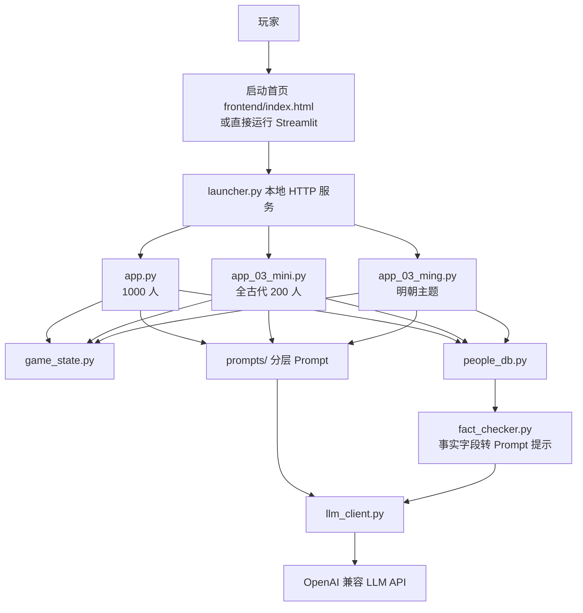
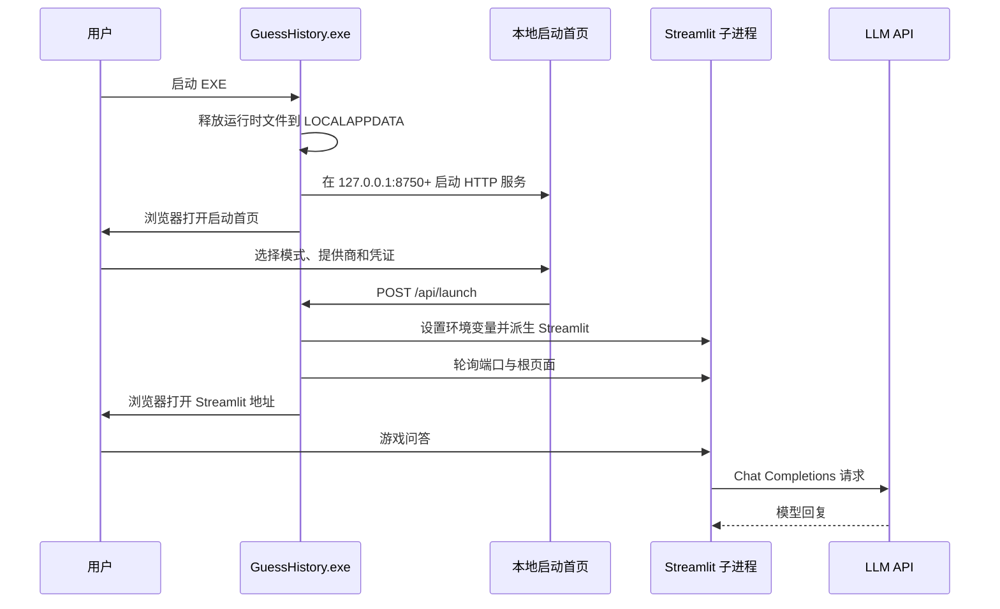

# 架构与运行流程

## 1. 总体结构



## 2. 直接运行 Streamlit 的流程

三个当前入口结构高度相似，差别主要在页面标题、主题文本和人物库加载方法。

### 2.1 页面初始化

1. 初始化 `st.session_state.game_state`，初始目标人物为空。
2. 初始化 `st.session_state.messages`，保存完整聊天历史。
3. 通过 `st.cache_data` 缓存人物库。
4. 在侧栏选择 API 来源：
   - 默认 API；
   - PC 环境变量中的预设提供商；
   - 手动输入 Key、URL 和模型。
5. 页面显示 `GameState.snapshot()`，其中直接包含目标人物，因此这是开发调试面板，不适合正式玩家界面。

### 2.2 开局或重开

以下任一条件成立时进入开局分支：

- 当前没有目标人物；
- 命中“再来一局”等重玩关键词；
- 用户输入中包含“开始”。

应用从对应人物池中 `random.choice()`，调用 `GameState.reset()`，然后回复“写好了，请猜猜看”。

注意：重开只重置 `GameState`，不会清空 `st.session_state.messages`。因此以前各局的对话仍会显示，并会继续加入后续 LLM 请求。

### 2.3 普通问答

1. `dialogue_count += 1`。
2. `GameState.hint_mode` 根据次数计算：
   - 小于 6：`blocked`；
   - 大于等于 6：`enabled`。
3. `build_system_prompt()` 组装角色、状态、回答规则、提示规则和输出规则。
4. 从人物库找到目标人物的 `Person`。
5. `fact_checker.py` 把已有结构化字段转为“目标人物确定性事实”文本，并追加通用事实核查规则。
6. 系统 Prompt 与全部历史消息一起发送给 LLM。
7. 正常游戏温度为 `0.3`；已经胜利或投降后为 `0.6`。
8. 根据模型回复做事后处理：
   - 提示请求且回复中出现“提示：”时记录提示；
   - 命中投降关键词时把阶段设为 `SURRENDERED`；
   - 回复同时包含“恭喜”和“答对”时把阶段设为 `WON`。

### 2.4 批量重答

当输入命中怀疑关键词时：

1. 不增加有效提问次数。
2. `collect_fact_qa_pairs()` 遍历历史消息。
3. 只保留正常用户问题以及与之配对的五种规范答案。
4. 排除开局、重玩、投降、提示和怀疑类消息。
5. 每 10 条组成一批。
6. 每批构造独立事实核查 Prompt，以温度 `0.1` 请求模型。
7. 页面显示批次进度，最后把每批结果顺序拼接。

这里的“汇总”是文本拼接，不会再调用一次模型形成跨批次的统一结论。

## 3. Prompt 组装

当前 `build_system_prompt()` 的顺序是：

```text
角色 persona
→ 当前状态 state
→ 五种回答规则 rules
→ blocked/enabled 提示策略 hint
→ 猜中/投降/普通对话输出格式 output
→ 通用事实核查层 fact_check（可选）
→ 工具说明 tools（可选，当前关闭）
```

三个 v3 应用调用时设置 `enable_fact_check=False`，随后自行追加：

```text
人物结构化事实
→ 通用事实核查强化规则
```

这样可以避免通用事实核查层重复出现。

`enable_tools` 当前始终为 `False`。`check_answer()`、`give_hint()` 和 `reveal_answer()` 只存在于未来设计说明中，没有真正的工具实现。

## 4. 单 EXE 运行流程



### 4.1 资源释放

PyInstaller 将前端、三个应用入口、核心模块、Prompt Python 文件和人物库打入 EXE。运行时 `launcher.py` 将这些文件覆盖复制到：

```text
%LOCALAPPDATA%\GuessHistory\runtime
```

随后检查 `prompts/__init__.py`、`game_state.py`、`llm_client.py`、`people_db.py`、`fact_checker.py` 和 `config.py` 是否存在。

### 4.2 本地 HTTP 接口

| 接口 | 作用 |
| --- | --- |
| `GET /` | 返回启动首页 |
| `GET /api/ping` | 返回简单存活状态 |
| `GET /api/health` | 返回已启动脚本、端口、存活状态和可选日志尾部 |
| `POST /api/launch` | 校验脚本与提供商，注入配置并启动对应 Streamlit |

只允许启动 `app.py`、`app_03_mini.py` 和 `app_03_ming.py`。

### 4.3 子进程与日志

- 优先从 8501 起寻找 Streamlit 空闲端口。
- 每个脚本在同一个启动器进程内只保留一个子进程。
- 日志写入 `%LOCALAPPDATA%\GuessHistory\logs`。
- 主启动器退出时，通过 `atexit` 和 `finally` 尝试终止全部游戏子进程。
- 已打包时复用当前 EXE，并以 `--streamlit-worker` 参数进入 Streamlit CLI。
- 开发态则由 Python 再执行 `launcher.py --streamlit-worker ...`。

## 5. 配置流

### 5.1 默认配置

`config.py` 的读取顺序：

1. `st.secrets["api_key"]`
2. `LLM_API_KEY`
3. `ZHIPU_API_KEY`
4. 页面手动输入

默认 URL 和模型还可由以下变量覆盖：

- `LLM_API_URL`
- `LLM_MODEL`

### 5.2 预设提供商

| 提供商 | Key 环境变量 | 默认模型 |
| --- | --- | --- |
| DeepSeek | `DEEPSEEK_API_KEY` | `deepseek-chat` |
| OpenAI | `OPENAI_API_KEY` | `gpt-4o-mini` |
| 智谱 | `ZHIPU_API_KEY` | `glm-4.5-air` |
| xAI | `XAI_API_KEY` | `grok-2` |
| 自定义 | `CUSTOM_ENV_KEY` 等 | 可自定义 |

所有提供商都按 Bearer Token 和 OpenAI 风格 `choices[0].message.content` 解析。

