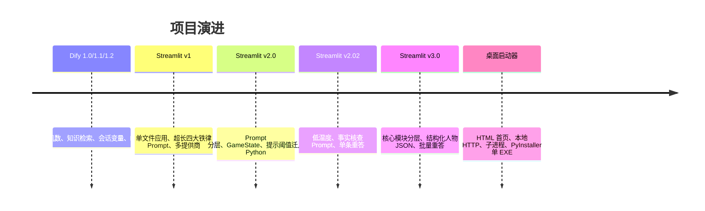

# 版本演进与遗留资产

## 1. 演进主线



## 2. Dify 工作流阶段

两个 YAML 是最早可见的完整产品形态。核心节点包括：

- 用户输入；
- 条件分支识别开始；
- Python 随机生成 1～1000；
- 知识检索；
- Python 从检索文档中清洗出人名；
- 写入 `target_answer` 会话变量；
- DeepSeek LLM 节点；
- 直接回复。

1.1 的 Prompt 存在目标变量引用不一致、规则表述和格式问题。1.2 改为正确的会话变量引用，补齐五种回答、提示不重复、胜利后状态与投降机制。

这部分当前不参与 Python 主线运行，但解释了 `主提示词.md`、人物 Markdown 和“对话轮数查表”设计的来源。

## 3. Streamlit v1

### `legacy/app_01_01.py`

- 只支持 DeepSeek；
- 从环境变量读取 DeepSeek Key；
- 直接把 Markdown 每一整行当人名，导致目标可能是“1. 黄帝”；
- 单一长 Prompt；
- 温度 0.7；
- 只有基础错误捕获。

### `legacy/app_01_02.py`

- 增加智谱默认模型和多个环境变量提供商；
- 支持自定义 URL 和模型；
- Prompt 扩展到四大铁律；
- 仍让模型通过“查表”判断提示次数；
- 仍存在 Markdown 序号未清理问题；
- 包含历史明文 Key。

### `legacy/app_01_ming.py`

- 面向明朝 CSV；
- 通过查询参数或配置选择提供商；
- 尝试兼容多种 CSV 编码；
- 仍是单文件状态与 Prompt；
- 属于早期 HTA 主页面配套入口。

## 4. Streamlit v2

### `legacy/app_02_01.py`

关键变化：

- 引入 `prompts/`；
- 引入 `GameState`；
- `N >= 6` 从 Prompt 查表迁到 Python；
- 添加状态调试面板；
- 提示和投降关键词进入 Python 辅助判断。

但 API 调用、提供商和人物加载仍重复写在应用文件中。

### `legacy/app_02_02.py`

新增：

- 普通回答温度从 0.7 降到 0.3；
- 复核温度 0.1；
- 通用事实核查强化 Prompt；
- 怀疑关键词；
- 找上一条问题并做单条二次核查。

这是 v3 批量重答的直接前身。

### `legacy/app_02_mini.py` / `legacy/app_02_ming.py`

把 v2 框架复制为全古代 200 人和明朝 200 人主题，人物加载仍在各应用内部完成。

## 5. Streamlit v3

v3 把重复逻辑下沉为：

```text
config.py
game_state.py
people_db.py
fact_checker.py
llm_client.py
prompts/
```

三套应用只保留 UI 和模式差异。相比 v2：

- 修复了 1000 人 Markdown 序号问题；
- 集中 LLM 重试和错误处理；
- 使用结构化人物 JSON；
- 从单条重答升级为整段规范问答批量复核；
- 移除当前 Python 主线的硬编码明文 Key；
- 将 v1/v2 应用归档到 `legacy/`。

## 6. HTA/HTML 主页面演进

| 文件 | 大致阶段 | 特点 | 当前状态 |
| --- | --- | --- | --- |
| `exe_01.hta/html` | v1 | ActiveX、批处理、明文默认 Key | 历史归档，部分脚本路径失效 |
| `exe_02_01.hta` | v2 | 三个 v2 入口 | 入口已移入 legacy |
| `exe_02_02.hta` | v2 修复 | 修复路径/启动细节 | 入口已移入 legacy |
| `exe_03_01.hta` | v3 初版 | 指向当前三入口，不再放明文 Key | 历史原型 |
| `exe_03_01.html` | v3 网页实验 | 现代主题，但仍含 ActiveX 路径 | 标准浏览器无法直接启动本机进程 |
| `exe_03_02.hta/html` | v3 UI 演进 | 深浅主题、XOR 凭证 | 历史原型 |
| `exe_03_03.hta` | v3 HTA 定稿 | 响应式缩放、当前三入口 | 被新 launcher 首页取代 |
| `frontend/index.html` | 单 EXE 当前首页 | 无 ActiveX，通过本地 HTTP 调 launcher | 当前主线 |

`exe_01.hta` 与 `exe_01.html` 内容完全相同，只是扩展名不同。普通 HTML 即使包含 `<HTA:APPLICATION>` 和 ActiveX，也不会自动获得标准浏览器之外的 HTA 权限。

## 7. 单 EXE 阶段

最新架构不再让首页直接执行 `WScript.Shell`，而是：

1. PyInstaller 打包 `launcher.py`；
2. launcher 托管普通浏览器首页；
3. 首页通过本机 `/api/launch` 请求启动游戏；
4. launcher 派生 Streamlit 子进程；
5. 三套游戏共用核心模块和人物数据。

这比 HTA 更接近可维护的桌面发行方式，也减少了对 IE/ActiveX 的依赖。但内置凭证、进程配置复用、健康判断和产物测试仍需完善。

## 8. 建议的遗留资产整理

推荐目录：

```text
legacy/
├─ dify/
│  ├─ 1.1.yml
│  └─ 1.2.yml
├─ streamlit_v1/
├─ streamlit_v2/
├─ launchers_hta/
└─ README.md
```

根目录只保留：

```text
app.py
app_03_mini.py
app_03_ming.py
launcher.py
核心模块
prompts/
data/
frontend/
tests/
构建与依赖文件
正式文档
```

同时删除或迁移完全重复的 `app_03_01.py`，并在 legacy README 中明确这些文件可能包含失效路径和不安全历史凭证，禁止直接用于发布。

