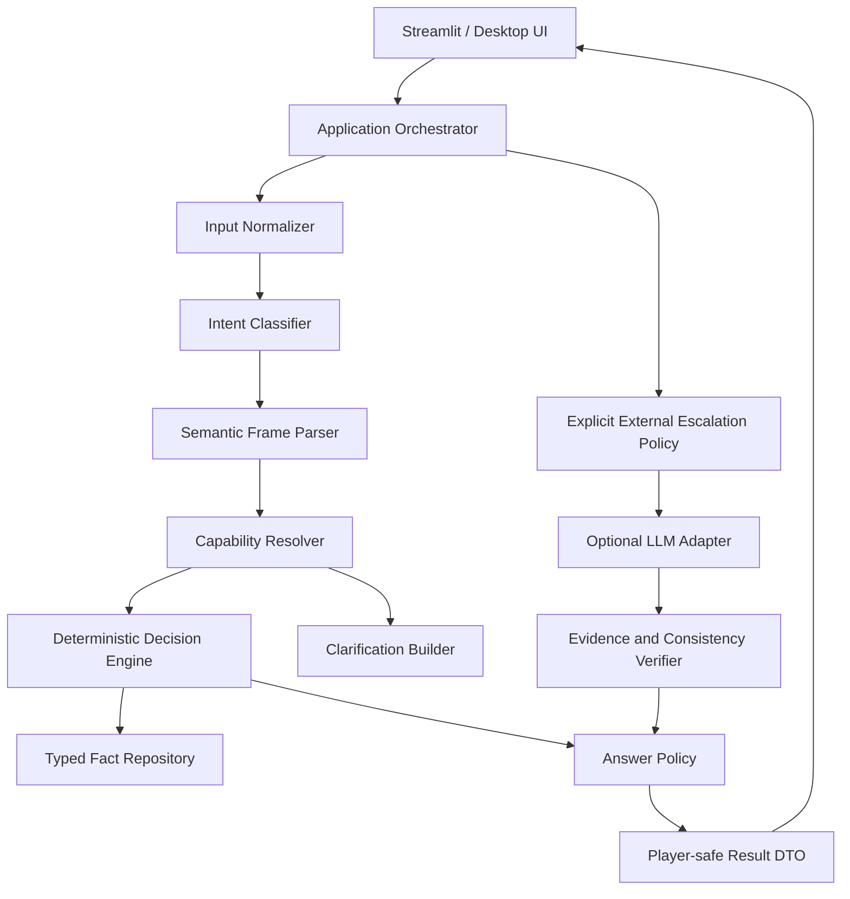

# V5 鲁棒性优先架构与开发计划

> 文档版本：v1.2
> 目标产品版本：V5  
> 状态：架构蓝图待签署，尚未进入实现  
> 日期：2026-07-29  
> 权威性：本文是 V5 的唯一架构与里程碑依据  
> V4 状态：正式废案，仅保留于 `ARCHITECTURE_V4_DEPRECATED.md`

## 1. 决策摘要

V5 不在 V4 上继续打补丁，而是建立独立的、离线可完整运行的确定性游戏内核。自然语言输入先被转换为显式语义框架，再由可审计的事实解析器裁决。LLM 是用户可选的外部知识增强器，不是解析失败后的默认逃生通道。

V5 的首要质量目标不是“能接更多模型”，而是：

- 简单问题始终由本地代码稳定回答；
- 无 API Key、断网、超时或模型故障时，游戏核心仍然完整可玩；
- 系统明确区分“没听懂”“听懂但没有事实”“事实有争议”和“外部服务不可用”；
- 每个回答都能解释它走过的确定性路径和使用的证据；
- 打包后的行为与源码运行一致，不依赖动态复制后碰巧可导入的模块。

## 2. V4 废案结论

V4 的分层、端口和数据包思想可以作为经验参考，但其运行架构整体不继承。废案原因如下：

1. `parse_question() -> None -> LLM` 将解析覆盖率问题错误地转化为网络依赖。
2. 关键词包含匹配缺乏组合语义，不能稳定处理简称、省略、否定、比较和上下文指代。
3. “事实未知”“表达不清”“能力不支持”“网关失败”在玩家体验中没有可靠区分。
4. 测试使用过多规范问句，未证明真实口语和变形表达的等价性。
5. V4 数据事实维度过窄，时间关系等常见问题只能事后追加特例。
6. Streamlit 与 PyInstaller 的运行时模块边界没有在设计阶段固定，导致源码通过而 EXE 缺包。
7. 本地降级只是异常映射，不是产品级的离线决策策略。

因此：

- `app_v4.py`、`src/guess_history/`、`data/v4/` 和 V4 Launcher 均被冻结为历史实验；
- 除安全修复外，不再向 V4 添加业务功能；
- V5 使用独立命名空间、数据目录、入口、契约和测试矩阵；
- V4 的通过测试不得作为 V5 验收证据。

## 3. V5 不变量

以下规则是架构硬约束，任何实现不得绕过：

1. **解析失败不触网**：`unparsed`、`ambiguous` 和 `unsupported` 不得自动调用 LLM。
2. **离线完整**：关闭网络和删除全部模型配置后，开局、提问、提示、猜名、投降、重玩和历史隔离必须可用。
3. **确定性优先**：本地事实可回答的问题永远不进入外部模型。
4. **结果是数据，不是异常**：正常的不理解、未知和需澄清必须返回类型化结果，不能抛系统异常。
5. **网络失败不污染会话**：外部调用失败不得计为已回答问题，不得破坏当前 session。
6. **证据边界**：没有有效事实或来源时不得给出确定的“是/否”。
7. **目标隔离**：玩家 DTO、日志和生产 UI 在游戏结束前不得包含目标 ID、姓名或可反推出目标的内部轨迹。
8. **包成员不漂移**：事实补全永远不能改变人物包成员资格。
9. **静态可打包**：发布入口必须通过正常 Python import 引用完整模块树，禁止把核心源码仅作为运行时数据脚本执行。
10. **同义表达等价**：语义等价的问句必须产生相同语义框架和裁决结果。

## 4. 架构决策记录（ADR）

| ADR | 决策 | 理由 |
| --- | --- | --- |
| V5-001 | 独立模块化单体 `guess_history_v5` | 与废弃 V4 形成编译期边界，同时保持本地应用简单 |
| V5-002 | 语义框架作为问答核心合同 | 将语言表达与事实裁决解耦，避免业务逻辑依赖字符串特例 |
| V5-003 | 本地确定性内核不依赖 LLM 端口 | 保证离线完整性和可重复测试 |
| V5-004 | 使用判别联合返回结果 | 明确区分回答、澄清、未知、不支持和系统失败 |
| V5-005 | 建立时间本体与类型化事实值 | 支持早于、晚于、处于、重叠和数值比较，而不是继续堆朝代正则 |
| V5-006 | LLM 采用显式升级策略 | 只有用户启用、Provider 就绪且问题属于允许类别时才能触网 |
| V5-007 | 会话采用事件记录 + 派生状态 | 便于重放、审计、隔离和属性测试 |
| V5-008 | 发布入口静态导入应用模块 | PyInstaller 在分析期即可发现完整依赖，不再复制源码后动态执行 |
| V5-009 | V5 数据为新 Schema，不直接加载 V4 overlay | 未审校 AI 补全不能成为 V5 默认事实 |
| V5-010 | 先建立语言黄金集再实现解析器 | 解析覆盖率必须由真实语料驱动，而不是由开发者想到的例句驱动 |

## 5. 总体结构



核心依赖方向：

```text
presentation / launcher
          ↓
application
          ↓
semantic + domain
          ↓
ports

adapters ──实现──> ports
```

`semantic` 和 `domain` 不得导入 Streamlit、Requests、文件系统、环境变量、Launcher 或任何模型 SDK。

## 6. 输入理解流水线

### 6.1 输入归一化

`InputNormalizer` 只做无损、可追踪的标准化：

- Unicode NFKC；
- 全角/半角标点统一；
- 连续空白折叠；
- 常见问号、语气词和礼貌前后缀分离；
- 简繁体映射使用固定本地词表；
- 最大长度和控制字符校验；
- 保留原文与归一化文本，便于诊断但默认不写日志。

归一化不得猜测答案或擅自删除否定词。

### 6.2 意图分类

`TurnIntent` 是封闭枚举：

- `START_GAME`
- `ASK_FACT`
- `GUESS_PERSON`
- `REQUEST_HINT`
- `REQUEST_RECHECK`
- `SURRENDER`
- `REPLAY`
- `HELP`
- `UNSUPPORTED_CHAT`
- `AMBIGUOUS`

命令与猜名先于事实问题解析。人物姓名匹配只对当前人物包的规范名和审校别名执行。

### 6.3 语义框架

事实问题必须被解析为以下判别联合之一：

```text
AttributePredicate
  fact_key: FactKey
  operator: EQ | NE | IN | CONTAINS
  expected: TypedValue
  polarity: POSITIVE | NEGATIVE

TemporalPredicate
  subject_axis: LIFETIME | ACTIVE_PERIOD | REIGN_PERIOD
  relation: BEFORE | AFTER | DURING | OVERLAPS
  reference_period_id: PeriodId
  polarity: POSITIVE | NEGATIVE

NumericPredicate
  fact_key: BIRTH_YEAR | DEATH_YEAR | REIGN_START | REIGN_END
  operator: LT | LTE | EQ | GTE | GT | BETWEEN
  expected: YearValue | YearRange

ExistencePredicate
  fact_key: FactKey
  expected_presence: bool
```

解析器返回 `ParseOutcome`：

- `PARSED(frame)`：唯一语义明确；
- `AMBIGUOUS(candidates, clarification)`：存在多个合理框架；
- `UNSUPPORTED(reason, examples)`：理解了大类但 V5 当前不支持；
- `UNPARSED(rephrase_examples)`：无法可靠建立语义。

后面三种均禁止自动触网。

### 6.4 领域词典与语法

领域词典必须版本化，至少包含：

- 朝代规范名、简称、别称及 `PeriodId`；
- 人物身份同义词；
- 头衔与称号同义词；
- 比较词：早于、晚于、之前、之后、不晚于、不早于；
- 否定词和双重否定模式；
- 时间轴指示词：出生、去世、主要活动、在位；
- 口语模板和省略模板。

词典只负责词汇映射，组合语义由语法规则生成，不允许用“包含某词就直接回答”的快捷路径。

## 7. 决策与降级合同

### 7.1 内核结果

```json
{
  "kind": "answer",
  "answer": "probably_yes",
  "reason_code": "TEMPORAL_BEFORE_MATCH",
  "confidence": 0.82,
  "fact_refs": ["person-x:active-period"],
  "source_refs": ["source-y"],
  "trace_id": "uuid"
}
```

`DecisionOutcome.kind` 只能是：

- `answer`
- `clarification_required`
- `fact_unknown`
- `unsupported`
- `external_candidate`

这些都是正常业务结果。只有数据损坏、违反不变量或基础设施失败才使用异常。

### 7.2 玩家答案

玩家可见答案固定为：

- 是；
- 不是；
- 或许是；
- 或许不是；
- 现有资料不足以判断；
- 我没能准确理解，请从给出的示例中改写；
- 这个问题暂不在本地能力范围内。

外部服务错误不得直接显示英文 provider 文案。若外部增强失败，回退到调用前已有的本地结果或中文可恢复提示。

### 7.3 外部升级策略

LLM 调用必须同时满足：

1. 用户显式启用“外部知识增强”；
2. Provider 配置在启动时已验证；
3. 内核结果为 `external_candidate`，而不是 `unparsed`；
4. 问题类别在允许清单中；
5. 当前 session 未超过调用预算；
6. 可构造不泄露答案的最小证据包；
7. 返回值可通过 Schema、证据绑定和独立一致性校验。

任何一项失败都返回本地类型化结果，不抛给玩家。

## 8. V5 数据模型

### 8.1 Person

```text
Person
  id: PersonId, required, stable slug
  canonical_name: str, required
  aliases: tuple[AliasRef, ...]
  summary: str | null
  fact_ids: tuple[FactId, ...]
  schema_version: 5
```

### 8.2 FactRecord

```text
FactRecord
  id: FactId
  person_id: PersonId
  predicate: PredicateId
  value: StringValue | EnumValue | YearValue | PeriodRef | ValueSet
  validity: TimeInterval | null
  confidence: CONFIRMED | PROBABLE | DISPUTED | UNKNOWN
  source_refs: tuple[SourceId, ...]
  review_status: DRAFT | REVIEWED | APPROVED | REJECTED
  provenance: MANUAL | MIGRATED | AI_CANDIDATE
```

约束：

- `CONFIRMED` 必须至少有一个 `APPROVED` 来源；
- `AI_CANDIDATE` 不得为 `APPROVED`；
- 同一人物、谓词和有效期发生冲突时必须显式标为 `DISPUTED`；
- 事实值类型必须与谓词 Schema 一致；
- 运行时默认只加载 `REVIEWED` 或 `APPROVED` 事实。

### 8.3 Period

```text
Period
  id: PeriodId
  canonical_name: str
  aliases: tuple[str, ...]
  start_year: int | null
  end_year: int | null
  parent_id: PeriodId | null
  precision: EXACT | APPROXIMATE | SYMBOLIC
```

年份使用有符号天文记年，公元前为非正值；比较必须通过时间区间服务执行，不得在解析器里维护散落的整数排名。

### 8.4 DataPack

```text
DataPack
  id: PackId
  version: SemVer
  display_name: str
  person_ids: tuple[PersonId, ...]
  expected_count: int
  locale: zh-CN
  membership_snapshot_sha256: str
```

人物包只引用人物 ID，不携带或合并事实。

### 8.5 SessionEvent

```text
SessionEvent
  id: EventId
  session_id: SessionId
  sequence: int
  event_type: GAME_STARTED | QUESTION_ASKED | ANSWERED | CLARIFICATION_REQUESTED |
              HINT_GIVEN | GUESS_SUBMITTED | SURRENDERED | GAME_WON | GAME_CLOSED
  public_payload: object
  private_payload: object
  created_at: UTC datetime
```

`public_payload` 和 `private_payload` 在类型和序列化层分离。玩家历史永远只读取 public 事件。

## 9. 应用合同

### `create_game`

```text
Input:  CreateGameCommand(pack_id, random_seed | null)
Output: PlayerGameView
Errors: PACK_NOT_FOUND | PACK_EMPTY | DATA_INVALID
```

### `handle_turn`

```text
Input:  HandleTurnCommand(session_id, text, expected_sequence)
Output: TurnResult
```

`TurnResult`：

```json
{
  "session_id": "uuid",
  "sequence": 7,
  "intent": "ask_fact",
  "outcome": {
    "kind": "clarification_required",
    "message": "你想问的是出生时间，还是主要活动时期？",
    "examples": ["他出生于唐代以前吗？", "他主要活动于唐代以前吗？"]
  },
  "state": {
    "phase": "playing",
    "valid_question_count": 5,
    "hint_available": false
  }
}
```

并发或重复提交通过 `expected_sequence` 检测，返回 `STALE_SESSION_VERSION`，防止 Streamlit rerun 重复记录回合。

### `request_hint`

只从未使用且可公开的审校事实生成，不调用 LLM。提示维度必须由领域策略选择，不能直接泄露规范姓名或唯一别名。

### `request_external_answer`

该用例与 `handle_turn` 分离，必须携带用户确认和待升级的 `trace_id`。这保证普通解析失败永远不会隐式触网。

## 10. 错误模型

```text
DomainInvariantError      数据或状态违反不可恢复不变量
ContractValidationError  外部输入不符合合同
RepositoryError          规范数据无法读取
ExternalProviderError    可恢复的外部增强失败
PackagingError           发布资源不完整
```

玩家层只接收稳定错误码和中文消息。开发诊断可以通过 `trace_id` 查看类型化轨迹，但不得包含 API Key、Authorization、完整模型响应或目标姓名。

## 11. 目标目录

```text
src/
└─ guess_history_v5/
   ├─ semantic/
   │  ├─ normalization.py
   │  ├─ intents.py
   │  ├─ frames.py
   │  ├─ lexicon.py
   │  ├─ grammar.py
   │  └─ parser.py
   ├─ domain/
   │  ├─ people.py
   │  ├─ facts.py
   │  ├─ periods.py
   │  ├─ sessions.py
   │  ├─ events.py
   │  ├─ decisions.py
   │  └─ policies.py
   ├─ application/
   │  ├─ create_game.py
   │  ├─ handle_turn.py
   │  ├─ request_hint.py
   │  ├─ request_external_answer.py
   │  └─ views.py
   ├─ ports/
   │  ├─ catalog_repository.py
   │  ├─ session_repository.py
   │  ├─ external_knowledge.py
   │  └─ secret_provider.py
   ├─ adapters/
   │  ├─ json_catalog/
   │  ├─ memory_sessions/
   │  ├─ llm/
   │  └─ secrets/
   ├─ presentation/
   │  └─ streamlit/
   ├─ launcher/
   ├─ contracts/
   └─ bootstrap.py

data/v5/
├─ catalog.json
├─ periods.json
├─ sources.json
└─ packs/

quality/v5/
├─ language/
├─ semantic/
├─ decisions/
├─ robustness/
└─ release/

app_v5.py
launcher_v5.py
```

## 12. 导入规则

- `semantic` 只能导入标准库和自身类型；
- `domain` 可以导入 `semantic.frames`，不得导入 application/adapters/UI；
- `application` 只能依赖 domain、semantic 和 ports；
- `adapters` 实现 ports，不得反向控制应用流程；
- `presentation` 只调用 application，用 Player DTO 渲染；
- `launcher` 只管理配置、HTTP 和进程，不导入人物事实或决策器；
- `bootstrap.py` 是唯一允许组装具体 adapter 的地方；
- V5 模块不得导入 `guess_history`（V4 命名空间）。

CI 必须用 AST 检查最后一条规则。

## 13. 安全架构

- Launcher 只绑定 `127.0.0.1`，状态变更使用 Origin + Host + CSRF；
- API Key 只进入选定子进程的独立环境，不能进入父环境、指纹明文、日志或响应；
- 自定义 Provider 仅允许 HTTPS；loopback HTTP 只在显式开发构建中允许；
- 玩家文本限制长度并拒绝控制字符；
- 模型收到的是字段化问题和最小证据，不是拼接后的系统源代码；
- 模型响应必须经过 Schema、证据绑定、目标一致性和答案枚举校验；
- 生产 UI 无目标、私有事件、内部 evidence statement 或原始异常；
- PyInstaller 清单必须显式验证 V5 包、数据、Schema 和静态资源。

## 14. 可观测性

每次回合生成一个不含原始敏感内容的 `DecisionTrace`：

```text
trace_id
normalization_version
intent
parse_status
frame_type
resolver
reason_code
fact_ref_count
source_ref_count
external_attempted
external_result
latency_buckets
```

生产默认不记录完整玩家文本。开发模式可在本地内存查看原文与语义框架，关闭页面即清除。

必须提供以下质量报告：

- 解析覆盖率；
- 澄清率；
- 本地确定性回答率；
- 外部升级率；
- 外部失败后的成功降级率；
- 按问题类型统计的错答率；
- 同义句不一致率。

## 15. 测试战略

### 15.1 语言黄金集

在写解析器前建立人工审校语料，每个支持意图至少包含：

- 规范问法；
- 口语、省略和语气词；
- 简称、别称和繁体；
- 肯定、否定、双重否定；
- 早于、晚于、期间和边界比较；
- 标点、空格和大小写变形；
- 歧义句与不可支持句；
- 对抗性文本和超长输入。

每条包含期望 intent、ParseOutcome、SemanticFrame 和是否允许外部升级。

### 15.2 变形测试

同一语义的标点变化、礼貌词、空白、简繁和同义模板必须生成相同框架。否定变形必须只改变 polarity，不得改变事实字段。

### 15.3 属性测试

- 任意有效输入不得使内核崩溃；
- `unparsed/ambiguous/unsupported` 的网络调用计数恒为 0；
- 重放相同事件得到相同状态；
- session A 的事件永远不进入 session B；
- 生产 DTO 序列化后不包含目标字段；
- 相同种子与相同 catalog 产生相同目标选择。

### 15.4 故障注入

覆盖无 Key、错误 Key、DNS 失败、连接拒绝、429、5xx、超时、非法 JSON、错误证据、子进程早退、端口占用和损坏数据包。

任何外部故障都必须转为本地可恢复结果；只有规范数据损坏允许阻止开局。

## 16. 发布质量门禁

V5 发布候选必须同时满足：

| 指标 | 门禁 |
| --- | --- |
| 审校语料中的支持意图解析率 | ≥ 99.5% |
| 已解析语义框架正确率 | 100% |
| 同义句不一致率 | 0% |
| `unparsed/ambiguous/unsupported` 隐式网络调用 | 0 次 |
| 无 Provider 的核心流程完成率 | 100% |
| 确定性事实与黄金答案一致率 | 100% |
| 生产态目标或敏感信息泄露 | 0 项 |
| 外部服务失败后的可恢复结果率 | 100% |
| 三人物包成员快照漂移 | 0 项 |
| 干净 Windows EXE 主流程 | 三包全部通过 |

若黄金集规模不足，相关比率只能标记 `insufficient_data`，不能以空集或少量样本通过。

## 17. V4 到 V5 的数据迁移

迁移采用“候选导入”，不是原样升级：

1. 读取 V4 catalog 和 pack snapshot；
2. 保留稳定人物 ID 与包成员资格；
3. 将人物事实映射为 V5 `FactRecord(DRAFT, MIGRATED)`；
4. 将 V4 overlay 映射为 `AI_CANDIDATE`，默认不加载；
5. 将朝代字符串映射到 `PeriodId`，无法唯一映射的记录进入隔离报告；
6. 生成确定性迁移报告和逐字段差异；
7. 双人审校后才允许升级为 `REVIEWED/APPROVED`；
8. V5 运行时拒绝读取 V4 目录。

## 18. 开发里程碑

### V5-M0：冻结与需求基线

- [ ] **0.1 冻结 V4**。DoD：所有 V4 入口和文档标记废弃，CI 禁止 V5 导入 V4 命名空间。
- [ ] **0.2 建立真实语言问题集**。DoD：不少于 1,000 条双人审校输入，覆盖全部支持、歧义和不支持类别。
- [ ] **0.3 固定能力矩阵**。DoD：每种问题类型明确本地支持、需澄清、不支持或可选外部增强。
- [ ] **0.4 签署 ADR 与威胁模型**。DoD：本文 ADR、数据边界和外部升级安全策略经人工确认。

### V5-M1：语义内核

- [ ] **1.1 输入归一化器**。DoD：语料变形测试全部通过且不改变否定语义。
- [ ] **1.2 意图分类器**。DoD：命令、猜名、事实问题和歧义输入达到发布门禁。
- [ ] **1.3 语义框架解析器**。DoD：支持属性、时间、数值和存在性框架，不含网络依赖。
- [ ] **1.4 澄清生成器**。DoD：每个歧义类别返回具体中文澄清和可点击示例。
- [ ] **1.5 隐式触网禁止器**。DoD：属性测试证明所有解析失败路径网络调用为零。

### V5-M2：事实本体与数据

- [ ] **2.1 Predicate 与值类型 Schema**。DoD：非法谓词/值组合在加载期失败。
- [ ] **2.2 时间本体**。DoD：朝代、子时期和区间比较通过边界测试。
- [ ] **2.3 V5 规范目录**。DoD：catalog、periods、sources 和 packs 交叉引用全部合法。
- [ ] **2.4 V4 候选迁移器**。DoD：确定性、可重复、无静默丢失并输出隔离报告。
- [ ] **2.5 审校门禁**。DoD：未审校 AI 候选无法进入默认运行时。

### V5-M3：确定性游戏引擎

- [ ] **3.1 事件化 session**。DoD：重放、并发 sequence 和跨局隔离属性测试通过。
- [ ] **3.2 决策解析器**。DoD：每个 SemanticFrame 都有类型化 resolver 和 reason code。
- [ ] **3.3 答案策略**。DoD：确定、可能、未知和澄清严格按证据质量输出。
- [ ] **3.4 提示与猜名**。DoD：离线完成六问、提示、猜中、投降和重玩。
- [ ] **3.5 玩家安全 DTO**。DoD：生产序列化扫描无目标和私有事件字段。

### V5-M4：可选外部知识

- [ ] **4.1 显式升级用例**。DoD：只有用户确认的 `external_candidate` 可进入端口。
- [ ] **4.2 Provider 能力探测**。DoD：启动时验证配置，运行中断路器可恢复。
- [ ] **4.3 结构化结果与证据绑定**。DoD：无证据或冲突回答不能进入玩家层。
- [ ] **4.4 预算与超时**。DoD：每局调用上限、总超时和取消行为可测试。
- [ ] **4.5 故障降级**。DoD：全部故障注入返回中文本地结果且不污染 session。

### V5-M5：界面

- [ ] **5.1 单一 Streamlit 应用**。DoD：三包由 pack 合同驱动，无模式分支复制。
- [ ] **5.2 能力可见性**。DoD：UI 明示本地模式、外部增强状态和问题能力示例。
- [ ] **5.3 澄清交互**。DoD：歧义结果可一键选择语义，不需要重新输入整句。
- [ ] **5.4 可恢复错误**。DoD：普通玩家永远看不到堆栈、英文 provider 错误或响应正文。
- [ ] **5.5 真实浏览器烟雾**。DoD：口语、比较、否定、无 Key、断网和重玩全流程通过。

### V5-M6：Launcher 与打包

- [ ] **6.1 静态发布入口**。DoD：PyInstaller 分析图直接包含 V5 presentation，不依赖复制源码脚本导入。
- [ ] **6.2 安全 Launcher**。DoD：loopback、CSRF、独立 env、配置冲突和 Job Object 全部通过。
- [ ] **6.3 产物清单**。DoD：自动检查 V5 包、数据、Schema、前端和版本，不允许打入 V4 业务代码。
- [ ] **6.4 干净 Windows 构建**。DoD：全新环境构建成功。
- [ ] **6.5 无 Python 测试机**。DoD：三包、离线流程、外部增强和进程回收全部通过。

### V5-M7：发布验收

- [ ] **7.1 全门禁报告**。DoD：第 16 节所有指标有非空样本和可追溯证据。
- [ ] **7.2 安全复核**。DoD：秘密、目标泄露、Prompt 注入、本地 HTTP 和依赖风险无高危未关闭项。
- [ ] **7.3 双语文档**。DoD：用户、开发、数据贡献和故障排查文档同步。
- [ ] **7.4 V5 发布候选**。DoD：由未参与实现的验收者在干净环境签署。

## 19. 实施顺序与停止条件

依赖顺序固定为：

```text
语言黄金集
  → SemanticFrame 合同
  → 解析器
  → 事实本体
  → 决策器
  → 会话与应用用例
  → 可选 LLM
  → UI
  → Launcher / EXE
```

禁止先做 UI 或 EXE 再补语义内核。任一阶段出现以下情况必须停止升级：

- 黄金集为空或缺少双人审校；
- 同义句产生不同框架；
- 解析失败触发网络；
- 无 Provider 时核心路径报系统错误；
- 数据无证据却输出确定答案；
- 源码与 EXE 行为不一致；
- V5 导入任何 V4 业务模块。

## 20. 给实现与评审的约束

### 给实现者

- 第一项代码工作是合同和失败测试，不是复制 V4 类；
- 不允许通过新增字符串特例关闭语言缺陷；必须先给黄金集加案例，再修改词典或语法；
- 每个 resolver 必须是纯函数并返回 reason code；
- 外部适配器最后接入，不能成为本地测试的默认依赖；
- 打包入口必须静态 import `guess_history_v5.presentation`。

### 给评审者

- 重点检查任何 `parse miss -> gateway` 的隐式路径；
- 搜索 V5 对 `guess_history`、`data/v4` 和 `app_v4.py` 的导入或读取；
- 检查 UNKNOWN 是否被误转为 NO；
- 检查 collection fact 缺少值时是否错误给出否定；
- 检查否定和时间边界；
- 检查错误文案是否泄露 Provider、响应体或目标；
- 检查 PyInstaller 是否真正分析 V5 模块，而非仅把源码作为 data。

## 21. 开放问题

这些问题不阻塞 V5-M0 启动，但必须在 M0 结束前签署：

1. V5 首发支持的事实谓词清单；
2. “主要活动时期”的历史学定义和区间来源；
3. 是否首发支持简繁自动转换，还是只使用受控词表；
4. 外部知识增强是否默认关闭；建议默认关闭；
5. 语言黄金集的两名责任审校者；
6. V4 的 1098 人数据中哪些事实允许进入 V5 审校队列；
7. 首发是否只支持中文；建议 V5.0 仅支持 `zh-CN`。

在上述架构获得确认前，不创建 `src/guess_history_v5` 实现代码，不启动 V5-M1。

## 22. 可执行鲁棒性矩阵

所有回合必须按下表处理。矩阵是应用层合同，测试和 UI 不得自行改变结果含义。

| 输入/运行情况 | 解析结果 | 是否允许联网 | 是否消耗有效问数 | 玩家可见结果 |
| --- | --- | --- | --- | --- |
| 本地可判断的事实问题 | `PARSED` + `answer` | 否 | 是 | 是/否/或许 |
| 语义有两个以上合理解释 | `AMBIGUOUS` | 否 | 否 | 澄清选项 |
| 语义已识别但能力未实现 | `UNSUPPORTED` | 否 | 否 | 能力范围提示 |
| 无法可靠建立语义框架 | `UNPARSED` | 否 | 否 | 改写示例 |
| 本地事实缺失或冲突 | `fact_unknown` | 否 | 是（仅当问题已解析） | 资料不足 |
| 明确允许的外部候选问题 | `external_candidate` | 仅在用户确认后 | 外部成功才计入 | 带证据的结果或可恢复失败 |
| Provider 超时、拒绝或非法响应 | 外部错误 | 已发生的调用立即终止 | 否 | 中文可恢复提示 |
| 规范数据包损坏 | 不创建游戏 | 否 | 不适用 | 阻止开局并显示修复指引 |

“是否消耗有效问数”只由 `TurnCommitPolicy` 决定，UI 不得根据文字内容自行递增计数。

## 23. 会话状态机与幂等性

### 23.1 状态

```text
CREATED → PLAYING → WAITING_CLARIFICATION → PLAYING
                    ├→ WON → CLOSED
                    ├→ SURRENDERED → CLOSED
                    └→ CLOSED
```

- `WAITING_CLARIFICATION` 只能接受澄清选项或取消，不能接受新的事实回合；
- `WON`、`SURRENDERED` 和 `CLOSED` 是终态，所有写操作返回 `SESSION_CLOSED`；
- 每次状态变更都必须由一个带单调 `sequence` 的事件产生。

### 23.2 原子回合

`handle_turn` 必须在一次事务中完成：

```text
读取 session 版本
  → 归一化与解析
  → 本地决策或生成澄清
  → 计算 Player DTO
  → 通过 TurnCommitPolicy 决定是否追加事件
```

只有最后一步成功才提交状态。外部调用失败、校验失败或重复提交不得追加 `ANSWERED` 事件。

幂等键为 `(session_id, expected_sequence, normalized_input_hash)`。同一幂等键重试必须返回第一次结果，不得重复抽题、扣问数或触发外部调用。

## 24. 配置与网络安全合同

V5 只读取以下经过启动校验的配置；未列出的变量不得改变业务行为：

| 配置 | 默认值 | 约束 |
| --- | --- | --- |
| `V5_EXTERNAL_ENABLED` | `false` | 只有显式 `true` 才允许外部升级 |
| `V5_PROVIDER_URL` | 空 | 仅允许 HTTPS；开发 loopback 必须使用开发构建 |
| `V5_REQUEST_TIMEOUT_MS` | `8000` | 范围 500–30000 |
| `V5_SESSION_EXTERNAL_BUDGET` | `0` | 非负整数，按 session 计数 |
| `V5_DATA_DIR` | 发布包内 `data/v5` | 必须包含并校验 manifest |
| `V5_LOG_LEVEL` | `INFO` | 生产禁止 DEBUG 原文记录 |

启动时必须完成：Schema 校验、数据包哈希校验、Provider URL 校验和秘密存在性校验。校验失败时以“外部增强不可用”启动本地模式；只有规范数据损坏才阻止开局。

网络能力只存在于 `adapters/llm`。`semantic`、`domain`、`application` 和 `memory_sessions` 必须通过静态检查证明没有 socket、HTTP 客户端或模型 SDK 依赖。

## 25. 证据、冲突与答案裁决

事实裁决遵循以下顺序：

1. 先按 `PredicateSchema` 验证值类型与时间精度；
2. 再过滤当前 pack、人物和有效期；
3. 汇总来源并检测同谓词冲突；
4. 仅当证据满足策略时输出确定答案，否则输出 `fact_unknown` 或 `probably_*`；
5. 将 `reason_code`、`fact_refs` 和 `source_refs` 写入内部轨迹，玩家层只接收安全文案。

确定的“是/否”至少需要一条 `APPROVED` 来源、无未解决冲突、值类型匹配且时间关系可计算。`PROBABLE`、`DISPUTED`、区间重叠或来源不足都不得被压扁为确定的“否”。

## 26. 变更治理与可追溯性

- 语义词典、Predicate Schema、时间轴和数据包均有独立版本；版本写入 `DecisionTrace` 和发布 manifest；
- 改变解析含义必须先新增黄金集案例，再提交 ADR amendment，禁止只改实现不改合同；
- 改变数据事实必须生成逐字段 diff、来源 diff 和 pack 成员快照 diff；
- 迁移、词典和 Schema 变更必须可回放、可逆或有明确隔离目录；
- 中文与英文架构的章节、门禁、里程碑数量必须在 CI 中一致；
- 每个发布候选必须关联一份不可变的 `quality/v5/release/manifest.json`，记录提交、数据哈希、测试报告和审校人。

## 27. V5-M0 必交付物

V5-M0 结束时不能只提交“已讨论”。必须同时存在以下可审查文件：

1. `requirements-matrix`：意图、语义框架、能力、失败结果和联网权限的逐项矩阵；
2. `language-gold-set`：每条输入的双人审校、期望解析结果和版本；
3. `predicate-schema` 与 `period-ontology`：可机器校验的字段、枚举和边界规则；
4. `threat-model`：Prompt 注入、目标泄露、秘密、loopback HTTP 和依赖风险；
5. `migration-report` 模板：V4 候选数据的逐字段差异和隔离原因；
6. `acceptance-plan`：第 16 节每个门禁的命令、样本、责任人和证据路径。

未达到上述交付物前，M0 不得标记完成；即使旧版测试通过，也不得开始 M1。

## 28. V5 开发计划总览

V5 按“合同先行、确定性内核先行、外部能力最后、发布证据闭环”的顺序推进。阶段可以提前准备资料，但未满足退出条件不得进入下一阶段。

| 阶段 | 核心工作 | 必交付物 | 前置条件 | 退出条件 | 预期效果 |
| --- | --- | --- | --- | --- | --- |
| M0 冻结与基线 | 锁定支持意图、黄金集、能力矩阵、威胁模型和 ADR | M0 六项交付物、签署记录 | 架构获确认 | 每个能力有明确本地/澄清/不支持/外部分类 | 团队不再靠临时猜测扩展功能，简单问题的处理边界固定 |
| M1 语义内核 | 归一化、意图、语义框架、词典、澄清 | `semantic` 合同、失败测试、黄金集报告 | M0 完成 | 支持输入达到门禁，解析失败网络调用为 0 | “早于唐”“唐代以前”等等价说法稳定进入同一语义框架 |
| M2 事实本体与数据 | Predicate、时间本体、来源、V4 候选迁移和审校 | V5 Schema、规范目录、隔离报告 | M1 框架稳定 | Schema、来源、pack 交叉引用全合法 | 不再因字段缺失、时间边界或 AI 候选造成假确定答案 |
| M3 确定性游戏引擎 | 决策器、事件 session、提示、猜名、重放 | 应用合同、状态机、属性测试 | M2 有可用规范数据 | 无 Provider 完成主流程，重放和隔离测试通过 | 断网、无 Key、Provider 故障时仍能完整游玩 |
| M4 可选外部知识 | 显式升级、Provider 适配、证据验证、预算和断路器 | 外部端口、故障注入报告、安全复核 | M3 本地结果稳定 | 只有 `external_candidate` 且用户确认时才触网 | 外部能力成为可控增强，而不是解析失败的逃生通道 |
| M5 用户界面 | 能力说明、澄清按钮、可恢复错误、历史隔离 | UI 状态映射、浏览器烟雾报告 | M3 完成；M4 可选 | 玩家只看到安全中文结果，澄清无需重输整句 | 用户知道系统“没听懂/没有资料/暂不支持/服务故障”的区别 |
| M6 Launcher 与打包 | 静态 import、数据 manifest、loopback 安全、进程回收 | 干净环境 EXE、产物清单、无 Python 测试报告 | M5 主流程稳定 | 源码与 EXE 行为一致，三包启动无导入错误 | 消除 `ModuleNotFoundError` 和“源码能跑、EXE 不能跑”问题 |
| M7 发布验收 | 全门禁、安全、文档和独立验收 | 不可变 release manifest、签署的 RC | M0–M6 全部通过 | 第 16 节所有指标有非空证据 | 发布结论可复现、可追责，失败可定位到具体阶段 |

固定依赖关系：

```text
M0 → M1 → M2 → M3 → M4 → M5 → M6 → M7
```

其中 M4 是可选增强阶段，但不能改变 M3 的本地合同；M5 可以在 M4 未启用时完成本地模式界面，M6 只能打包已通过 M3/M5 的主流程。

## 29. 预期效果与量化目标

下表是 V5 相对于 V4 的产品效果，不是宣传口号；每项必须在 `quality/v5` 生成证据。

| 质量维度 | V4 暴露的问题 | V5 目标 | 验证方式 |
| --- | --- | --- | --- |
| 简单问题稳定性 | 简单问题可能落入 Provider 错误 | 本地可判断问题的确定性回答率 100% | 事实黄金集 + 无 Provider 测试 |
| 隐式联网 | 解析失败可能触发 LLM | `UNPARSED/AMBIGUOUS/UNSUPPORTED` 隐式网络调用 0 次 | 网络桩调用计数 |
| 离线可玩性 | 降级不完整 | 开局、问答、提示、猜中、投降、重玩 100% 可用 | 断网/无 Key 故障注入 |
| 语义一致性 | 口语、省略、比较覆盖不足 | 同义句不一致率 0%；支持意图解析率 ≥99.5% | 双人审校黄金集 + 变形测试 |
| 不确定性表达 | 未知、冲突和否定易混淆 | 未知不转否定；确定答案有证据绑定 | 事实裁决单元测试 |
| 会话正确性 | 重跑可能重复记录或污染上下文 | 幂等重试不重复扣问、不重复触网；跨局泄露 0 | sequence/重放/隔离属性测试 |
| 用户可理解性 | 直接显示英文 Provider 错误 | 玩家层不出现堆栈、响应体、Provider 原文 | UI 快照 + 错误注入 |
| 打包可靠性 | 源码通过但 EXE 缺模块 | 三套人物包在干净 Windows 环境启动与主流程 100% 通过 | PyInstaller 分析图 + 无 Python 测试机 |
| 数据可信度 | AI overlay 容易被当作事实 | 默认运行时只加载 `REVIEWED/APPROVED` | Schema 校验 + 迁移隔离报告 |

## 30. 非目标、暂停和回滚规则

V5.0 明确不承诺：

- 一次性理解所有开放式聊天或任意历史学问题；
- 让 LLM 自动决定答案、修改 session 或提升事实可信度；
- 把 V4 的全部人物和 overlay 无审校地原样搬入；
- 为兼容 V4 而在 V5 中保留双套业务逻辑；
- 在没有黄金集、证据或可复现报告时以“人工感觉良好”放行。

任一阶段门禁失败时：冻结该阶段版本；保留失败样本、trace 和差异报告；将不合格数据或外部结果放入隔离目录；修复并重新运行本阶段门禁后才能继续。禁止通过降低阈值、删除失败样本或绕过 V5 合同“推进版本”。
