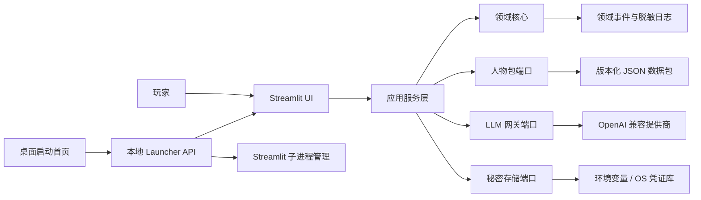
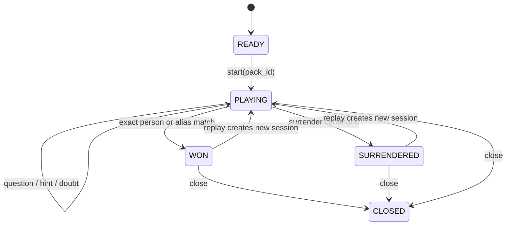
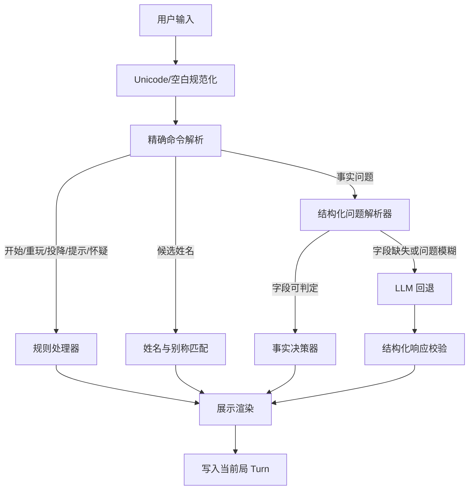

# V4 架构与开发记录（废案）

> **废案声明（2026-07-29）**：V4 因输入理解依赖脆弱的关键词解析、解析失败即调用 LLM、离线降级不完整，以及打包与运行时边界反复暴露问题，已被正式判定为废案。本文只保留历史决策与验收记录，不再作为开发依据；新的权威蓝图见 `ARCHITECTURE.md`（V5）。

> 文档版本：v2.0  
> 目标产品版本：v4（下一代）  
> 基线：当前 v3 仓库审阅结果，2026-07-29  
> 方法：Aria 架构蓝图 + Alex 依赖感知实施计划
> M0 状态：本地基线已建立；外部凭证轮换、干净环境安装和远端 CI 门禁待验收
> M1 状态：已完结（本地 DoD 全部通过）；发布仍受 M0 未关闭门禁约束
> M2 状态：执行中；9/11 项自动化 DoD 完成，黄金集双格式工作流已落地，内容与其驱动的语言验收待双人审校
> M3 状态：执行中；3.1～3.9 工具 DoD 已通过，3.10 等待固定校准集，数据基线漂移已通过规范 v4 重建消除
> M4 状态：已完结（本地 DoD 4.1～4.8 全部通过）；发布仍受 M0、M2 和 M3 外部门禁约束
> M5 状态：执行中；5.1～5.6、5.8 已通过，5.7 已完成本机干净构建与产物验证，等待独立干净 Windows 环境复验

## 1. 执行摘要

下一代版本不应继续复制 `app_*.py`，也不应继续让 Prompt 承担状态机和关键裁决。目标是把项目重构为一个本地优先的模块化单体：

- 核心游戏规则是纯 Python，可在无 Streamlit、无网络、无 LLM 时测试。
- 人物池成员资格与人物事实资料分离，主题包绝不因事实补全而扩大。
- 开局、重玩、投降、猜中、计数、提示资格和可结构化事实问答由确定性代码处理。
- LLM 只处理无法由结构化事实回答的模糊问题，并必须返回受校验的结构化结果。
- 每局拥有独立 `session_id` 和消息范围，旧局不进入新局上下文。
- API Key 不进入源码、网页、日志、构建产物或 Git 历史；桌面启动器按请求向子进程传递独立环境。
- Streamlit 继续作为首个 UI，单 EXE 继续作为首个发行方式，但二者都只是核心应用的适配器。

该方案优先解决当前最影响正确性与发布安全的问题，同时保留渐进迁移路径，不要求一次重写全部 UI 和 1000 人资料。

## 2. 需求基线

### 2.1 必须实现

1. 保留全古代 1000 人、全古代 200 人和明朝 200 人三种模式。
2. 三个人物池的运行时数量必须分别严格等于 1000、200、200。
3. 保留五种普通回答、提示、投降、猜中、重玩和批量复核能力。
4. 同一套核心逻辑服务所有模式，不复制页面业务代码。
5. 支持智谱、DeepSeek、OpenAI、xAI 和自定义 OpenAI 兼容端点。
6. 支持源码运行和 Windows 单 EXE。
7. 支持无真实 API 的完整核心测试。
8. 发布物不得包含可用的内置 LLM Key。

### 2.2 质量目标

- 确定性规则分支单元测试覆盖率不低于 95%。
- 核心包总测试覆盖率不低于 85%。
- 所有人物包通过 Schema、唯一性、成员数量和引用完整性校验。
- 普通回答在输出边界只能是规定枚举或明确的结算/提示模板。
- 一局结束后，新局 LLM 上下文中不得出现上一局消息。
- 同一模式更换提供商配置后，不得复用旧配置进程。
- 日志中不得出现 Authorization 头、API Key 或完整请求载荷。
- 发布黄金问答集不少于 500 条，确定性分支准确率和规范输出合规率必须达到 100%。
- LLM 回退在人工裁定测试集上的选择性准确率不低于 98%，明确“是/否”的自信错答率不高于 0.5%。
- 准确率、回答覆盖率和保守拒答率必须分别报告，禁止通过大量拒答虚增准确率。

### 2.3 非目标

- v4 首发不建设云端多用户平台。
- 不引入微服务、消息队列或远程数据库。
- 不要求首发前把 1000 人全部补成完整结构化资料。
- 不承诺兼容旧 HTA、旧 Dify 工作流或 `legacy/` 入口。
- 不在首发中实现欧洲人物包，但架构允许后续增加。

### 2.4 默认假设

- 首发平台为 Windows 10/11 x64。
- 源码开发基线为 Python 3.12；其他版本由 CI 结果决定是否支持。
- 游戏记录默认只存在当前进程内，不长期保存。
- 人物资料使用版本化本地数据包，不引入数据库。
- 1000 人包允许“200 人结构化 + 800 人仅姓名”的渐进状态；缺少事实时走受控 LLM 回退。

## 3. 架构决策记录

### ADR-001：模块化单体，而非微服务

选择模块化单体。项目是本地桌面游戏，进程和数据规模很小；清晰模块边界已经足够，微服务只会增加部署、网络和调试成本。

### ADR-002：端口/适配器分层

核心领域只暴露接口，不依赖 Streamlit、Requests、文件系统或 `http.server`。UI、LLM、数据包、秘密存储和桌面进程都通过适配器接入，以便独立测试和替换。

### ADR-003：人物包与人物目录分离

“人物包”只保存允许参与某模式的 `person_id`；“人物目录”保存事实。补全事实不得改变人物包成员，这是修复明朝 377 人问题的结构性措施。

### ADR-004：无数据库的版本化数据文件

首发使用 UTF-8 JSON/JSONL 和 JSON Schema。人物规模小、主要是只读内容，数据库没有明显收益。若未来需要跨局统计，再以独立 ADR 引入 SQLite。

### ADR-005：确定性优先、LLM 回退

命令、状态、姓名匹配和结构化事实优先由代码裁决；只有无法确定的开放问题进入 LLM。LLM 返回内部结构化决策，展示层再渲染为允许文本。

### ADR-006：单一应用入口

保留一个 `app.py`，模式由配置或查询参数选择。删除当前三个近乎重复的页面入口，启动首页只传 `pack_id`。

### ADR-007：无内置客户端凭证

不在 HTML、Python、环境默认值或 EXE 中携带演示 Key。用户凭证来自手动输入、进程环境或操作系统凭证库；日志统一脱敏。

### ADR-008：同步 LLM 网关作为首发实现

首发保持同步请求，避免为当前交互量引入异步复杂度。网关接口预留取消和流式能力，但不作为 v4 首发阻塞项。

## 4. 目标系统上下文



## 5. 分层与依赖规则

```text
presentation  ─┐
launcher      ─┼─> application ─> domain
adapters      ─┘        │
                        └─> ports <─ adapters
```

### 5.1 `domain`

包含实体、值对象、状态机、命令解析、确定性判定和领域错误。只能依赖 Python 标准库及本层代码。

### 5.2 `application`

编排用例，例如创建游戏、处理输入、生成提示、批量复核和结束游戏。可依赖 `domain` 与 `ports`，不能依赖具体 UI 或网络实现。

### 5.3 `ports`

定义人物仓库、LLM 网关、秘密提供者、时钟、随机数和日志接口。接口不得泄漏 Requests、Streamlit 等实现类型。

### 5.4 `adapters`

实现 JSON 数据包、OpenAI 兼容 HTTP、环境变量、OS keyring、系统随机数等外部能力。

### 5.5 `presentation`

负责 Streamlit 状态映射、组件、文案和渲染，不直接读取人物文件或调用 HTTP。

### 5.6 `launcher`

负责本地 HTTP 协议、进程注册、端口、日志目录和浏览器。它只能通过受控命令启动 presentation 入口，不导入游戏业务逻辑。

### 5.7 强制导入规则

- `domain` 不得导入其他层。
- `application` 不得导入 `presentation`、`launcher` 或 `adapters`。
- `presentation` 不得直接导入 `requests`、`people_db` 或文件路径。
- `adapters` 通过 `ports` 满足接口，不反向控制用例。
- 所有模式差异必须来自数据包或配置，不得复制应用入口。

## 6. 领域模型

### 6.1 `Person`

| 字段 | 类型 | 约束 |
| --- | --- | --- |
| `id` | `str` | 必填，稳定 slug，全目录唯一 |
| `canonical_name` | `str` | 必填，去首尾空白 |
| `aliases` | `list[Alias]` | 默认空，规范化值在同一人物内唯一 |
| `summary` | `str | None` | 最长 300 字 |
| `facts` | `list[Fact]` | 默认空 |
| `schema_version` | `int` | 必须为受支持版本 |

### 6.2 `Alias`

| 字段 | 类型 | 说明 |
| --- | --- | --- |
| `value` | `str` | 别称文本 |
| `kind` | `name | courtesy | art_name | temple | era | title | other` | 别称类型 |
| `normalized` | `str` | 用于确定性匹配 |

### 6.3 `Fact`

| 字段 | 类型 | 约束 |
| --- | --- | --- |
| `key` | `FactKey` | 如 `period`、`gender`、`identity`、`title`、`birth_year` |
| `value` | JSON 标量或数组 | 必填 |
| `normalized_values` | `list[str]` | 用于比较 |
| `confidence` | `confirmed | probable | disputed` | 必填 |
| `source_ids` | `list[str]` | `confirmed` 至少一个来源；迁移期可标记待补 |
| `note` | `str | None` | 争议或边界说明 |

### 6.4 `Source`

| 字段 | 类型 | 约束 |
| --- | --- | --- |
| `id` | `str` | 全局唯一 |
| `title` | `str` | 必填 |
| `locator` | `str | None` | URL、ISBN、书名卷次等 |
| `publisher` | `str | None` | 可选 |
| `accessed_at` | ISO 日期或 `None` | 网络来源使用 |

### 6.5 `DataPack`

| 字段 | 类型 | 约束 |
| --- | --- | --- |
| `id` | `str` | 如 `china_all_1000` |
| `version` | SemVer 字符串 | 必填 |
| `display_name` | `str` | 必填 |
| `theme` | `str` | 注入角色描述 |
| `person_ids` | `list[str]` | 不重复且全部引用存在人物 |
| `expected_count` | `int` | 必须等于 `person_ids` 长度 |
| `default_locale` | `zh-CN` | 首发固定 |

### 6.6 `GameSession`

| 字段 | 类型 | 约束 |
| --- | --- | --- |
| `id` | UUID | 每局新建 |
| `pack_id` | `str` | 必须存在 |
| `target_person_id` | `str` | 必须属于该包 |
| `phase` | `READY | PLAYING | WON | SURRENDERED | CLOSED` | 必填 |
| `valid_question_count` | 非负整数 | 只统计事实问题 |
| `hint_keys_used` | `set[str]` | 防止同维度重复 |
| `turns` | `list[Turn]` | 仅当前局 |
| `started_at` | UTC 时间 | 必填 |
| `ended_at` | UTC 时间或 `None` | 结束时填写 |

### 6.7 `Turn`

| 字段 | 类型 | 说明 |
| --- | --- | --- |
| `id` | UUID | 本局唯一 |
| `kind` | `START | QUESTION | GUESS | HINT | DOUBT | SURRENDER | REPLAY | CHAT` | 输入意图 |
| `user_text` | `str` | 原始输入 |
| `answer` | `CanonicalAnswer | None` | 普通事实问答使用 |
| `decision_source` | `RULE | FACT | LLM | SYSTEM` | 决策来源 |
| `fact_refs` | `list[str]` | 使用的事实键/标识 |
| `evidence_refs` | `list[str]` | 实际支持结论的证据标识 |
| `confidence` | `float | None` | 0～1；规则与已确认事实可为 1 |
| `verification` | `NOT_REQUIRED | PASSED | DEGRADED | FAILED` | 验证结果 |
| `display_text` | `str` | 最终展示文本 |
| `created_at` | UTC 时间 | 必填 |

### 6.8 `CanonicalAnswer`

内部枚举：

```text
YES
NO
PROBABLY_YES
PROBABLY_NO
REFUSE_REPHRASE
```

中文展示层映射到现有五种文本，领域层不保存带标点的 UI 字符串。

### 6.9 `LLMProfile`

| 字段 | 类型 | 约束 |
| --- | --- | --- |
| `provider_id` | `zhipu | deepseek | openai | xai | custom` | 必填 |
| `base_url` | HTTPS URL | 本机开发端点需显式开启 |
| `model` | `str` | 必填 |
| `secret_ref` | `str` | 引用秘密，不包含 Key |
| `timeout_seconds` | `int` | 1～120 |
| `max_retries` | `int` | 0～5 |

## 7. 游戏状态机



关键不变量：

- `target_person_id` 必须属于 `pack.person_ids`。
- 只有 `QUESTION` 增加 `valid_question_count`。
- `HINT`、`DOUBT`、`GUESS`、`SURRENDER`、`REPLAY` 不增加次数。
- `REPLAY` 创建新的 `GameSession.id`，不修改旧局对象。
- `WON` 和 `SURRENDERED` 后不再接受游戏事实问题；只允许重玩、关闭或明确的一般聊天适配。
- 领域层不从 LLM 文本推断胜利状态。

## 8. 输入决策流水线



优先级固定为：

1. 空输入与长度校验；
2. 精确系统命令；
3. 姓名/别称猜测；
4. 可结构化事实问题；
5. LLM 回退；
6. 输出枚举与模板渲染。

LLM 不得直接修改会话阶段，也不得直接返回可展示的任意文本作为普通答案。

## 9. LLM 端口契约

```python
class LLMGateway(Protocol):
    def decide(self, request: DecisionRequest) -> DecisionResult: ...
    def generate_hint(self, request: HintRequest) -> HintResult: ...
    def recheck(self, request: RecheckRequest) -> RecheckResult: ...
```

`DecisionResult` 必须包含：

```json
{
  "answer": "YES | NO | PROBABLY_YES | PROBABLY_NO | REFUSE_REPHRASE",
  "confidence": 0.0,
  "reason_code": "short_machine_code"
}
```

约束：

- `reason_code` 和推理仅用于调试与复核，不直接展示。
- Schema 不合法时最多进行一次格式修复请求；再次失败返回受控错误，不猜测答案。
- 网络与服务错误转为统一 `GatewayError`，UI 显示不泄露响应体的用户消息。
- 429、5xx、连接错误可重试；其他 4xx 不重试。
- 所有日志在写入前移除 Key、Authorization、Cookie 和请求消息正文。

## 10. 人物数据包格式

建议目录：

```text
data/
├─ catalog/
│  ├─ people.jsonl
│  ├─ sources.json
│  └─ schema/
│     ├─ person.schema.json
│     └─ source.schema.json
└─ packs/
   ├─ china_all_1000/
   │  └─ manifest.json
   ├─ china_famous_200/
   │  └─ manifest.json
   └─ ming_200/
      └─ manifest.json
```

`manifest.json` 示例：

```json
{
  "schema_version": 1,
  "id": "ming_200",
  "version": "1.0.0",
  "display_name": "大明王朝 200 人",
  "theme": "明朝历史",
  "expected_count": 200,
  "person_ids": ["zhu-yuanzhang", "zhu-yunwen"]
}
```

校验必须在开发期、测试期和打包前执行；运行时加载失败时禁止悄悄回退为另一个人物池。

## 11. 本地 Launcher API v1

服务只监听 `127.0.0.1`，响应统一使用 JSON；首页静态资源不需要认证。所有改变进程状态的接口要求同源请求，并校验启动时生成的短期 CSRF token。

### `GET /api/v1/status`

响应 `200`：

```json
{
  "ok": true,
  "version": "4.0.0",
  "runtime_dir": "...",
  "processes": [
    {
      "pack_id": "ming_200",
      "port": 8501,
      "state": "running",
      "profile_fingerprint": "sha256:..."
    }
  ]
}
```

### `GET /api/v1/packs`

响应 `200`：

```json
{
  "items": [
    {
      "id": "ming_200",
      "display_name": "大明王朝 200 人",
      "expected_count": 200,
      "available": true
    }
  ]
}
```

### `POST /api/v1/processes`

请求：

```json
{
  "pack_id": "ming_200",
  "profile": {
    "provider_id": "zhipu",
    "base_url": "https://example.com/v1/chat/completions",
    "model": "model-name"
  },
  "api_key": "write-only"
}
```

响应：

- `201`：新进程已启动；
- `200`：相同配置进程已存在；
- `409`：同一人物包已有不同配置进程，客户端应选择重启；
- `422`：请求或人物包无效；
- `503`：进程未在期限内就绪。

Key 只用于创建子进程环境，不保存到进程注册信息或响应。

### `DELETE /api/v1/processes/{pack_id}`

响应：

- `204`：进程已停止；
- `404`：没有该人物包进程。

### 统一错误格式

```json
{
  "error": {
    "code": "PACK_NOT_FOUND",
    "message": "可展示的简短信息",
    "request_id": "uuid"
  }
}
```

## 12. 目标目录结构

```text
src/guess_history/
├─ domain/
│  ├─ models.py
│  ├─ enums.py
│  ├─ errors.py
│  ├─ llm_models.py
│  ├─ evidence_validation.py
│  ├─ verification.py
│  ├─ calibration.py
│  ├─ state_machine.py
│  ├─ commands.py
│  ├─ name_matcher.py
│  ├─ fact_parser.py
│  ├─ fact_decider.py
│  └─ answer_renderer.py
├─ application/
│  ├─ dto.py
│  ├─ decision_service.py
│  ├─ recheck_game.py
│  ├─ create_game.py
│  ├─ handle_turn.py
│  ├─ give_hint.py
│  └─ recheck_game.py
├─ ports/
│  ├─ people_repository.py
│  ├─ llm_gateway.py
│  ├─ secret_provider.py
│  ├─ clock.py
│  └─ random_source.py
├─ contracts/
│  └─ llm_gateway.schema.json
├─ adapters/
│  ├─ data_packs/
│  │  ├─ repository.py
│  │  └─ validation.py
│  ├─ llm/
│  │  ├─ openai_compatible.py
│  │  ├─ schemas.py
│  │  └─ retry.py
│  ├─ secrets/
│  │  ├─ environment.py
│  │  └─ keyring_store.py
│  └─ system/
│     ├─ clock.py
│     └─ random_source.py
├─ presentation/
│  └─ streamlit/
│     ├─ app.py
│     ├─ session_mapper.py
│     ├─ sidebar.py
│     └─ views.py
├─ launcher/
│  ├─ server.py
│  ├─ contracts.py
│  ├─ process_manager.py
│  ├─ health.py
│  └─ main.py
├─ config.py
└─ logging_config.py

data/
frontend/
tests/
├─ unit/
├─ contract/
├─ integration/
├─ data/
└─ smoke/
```

`pyproject.toml` 统一声明依赖、测试、静态检查和构建配置。仓库根 `app.py` 可作为短小兼容入口，只导入新的 Streamlit main。

## 13. 安全架构

### 13.1 秘密

- 禁止默认 Key、XOR Key 和演示凭证。
- `api_key` 只存在于输入控件内存和目标子进程环境。
- 可选使用 OS keyring 保存 `secret_ref` 对应的 Key。
- 异常、遥测和健康接口不得返回环境内容。
- CI 对当前工作树和 Git 历史执行秘密扫描。

### 13.2 输入验证

- 用户文本限制长度并去除控制字符。
- `pack_id`、`provider_id`、模型名使用白名单或格式约束。
- 自定义 URL 默认要求 HTTPS；允许本机 HTTP 必须打开开发选项。
- Launcher 不接受脚本路径，只接受已注册 `pack_id`。
- 所有数据包在使用前通过 JSON Schema。

### 13.3 本地 HTTP

- 只绑定 loopback。
- 改变进程状态的请求需要同源与 CSRF token。
- 设置严格 CSP，不加载远程脚本；字体改为本地或系统字体。
- 响应不反射未转义用户输入。
- 子进程参数使用列表传给 `Popen`，不经过 shell。

### 13.4 LLM 风险

- 人物事实和系统指令与玩家文本分字段传递。
- 玩家文本永不拼进系统模板源代码。
- 输出必须过 Schema 与枚举校验。
- Prompt 注入不能越过领域状态机公布答案。
- 自定义端点 UI 明确提示 Key 将发送到该地址。

## 14. 错误、日志与可观测性

统一错误层级：

```text
DomainError
ApplicationError
DataPackError
GatewayError
LauncherError
```

规则：

- 领域错误可安全展示，不包含技术细节。
- 适配器错误保留 `request_id` 和脱敏上下文。
- UI 展示简短说明及日志位置。
- JSON 结构化日志至少包含时间、级别、组件、事件、session_id、request_id。
- 不记录目标人物到普通 INFO 日志；仅在显式开发模式下记录，并明确标记敏感。
- 记录 LLM 延迟、重试次数、错误类别和决策来源，不记录完整消息正文。

关键指标：

- 开局成功率；
- 每种 `decision_source` 占比；
- LLM 请求成功率和 P95 延迟；
- 非法模型响应率；
- 数据包校验失败数；
- 进程启动与健康超时数。

## 15. 缓存策略

- 人物目录和包 manifest 在进程内按文件内容哈希缓存。
- 数据文件变化时使缓存失效；发行版运行时文件只读，可缓存到进程结束。
- 不缓存 API Key、完整 LLM 请求或响应。
- Streamlit 只缓存不可变仓库对象，不缓存 `GameSession`。

## 16. 迁移策略

### 16.1 资料迁移

1. 解析 `peoples_names.md` 生成稳定 `person_id`。
2. 解析两个 CSV 生成三个 manifest。
3. 将 `data/people.json` 字段映射为 `Fact`。
4. 为缺少来源的迁移事实标记迁移状态，不伪造引用。
5. 生成迁移报告：数量、重复、孤儿引用、字段覆盖。
6. 用当前名单快照测试保证人物池边界不变。

### 16.2 代码迁移

采用绞杀式迁移：

1. 在现有 UI 后面引入新领域核心。
2. 先让 200 人版走新核心，保留旧实现作为对照。
3. 再迁移 1000 人版和明朝版。
4. 合并到单入口。
5. 替换 launcher 协议与进程管理。
6. 删除旧 v3 重复模块前运行行为对照测试。

### 16.3 兼容

- 旧 `.bat` 可以暂时转发到新单入口和对应 `pack_id`。
- 旧 HTA 与 Dify 文件只归档，不继续兼容。
- 旧 JSON/CSV 只作为迁移输入，不作为 v4 运行时源。

## 17. 关键路径

```text
秘密止血
→ 领域模型与状态机
→ 数据包 Schema 与迁移
→ 黄金问答集与错误基线
→ 确定性决策流水线
→ LLM 结构化网关与证据验证
→ 单 Streamlit UI
→ Launcher v1
→ 精度门禁、打包与端到端验收
```

领域模型、数据包边界和 LLM 输出契约是全项目的三项架构门；它们未稳定前不应大规模重写 UI。

## 18. 里程碑

| 里程碑 | 工作量 | 可交付切片 |
| --- | --- | --- |
| M0：安全与基线 | S | 无可用内置 Key，人物池、错误分类和行为基线可自动验证 |
| M1：领域内核 | L | 无 UI、无网络即可完整玩一局确定性流程 |
| M2：数据包系统 | L | 三个包严格加载 1000/200/200，事实来源与黄金集通过校验 |
| M3：LLM 网关 | L | 模糊问题经证据约束、独立复核和置信度策略回答 |
| M4：单一 Streamlit 应用 | L | 三模式共用一个 UI，跨局隔离且功能完整 |
| M5：Launcher 与 EXE | L | 配置隔离、可停止重启、构建后可运行 |
| M6：发布质量 | L | 精度门禁、CI、秘密扫描、集成/烟雾测试和发布文档完成 |

## 19. 实施清单

标签：`[LOW|MED|HIGH]` 为复杂度，`[SEC]` 为安全敏感，`[EXT]` 为外部服务。

### M0：安全与基线

- [ ] **0.1 [SEC] 凭证清点与轮换**：轮换所有曾进入源码、HTML、HTA、EXE 或 Git 历史的 Key。DoD：秘密扫描不再识别任何有效凭证，旧 Key 在提供商侧全部失效。`[MED] [EXT]`
- [x] **0.2 [SEC] 删除内置凭证路径**：移除 XOR、默认 Key 和“已内置”UI。DoD：从源码和构建产物无法恢复任何可调用提供商的 Key。`[MED]`
- [x] **0.3 建立当前行为基线**：保存三个人物池、关键 Prompt 和核心交互的快照测试。DoD：测试能稳定复现当前 1000/200/377 数据事实及已知行为，修复后可有意更新。`[MED]`
- [ ] **0.4 建立工程配置**：创建 `pyproject.toml`，声明 Python、运行、开发和构建依赖。DoD：干净环境可用一条安装命令运行测试。`[LOW]`
- [ ] **0.5 建立 CI 基线**：运行单测、格式、静态检查、数据校验和秘密扫描。DoD：每个合并请求都会执行全部基线检查且失败会阻止合并。`[MED] [SEC]`
- [x] **0.6 建立精度基线与错误分类**：定义事实错误、解析错误、上下文污染、证据不足、格式错误和合理争议六类结果。DoD：当前版本在固定样本上的每个失败都能唯一归入一种主错误类别并生成基线报告。`[MED]`

### M1：领域内核

- [x] **1.1 定义领域枚举与错误**。DoD：状态、输入意图、规范答案、决策来源和领域错误均有唯一类型且无 UI 文案。`[LOW]`
- [x] **1.2 定义 `GameSession` 与 `Turn`**。DoD：模型强制每局独立 ID、合法阶段和非负问题数。`[MED]`
- [x] **1.3 实现状态机**。DoD：非法阶段转换抛出领域错误，全部合法转换有单元测试。`[MED]`
- [x] **1.4 实现精确命令解析**。DoD：“开始做官”等普通问题不会触发开始命令，所有系统命令有表驱动测试。`[MED]`
- [x] **1.5 实现姓名与别称匹配**。DoD：规范姓名和登记别称可确定性猜中，错误姓名不会改变阶段。`[MED]`
- [x] **1.6 实现有效问题计数规则**。DoD：只有 `QUESTION` 增加计数，提示、猜测、怀疑、投降和重玩均不增加。`[LOW]`
- [x] **1.7 实现提示资格与维度去重**。DoD：第 6 个有效问题后才可提示，同一事实维度在一局内不会重复。`[MED]`
- [x] **1.8 实现规范答案渲染**。DoD：普通问答只能渲染五种中文规范文本之一。`[LOW]`
- [x] **1.9 实现新局隔离**。DoD：重玩创建新 session，传给决策器的历史不含上一局 Turn。`[MED]`

### M2：数据包系统

- [x] **2.1 定义 Person、Fact、Source 和 DataPack Schema**。DoD：合法样例通过、缺字段/错类型/孤儿引用样例失败。`[HIGH]`
- [x] **2.2 实现只读人物仓库端口**。DoD：应用层可按 `person_id`、姓名和 `pack_id` 查询且不知道文件格式。`[MED]`
- [x] **2.3 编写旧数据迁移器**。DoD：MD、两个 CSV 和 JSON 可重复生成同一规范化输出。`[HIGH]`
- [x] **2.4 生成三个 manifest**。DoD：包校验结果严格为 1000、200、200 且无重复或孤儿 ID。`[MED]`
- [x] **2.5 实现数据校验 CLI**。DoD：一条命令输出机器可读报告并在任何错误时返回非零退出码。`[MED]`
- [x] **2.6 实现结构化问题解析器第一版**。DoD：性别、时期/朝代、身份、头衔和生卒年问题有可验证解析结果。`[HIGH]`
- [x] **2.7 实现事实决策器**。DoD：对已覆盖字段无需 LLM 即可返回答案、置信度和事实引用。`[HIGH]`
- [x] **2.8 建立人物包回归测试**。DoD：任何成员增删都必须显式更新版本和审批快照。`[LOW]`
- [ ] **2.9 建立人工黄金问答集**。DoD：至少 500 条经双人复核的问题覆盖不少于 100 人，并包含正例、反例、别称、语言陷阱、争议事实和注入攻击。`[HIGH]`
- [ ] **2.10 加固语言规范化与否定解析**。DoD：否定句、双重否定、反问、朝代简称和别称变体全部通过对应黄金用例。`[HIGH]`
- [x] **2.11 建立事实来源治理**。DoD：所有新增 `confirmed` 事实至少引用一个可定位来源，缺少来源的迁移事实不能进入确定性“是/否”分支。`[MED]`

### M3：LLM 网关

- [ ] **3.1 定义 LLM 端口 DTO 与 JSON Schema**。DoD：网关请求和响应不包含 UI/Requests 类型，非法答案枚举被拒绝。`[MED]`
- [ ] **3.2 实现 OpenAI 兼容适配器**。DoD：四个预设提供商和自定义 HTTPS 端点通过 mock 合同测试。`[HIGH] [EXT]`
- [ ] **3.3 集中重试与错误映射**。DoD：429/5xx/连接错误按策略重试，其他 4xx 不重试且全部转为统一错误。`[MED] [EXT]`
- [ ] **3.4 实现响应格式修复**。DoD：首次非法 Schema 只修复一次，第二次失败返回受控错误。`[MED] [EXT]`
- [ ] **3.5 实现 LLM 回退决策**。DoD：只有结构化解析无法处理的输入会调用网关。`[MED]`
- [ ] **3.6 重构批量复核**。DoD：复核只覆盖当前 session，确定性决策本地重算，LLM 决策按批复核。`[HIGH] [EXT]`
- [ ] **3.7 实现日志脱敏**。DoD：自动测试证明 Key、Authorization 和消息正文不出现在日志。`[MED] [SEC]`
- [ ] **3.8 实现证据绑定校验器**。DoD：LLM 引用不存在、无关或不支持结论的证据时，候选答案无法进入展示层。`[HIGH]`
- [ ] **3.9 实现独立复核策略**。DoD：LLM 候选答案会先经过代码一致性检查，必要时再用隔离上下文或第二模型复核，任何分歧都会降级而非投票硬选。`[HIGH] [EXT]`
- [ ] **3.10 校准置信度与降级策略**。DoD：固定验证集上每个置信度区间都有统计报告，未达阈值的“是/否”自动降为“或许”或拒答。`[HIGH]`

### M4：单一 Streamlit 应用

- [x] **4.1 建立应用用例层**。DoD：创建游戏、处理回合、提示和复核均可通过无 UI 测试调用。`[HIGH]`
- [x] **4.2 建立 Streamlit session 映射器**。DoD：刷新页面不会破坏当前局，重玩会切换到新 session。`[MED]`
- [x] **4.3 合并三套入口**。DoD：一个应用通过 `pack_id` 启动三种模式且没有复制业务分支。`[HIGH]`
- [x] **4.4 重做玩家界面状态**。DoD：生产模式不显示目标人物，开发调试面板需显式开启。`[MED] [SEC]`
- [x] **4.5 接入结构化错误与进度**。DoD：LLM、数据和复核错误均有可恢复 UI，且不展示敏感响应体。`[MED]`
- [x] **4.6 添加当前局历史与清空行为**。DoD：UI 可查看历史局，但发送给决策器的只包含当前局。`[MED]`
- [x] **4.7 Streamlit 烟雾测试**。DoD：自动测试覆盖开局、六次提问、提示、猜中和重玩主路径。`[HIGH]`
- [x] **4.8 添加开发态决策诊断**。DoD：显式开发模式可查看决策来源、证据、置信度和验证状态，生产模式完全隐藏目标与内部依据。`[MED] [SEC]`

### M5：Launcher 与 EXE

- [x] **5.1 定义 Launcher v1 合同**。DoD：状态、包列表、启动和停止接口通过 Schema 合同测试。`[MED]`
- [x] **5.2 [SEC] 重写进程环境传递**。DoD：每个 `Popen` 使用独立 env，父进程全局环境从不写入请求 Key。`[HIGH]`
- [x] **5.3 实现配置指纹与冲突处理**。DoD：相同配置复用，不同配置返回 409 或按用户选择重启。`[MED]`
- [x] **5.4 实现可靠健康检查**。DoD：脚本导入崩溃、提前退出和启动超时都能被自动测试识别。`[HIGH]`
- [x] **5.5 [SEC] 加固本地 HTTP**。DoD：服务只绑定 loopback，状态变更需要同源 CSRF token，脚本路径无法由请求控制。`[HIGH]`
- [x] **5.6 更新启动首页**。DoD：首页从包接口渲染模式，不含凭证或远程脚本，并可停止/重启进程。`[MED]`
- [ ] **5.7 重建 PyInstaller 配置**。DoD：干净 Windows 环境构建成功，三个人物包和 Schema 全部包含。`[HIGH]`
- [x] **5.8 EXE 生命周期测试**。DoD：启动、切换模式、配置冲突、停止和主进程退出回收全部通过。`[HIGH]`

### M6：发布质量

- [ ] **6.1 建立跨层测试矩阵**。DoD：unit、contract、integration、data、smoke 五类测试可分别和整体运行。`[MED]`
- [ ] **6.2 建立发行验收脚本**。DoD：一条命令完成数据校验、测试、秘密扫描、构建和产物检查。`[HIGH] [SEC]`
- [ ] **6.3 更新中英文用户与开发文档**。DoD：安装、配置、源码运行、构建、故障排查和数据贡献均有同步双语说明。`[MED]`
- [ ] **6.4 归档旧资产**。DoD：根目录不再包含可误启动的 v1/v2/HTA 文件，legacy README 明确安全风险。`[LOW]`
- [ ] **6.5 发布候选验收**。DoD：在无 Python 的 Windows 测试机上完成三模式全流程且没有严重日志或进程残留。`[HIGH]`
- [ ] **6.6 执行精度发布门禁**。DoD：黄金集确定性分支与格式合规率为 100%，LLM 回退选择性准确率至少 98%，自信错答率不高于 0.5%，并同时公布回答覆盖率。`[HIGH] [EXT]`
- [ ] **6.7 建立错误复盘闭环**。DoD：每个确认错答都能形成匿名化复现用例、根因类别、修复提交和防回归测试后才关闭。`[MED]`

## 20. 测试策略

| 层 | 测试类型 | 必测内容 |
| --- | --- | --- |
| Domain | 单元 + 属性测试 | 状态转换、命令歧义、计数、不变量、姓名匹配 |
| Data | Schema + 快照 | 数量、唯一性、引用、迁移可重复性 |
| Application | 用例测试 | 当前局隔离、回退条件、复核范围 |
| LLM Adapter | 合同 + mock | 提供商请求、重试、非法响应、脱敏 |
| Streamlit | 烟雾 | 主用户路径与错误恢复 |
| Launcher | 集成 | 端口、进程、配置冲突、CSRF、回收 |
| Package | Windows E2E | 无 Python 环境启动与三模式 |

真实 LLM 测试不进入每次 CI；使用录制后脱敏的合同样例。发布前可在受控预算下运行可选 provider smoke。

精度评测必须同时报告：

- **总体准确率**：全部人工裁定样本中回答正确的比例；
- **选择性准确率**：排除合理拒答后，实际给出判断的样本正确率；
- **回答覆盖率**：未拒答样本占全部样本的比例；
- **自信错答率**：错误的 `YES/NO` 占全部已回答样本的比例；
- **保守降级率**：从候选 `YES/NO` 降为“或许”或拒答的比例；
- **证据有效率**：所有展示答案中，证据引用存在且真正支持结论的比例。

## 21. 风险与缓解

| 风险 | 影响 | 缓解 |
| --- | --- | --- |
| 1000 人缺少结构化事实 | LLM 回退比例高 | 按高频人物逐步补全，记录决策来源 |
| 历史资料存在争议 | 确定性回答过度自信 | `confidence=disputed` 时返回“或许”并保留说明 |
| Prompt 供应商差异 | Schema 遵循不一致 | 合同测试、一次格式修复、受控失败 |
| PyInstaller 体积大 | 构建慢、下载大 | 最小化 collect、固定依赖、分析产物 |
| 迁移改变人物标识 | 包引用失效 | 稳定 slug 映射和迁移快照 |
| Streamlit 状态模型限制 | 多局历史复杂 | 领域 session 为权威，UI 状态仅映射 |

## 22. 决策门

以下选择不阻塞 M0～M2，但必须在对应里程碑前确定：

1. **是否长期保存游戏历史**：推荐 v4 首发不保存；若需要，另行设计 SQLite 与隐私清理。
2. **是否支持本机 HTTP 自定义 LLM**：推荐仅在开发模式允许。
3. **是否提供一般聊天模式**：推荐胜利后只提示重玩，首发不扩展通用聊天。
4. **是否首发使用 OS keyring**：推荐作为可选功能，环境变量和单次输入为必选基线。
5. **1000 人资料完成度门槛**：推荐不阻塞架构发布，但在 UI 标明事实覆盖等级。

## 23. 发布完成定义

v4 只有同时满足以下条件才算完成：

- 三个人物包严格为 1000、200、200；
- 仓库、前端、日志和 EXE 不含有效凭证；
- 一局所有状态转换由领域层决定；
- 普通问题输出经过枚举校验；
- 确定性黄金集准确率与规范输出合规率达到 100%；
- LLM 回退达到至少 98% 选择性准确率、自信错答率不高于 0.5%，且回答覆盖率单独达标和披露；
- 所有非规则答案具有有效证据引用与验证状态；
- 新局上下文与旧局完全隔离；
- LLM 只作为明确回退且失败可恢复；
- 一个 Streamlit 入口服务所有人物包；
- Launcher 可识别配置冲突并安全管理进程；
- 自动测试、数据校验、秘密扫描和 Windows E2E 全部通过；
- 中英文运行、架构和发布文档同步。

## 24. 实施与评审交接说明

### 给实现者

- 严格按 M0 → M6 推进；M1/M2/M3 的契约稳定前不要先复制或重写 UI。
- 每个任务只提交其编号范围内的原子变化，并在合并请求中逐字引用对应 DoD。
- 迁移期间把旧实现当作行为对照，不要让新领域层依赖旧模块。
- 所有外部依赖通过端口注入；测试不得依赖真实时间、真实随机数或真实 LLM。
- 删除旧文件应放在新路径通过对照测试之后的独立提交中。

### 给代码评审者

- 检查依赖方向，尤其禁止 `domain` 导入 Streamlit、Requests 或文件系统适配器。
- 检查任何人物包加载是否可能追加 manifest 之外的人物。
- 检查状态变化是否来自领域命令，而不是模型文本或 UI 字符串搜索。
- 检查秘密是否可能进入全局环境、日志、异常、健康接口或构建资源。
- 检查每项 DoD 是否由自动测试或明确的发布验收证据证明。

### 架构变更控制

以下变化必须新增 ADR，并同步更新中英文文档：

- 引入数据库、云后端或多用户身份系统；
- 改变人物包成员语义或 `person_id` 规则；
- 让 LLM 获得状态转换权；
- 增加新的本地 HTTP 权限边界；
- 改变秘密的保存位置或生命周期；
- 改变首发平台或打包技术。

## 25. 严谨性与准确性保障计划

### 25.1 原则：减少错误，而不是隐藏错误

系统不得用大量“无可奉告”制造虚假高准确率。准确率和覆盖率必须同时考核；无法可靠回答时允许保守降级，但每次降级都要有机器可识别的原因。

### 25.2 三级裁决政策

| 等级 | 条件 | 允许输出 | 是否需要 LLM |
| --- | --- | --- | --- |
| A：确定性 | 精确规则或 `confirmed` 结构化事实直接支持 | `YES` / `NO` | 否 |
| B：有依据但不确定 | `probable/disputed` 事实，或证据存在边界 | `PROBABLY_YES` / `PROBABLY_NO` | 可选 |
| C：证据不足或歧义 | 没有支持事实、问题多义、复核冲突 | `REFUSE_REPHRASE` | 可选 |

只有 A 级允许无保留地回答“是/否”。LLM 自身置信度不能把 B/C 级提升为 A 级。

### 25.3 四道输出门

```mermaid
flowchart LR
    Candidate["候选答案"] --> Schema["1. Schema/枚举校验"]
    Schema --> Evidence["2. 证据绑定校验"]
    Evidence --> Consistency["3. 规则与历史一致性检查"]
    Consistency --> Policy["4. 置信度与降级策略"]
    Policy --> Display["展示答案"]
    Schema -->|失败| Safe["受控错误/拒答"]
    Evidence -->|失败| Safe
    Consistency -->|冲突| Safe
```



1. **格式门**：答案必须属于内部枚举，字段类型完整。
2. **证据门**：事实或检索证据必须存在、与目标人物一致并能支持结论。
3. **一致性门**：不得与确定性事实、当前阶段和本局已确认回答矛盾。
4. **策略门**：按事实置信度、模型校准和复核结果决定保留、降级或拒答。

### 25.4 独立复核规则

- 确定性规则不交给模型“投票”，只重新运行相同纯函数并核对输入。
- LLM 候选先与结构化事实交叉验证。
- 只有事实库不能判定时，才可使用隔离上下文或不同模型复核。
- 两个模型一致不等于事实成立；仍必须满足证据门。
- 任意复核冲突都降级为“或许”或“换个问法”，不得多数票强行输出“是/否”。

### 25.5 黄金问答集最低组成

首个发布集不少于 500 条、覆盖不少于 100 位人物：

| 类别 | 最低数量 |
| --- | ---: |
| 直接结构化正例 | 100 |
| 直接结构化反例 | 100 |
| 姓名、字、号、庙号和异体变体 | 75 |
| 否定、双重否定、反问和歧义表达 | 75 |
| 固定头衔、人物关系与朝代边界 | 75 |
| 争议事实、资料缺失与合理拒答 | 50 |
| Prompt 注入、跨局污染和格式攻击 | 25 |

每条样本包含目标人物、人物包、问题、允许答案集合、事实/来源引用、审校人和审校日期。争议问题可以拥有多个允许的保守答案，但不得把唯一结论伪装成争议。

### 25.6 回归与上线后闭环

```text
发现错答
→ 匿名化并最小化复现
→ 标记错误类别与 decision_source
→ 判断是数据、解析、规则、LLM、上下文还是渲染问题
→ 修复最底层根因
→ 添加黄金/回归用例
→ 全量精度门禁
→ 才能关闭问题
```

上线后只收集经用户同意的脱敏指标。默认不保存完整问题文本；可保存错误类别、人物包、决策来源、证据 ID、置信度区间和模型配置指纹。

### 25.7 不保证事项

系统不能保证所有开放历史问题绝对无错，尤其是：

- 学界有真实争议的事实；
- 人物资料尚未结构化的长尾问题；
- 用户问题本身存在多种解释；
- 外部 LLM 服务行为变化。

工程承诺是：覆盖范围内确定性正确；覆盖范围外有证据才回答；证据不足时明确降级；每个确认错误都进入可复现的防回归闭环。

## 26. M0 执行与验收记录

最后本地验证：2026-07-28，Python 3.14。

| 任务 | 状态 | 已取得证据 | 关闭条件 |
| --- | --- | --- | --- |
| 0.1 凭证清点与轮换 | 外部阻塞 | 当前工作树脱敏扫描通过；泄露机制和处置步骤已记录 | 仓库所有者确认旧 Key 已吊销、账单/调用日志已审阅，并决定 Git 历史处置方案 |
| 0.2 删除内置凭证路径 | 完成 | 15 个现行/历史源文件中的明文默认值、XOR 载荷、解密器、内置标志及回退分支已删除；旧 `build/build_exe` 与 `dist/GuessHistory.exe` 已删除 | 新构建前再次运行秘密扫描与完整测试 |
| 0.3 当前行为基线 | 完成 | 自动验证 1000/200/377 三个人物池、4 个 Prompt 摘要快照、19 个交互分类样例和 4 个提示阈值样例 | 任何有意行为变化必须同时审阅并更新基线 |
| 0.4 工程配置 | 进行中 | `pyproject.toml` 可解析，已声明 Python、运行、开发与构建依赖 | 在干净 Python 3.12 环境执行 `python -m pip install -e ".[dev]"` 并跑通全部门禁 |
| 0.5 CI 基线 | 进行中 | 已添加 PR/push CI、当前树扫描和定时全历史扫描工作流 | 在远端完成一次绿色运行，并启用“CI 成功后才能合并”的分支保护 |
| 0.6 精度与错误分类 | 完成 | 8 条固定观察中 2 条通过、6 条失败；失败唯一覆盖事实、解析、上下文污染、证据不足、格式和合理争议六类 | M2/M3 用人工双审黄金集替换此启动基线 |

本地验收命令：

```powershell
python scripts/security_scan.py
python scripts/check_data_baseline.py
python scripts/check_behavior_baseline.py
python scripts/report_accuracy_baseline.py
python -m pytest -q -p no:cacheprovider
git diff --check
```

最近一次结果为全部通过，完整测试 `46 passed`。Ruff 已配置进 CI，但本机临时安装受目录权限和网络超时影响，尚无本地执行证据；因此 0.4/0.5 不标记完成。M0 安全审查见 `security/M0_SECURITY_REVIEW.md`，凭证事件处置见 `security/SECRET_INCIDENT_2026-07-28.md`。

## 27. M1 执行与验收记录

最后本地验证：2026-07-28，Python 3.14。M1 issue 状态视为 `ready`，目标环境为本地开发环境，已完成两轮“实现—复核—修正”。

关闭结论：`accepted / closed`。1.1～1.9 全部满足 DoD，2026-07-28 独立关闭门禁再次通过。

| 任务 | 状态 | 验收证据 |
| --- | --- | --- |
| 1.1 领域枚举与错误 | 完成 | `GamePhase`、`InputIntent`、`CanonicalAnswer`、`DecisionSource`、`VerificationStatus` 与五种领域错误均为唯一类型；枚举不含展示文案 |
| 1.2 `GameSession` 与 `Turn` | 完成 | UUID、必填标识、UTC 时间、合法枚举、非负整数、0～1 置信度、不可变引用和局内 Turn ID 唯一性均有失败测试 |
| 1.3 状态机 | 完成 | READY→PLAYING、PLAYING 自循环/WON/SURRENDERED/CLOSED、终局→新局、WON/SURRENDERED→CLOSED 的合法与非法路径均有测试 |
| 1.4 精确命令解析 | 完成 | 23 个命令短语采用表驱动测试；“开始做官了吗”等五类子串近似输入均保持为普通问题 |
| 1.5 姓名与别称匹配 | 完成 | 规范姓名、别称、显式猜测前缀、NFKC/空白/标点归一化可匹配；包含姓名的普通问题及错误姓名不匹配 |
| 1.6 有效问题计数 | 完成 | QUESTION 唯一增加计数；GUESS、DOUBT、CHAT、受控 HINT、SURRENDER 与 REPLAY 均不增加 |
| 1.7 提示资格与去重 | 完成 | 0 和 5 次时拒绝，第 6 次后允许；提示维度大小写/空白归一化后局内不可重复 |
| 1.8 规范答案渲染 | 完成 | 五个内部枚举一一映射到五种中文文本；字符串或其他未类型化输入被拒绝 |
| 1.9 新局隔离 | 完成 | WON/SURRENDERED 后 replay 返回新 UUID、空 Turn、零计数的新 PLAYING 会话，旧会话对象及历史不变 |

实现位于 `src/guess_history/domain/`，旧 `game_state.py` 继续作为 v3 兼容层且未修改。定向 M1 测试为 `81 passed`；加入全部 v3/M0 回归后为 `127 passed`。`pyproject.toml` 已让 pytest 识别 `src` 布局，CI 静态与格式检查范围也已加入 `src` 和 M1 测试。

M1 的本地功能 DoD 已接受，但不得据此绕过 M0：旧凭证吊销、干净环境安装、远端 Ruff/CI 与分支保护仍是合并和发布前门禁。

## 28. M2 启动与执行记录

最后本地验证：2026-07-28，Python 3.14。M2 采用只读迁移策略，旧 `peoples_names.md`、两份 CSV 和 `data/people.json` 均未被覆盖；规范化输出写入 `data/v4/`。

| 任务 | 状态 | 证据或剩余门禁 |
| --- | --- | --- |
| 2.1 Schema | 完成 | 合法 Catalog 通过；缺字段、错类型、重复、孤儿人物/来源、无来源 confirmed Fact 均失败 |
| 2.2 仓库端口 | 完成 | 可按稳定 ID、规范姓名/别称和 pack 查询；同名别称返回全部候选，不静默猜测 |
| 2.3 迁移器 | 完成 | 四种旧输入连续迁移的所有 JSON 字节一致，且与提交的 `data/v4` 一致；原输入 SHA-256 不变 |
| 2.4 manifest | 完成 | 规范目录 1098 人；三个包严格为 1000/200/200，无重复和孤儿 ID |
| 2.5 校验 CLI | 完成 | `python scripts/validate_v4_data.py` 输出 JSON，错误 Schema/边界返回非零 |
| 2.6 问题解析器 | 完成 | 性别、时期、身份、头衔、出生年、死亡年和公元前年份均有确定性测试 |
| 2.7 事实决策器 | 完成 | confirmed 标量事实可返回 YES/NO；probable 仅返回 PROBABLY；disputed、缺失和非穷举列表反例明确拒答 |
| 2.8 包回归 | 完成 | 成员摘要快照通过；成员变化但 pack 版本不变时拒绝更新快照 |
| 2.9 人工黄金集 | 工具完成、人工阻塞 | XLSX 审阅、规范 JSONL 导出、同步检查和双人审批门禁已建立；当前为 0/500 条、0/100 人、0 个双人通过案例 |
| 2.10 语言加固 | 部分完成 | 否定、双重否定、反问、朝代变体与别称自动测试通过；仍须通过 2.9 的正式黄金样例才能勾选 |
| 2.11 来源治理 | 完成 | 迁移事实全部标为 probable 并保留文件哈希来源；当前 confirmed 数为 0，Schema 禁止无来源 confirmed Fact；AI 补全已移出规范目录进入 overlay |

### 28.1 黄金集双格式工作流

人工审校使用 `quality/gold/review/m2_gold_review.xlsx`，便于填写、筛选、下拉选择和双人独立签署；规范版本资产使用 `quality/gold/m2_gold_questions.jsonl`，便于逐行 Git 差异审查、程序读取和稳定回归。字段契约由 `quality/gold/review_schema.json` 固定。两种格式各司其职，不以二进制 XLSX 取代可审查的文本历史。

标准顺序如下：

```powershell
# 1. 人工编辑 XLSX 后，确定性导出规范 JSONL
python scripts/export_gold_review.py

# 2. 审阅 JSONL 的 Git 差异，再验证双格式同步和结构
python scripts/check_gold_sync.py
python scripts/validate_gold_set.py --schema-only

# 3. 发布前运行严格内容门禁
python scripts/validate_gold_set.py
```

导出器固定字段顺序、UTF-8 编码和单行 JSON 表示；同步检查同时拒绝内容漂移和非规范 JSONL 字节。工作簿生成器固定 ZIP 元数据并接受确定性字节验证。任何 `approved` 案例必须同时具有 A/B 两个槽位、不同且非空的审校人、两次 `approved` 结论、ISO 日期以及非空事实/来源引用。AI 只能生成 `draft` 候选，不能代填审校身份或批准案例。

M2 定向自动化测试为 `40 passed`，完整 v3/M0/M1/M2 回归为 `167 passed`；工作簿专项验证另由含 `openpyxl` 的项目运行时执行。严格黄金集命令 `python scripts/validate_gold_set.py` 按设计返回非零；`--schema-only` 已加入 CI，仅证明规范空集和格式合法，不代表内容门禁通过。

完结 M2 的最小人工输入是：至少两名可追责审校者，根据 `quality/gold/README.md` 在 XLSX 中完成 500 条、覆盖不少于 100 人的复核，导出 JSONL 并通过严格门禁。审校完成前，不得把 2.9、2.10 或整个 M2 标记为 accepted。

### 28.2 v4 规范目录与 AI overlay 边界

`data/v4/catalog.json` 和 `data/v4/packs/` 只接受 `scripts/migrate_v4_data.py` 的确定性输出。AI 补全、额外别名和 AI 摘要写入 `data/v4/overlays/llm-auto-enrichment.json`，并记录 `base_catalog_sha256`。加载 overlay 前必须先校验基线哈希；overlay 只能提供 `probable` 事实，不得把 `confirmed` 写入规范目录。

当前迁移结果保留工作区中的 200 条 `data/people.json`，规范目录为 1098 人、1000/200/200 三个包；旧的 717 人 AI 补全记录已迁入 overlay。直接修改规范 `catalog.json` 的旧脚本 `scripts/enrich_v4_data.py` 已禁用，避免再次造成迁移快照漂移。

## 29. M3 启动与执行记录

最后本地验证：2026-07-29，Python 3.14。M3 issue 按用户指令视为 `ready`，目标环境为本地开发环境；真实 provider smoke、密钥配置和固定校准数据不在本地自动执行范围内。

| 任务 | 状态 | 验收证据或剩余门禁 |
| --- | --- | --- |
| 3.1 LLM 端口 DTO 与 Schema | 完成 | `llm_models.py` 提供请求、结果、提示和复核 DTO；`contracts/llm_gateway.schema.json` 固定答案枚举，端口和领域无 Requests/UI 类型 |
| 3.2 OpenAI 兼容适配器 | 完成 | `OpenAICompatibleGateway` 覆盖智谱、DeepSeek、OpenAI、xAI 四个预设及自定义 HTTPS/显式 loopback HTTP；28 条 M3 mock 合同测试覆盖请求、提示和复核 |
| 3.3 重试与错误映射 | 完成 | 429/5xx/连接错误按有限指数退避重试，其他 4xx 不重试；统一 `GatewayError` 不携带响应正文 |
| 3.4 响应格式修复 | 完成 | 非法 JSON/Schema 最多触发一次 repair 请求，第二次失败返回 `INVALID_RESPONSE` |
| 3.5 LLM 回退决策 | 完成 | `FallbackDecisionService` 先运行结构化解析；可判定问题不触网，只有解析无法覆盖的问题调用网关 |
| 3.6 批量复核 | 完成 | `RecheckGameService` 只接受一个 `GameSession`，事实回合本地重算，LLM 回合按批发送，响应 turn ID 必须属于当前局 |
| 3.7 日志脱敏 | 完成 | 适配器只记录 request ID、错误类别、重试次数等安全元数据；测试证明 Key、Authorization 和消息正文不进入日志 |
| 3.8 证据绑定 | 完成 | 缺失、他人、结论不支持或 probable 支撑 definitive 的证据均抛出 `EvidenceBindingError`，不能进入结果层 |
| 3.9 独立复核 | 完成 | 代码一致性检查先行；可选隔离复核不接收原 context；分歧降级为 PROBABLY，不进行多数投票 |
| 3.10 置信度校准 | 工具完成、数据阻塞 | `scripts/report_m3_calibration.py` 输出每个置信度区间的准确率、覆盖率和 definitive 错误率；当前固定集为空，严格门禁按设计失败 |

M3 运行命令：

```powershell
python -m pytest tests/test_m3_llm_gateway.py -q -p no:cacheprovider
python scripts/report_m3_calibration.py --schema-only
python scripts/report_m3_calibration.py  # 固定集完成后才允许通过
```

本次 M3 定向测试为 `28 passed`；重建规范 v4 后完整回归为 `200 passed, 1 skipped`。工作簿测试的单项跳过来自默认 Python 未安装 `openpyxl`，含该依赖的项目运行时和 CI 验证已通过。M3 仍需固定校准集才能标记 `accepted`。

## 30. M4 启动、执行与关闭记录

关闭结论：`accepted / closed（本地范围）`。最后本地验证：2026-07-29，Python 3.14，Streamlit 1.58。M4 采用 `app_v4.py` 作为单一新入口，旧 v3 入口继续保留，避免把界面迁移与旧版兼容清理混为同一变更。

| 任务 | 状态 | 验收证据 |
| --- | --- | --- |
| 4.1 应用用例层 | 完成 | `GameApplication` 统一暴露创建游戏、处理回合、提示和复核；应用测试不导入 Streamlit |
| 4.2 session 映射 | 完成 | `StreamlitSessionMapper` 显式映射当前局、当前消息、历史局和公开错误；同一状态重建映射器保持 session ID，重玩切换新 ID |
| 4.3 单一入口 | 完成 | `app_v4.py` 与同一 composition root 从目录列出三个包，并仅通过 `pack_id` 创建游戏，无按模式复制的业务分支 |
| 4.4 玩家状态 | 完成 | `PlayerSnapshot` 不含目标 ID、姓名、证据或内部裁决；进行中的生产界面不展示答案，诊断只由 `GUESS_HISTORY_DEV_MODE=1` 开启 |
| 4.5 错误与进度 | 完成 | 回合使用进度 spinner；网关、数据、领域和应用错误映射为可恢复 `PublicError`，未知异常及上游正文不会进入玩家消息 |
| 4.6 历史隔离 | 完成 | 重玩归档上一局，侧栏只展示非敏感摘要并可清空；LLM context 与批量复核请求均由当前 `GameSession` 独立构造 |
| 4.7 Streamlit 烟雾 | 完成 | AppTest 自动执行开局、六次结构化提问、提示、正确猜测、重玩，并验证历史局数量和新 session ID |
| 4.8 开发诊断 | 完成 | 显式开发模式展示目标、决策来源、事实/证据引用、置信度和验证状态；生产 AppTest 证明无诊断 JSON |

M4 定向测试为 `9 passed`；包含 M0～M4 的完整回归为 `209 passed, 1 skipped`。单项跳过仍仅是默认 Python 缺少 `openpyxl`，同次验收已用工作区捆绑 Python 执行 `scripts/verify_gold_workbook.py` 并通过。M4 的本地 DoD 已全部关闭，但整体 v4 发布不得绕过 M0 的外部凭证/远端 CI、M2 的双人黄金集审校以及 M3 的固定校准集门禁。

## 31. M5 启动与执行记录

当前结论：`executing（7/8 DoD 通过）`。最后本地验证：2026-07-29，Windows 11、Python 3.14、PyInstaller 6.21、Streamlit 1.58。

| 任务 | 状态 | 验收证据或剩余门禁 |
| --- | --- | --- |
| 5.1 Launcher v1 合同 | 完成 | 新增 `launcher_v1.schema.json`；真实 HTTP 测试覆盖 status、packs、start、stop 和统一错误结构 |
| 5.2 进程环境隔离 | 完成 | 每次 `Popen` 从父环境复制独立字典、先清除旧 LLM 变量再注入；测试证明请求 Key 不修改父 `os.environ`、不进入注册表或响应 |
| 5.3 指纹与冲突 | 完成 | 以进程期随机密钥 HMAC 配置与 Key，避免保存原 Key；真实 EXE 返回同配置 `200`、异配置 `409`、确认重启 `201` |
| 5.4 健康检查 | 完成 | 轮询 `/_stcore/health` 且同时检查进程退出；自动测试分别覆盖导入崩溃、提前退出、超时与失败清理 |
| 5.5 本地 HTTP 加固 | 完成 | 创建服务器时拒绝非 `127.0.0.1`；POST/DELETE 同时校验 Host、Origin、CSRF；不接受 script 字段；CSP 使用启动期 nonce 且无 `unsafe-inline` |
| 5.6 启动首页 | 完成 | 首页只用本地内联 nonce 资源，从 `/api/v1/packs` 动态渲染三个包，可启动、冲突确认重启和停止，不保存 Key |
| 5.7 PyInstaller | 外部环境待验收 | `python -m PyInstaller --noconfirm --clean build_exe.spec` 成功生成 EXE；归档含三个包、`app_v4.py`、首页、完整 `src/guess_history` 运行时源码和三份项目 Schema；已修复 `guess_history.presentation` 在 worker 中缺失的问题，仍需独立干净 Windows 环境复建 |
| 5.8 EXE 生命周期 | 完成 | 实际 EXE 完成启动、同配置复用、异配置冲突、重启、第二包启动和停止；Windows Kill-on-Close Job Object 在强制结束主进程后同时关闭 API/游戏端口且无残留进程 |

M5 定向源码测试为 `12 passed`，完整 M0～M5 回归为 `221 passed, 1 skipped`；默认 Python 的唯一跳过仍是 `openpyxl`，工作区捆绑运行时的工作簿专项验证通过。针对用户报告的 `ModuleNotFoundError: guess_history.presentation`，重新构建后的 EXE 已实际启动 Streamlit worker 并返回 `201/running`；`早于唐?` 等比较式朝代问题也已验证不会调用 LLM。M5 暂不标记 `accepted`：关闭 5.7 需要在独立干净 Windows 构建环境执行 `build_exe.bat`，并核对产生的 EXE 归档与启动结果。
