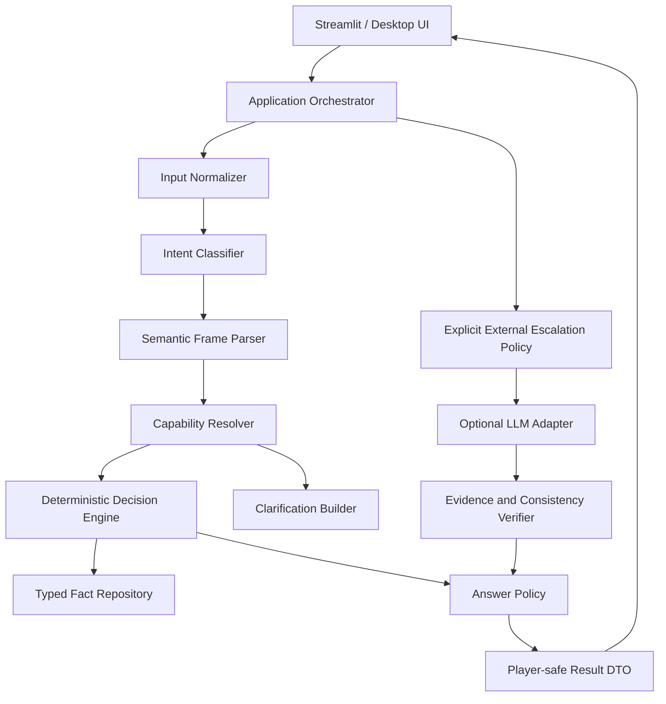

# V5 Robustness-First Architecture and Development Plan

> Document version: v1.1
> Target product version: V5  
> Status: architecture blueprint awaiting sign-off; implementation has not started  
> Date: 2026-07-29  
> Authority: this is the sole architecture and milestone authority for V5  
> V4 status: formally abandoned and retained only in `ARCHITECTURE_V4_DEPRECATED.md`

## 1. Decision Summary

V5 will not continue patching V4. It establishes an independent, fully offline-capable deterministic game core. Natural-language input is converted into an explicit semantic frame before an auditable fact resolver makes a decision. The LLM is an optional, user-approved external knowledge enhancer—not the default escape path for parser misses.

The primary V5 quality goal is not “support more models.” It is to ensure that:

- simple questions are answered consistently by local code;
- the core game remains fully playable without a key, network, or healthy provider;
- the system distinguishes misunderstanding, missing facts, disputed facts, unsupported capability, and infrastructure failure;
- every answer has an inspectable deterministic route and evidence basis;
- packaged behavior matches source behavior without relying on dynamically copied modules that happen to import.

## 2. V4 Abandonment Verdict

V4's layering, ports, and pack separation remain useful lessons, but its runtime architecture is not inherited. It is abandoned because:

1. `parse_question() -> None -> LLM` converted parser coverage defects into network dependencies.
2. Keyword containment lacked compositional semantics for abbreviations, ellipsis, negation, comparisons, and contextual references.
3. Unknown facts, unclear wording, unsupported capability, and gateway failure were not reliably distinguished for players.
4. Tests overused canonical questions and did not prove equivalence across real conversational variations.
5. The fact taxonomy was too narrow, so common temporal relations required reactive special cases.
6. Streamlit and PyInstaller module boundaries were not fixed during design, allowing source success and packaged import failure.
7. Local degradation was exception mapping, not a complete offline product policy.

Therefore:

- `app_v4.py`, `src/guess_history/`, `data/v4/`, and the V4 Launcher are frozen historical experiments;
- no business feature is added to V4 except a necessary security fix;
- V5 receives its own namespace, data directory, entry points, contracts, and test matrix;
- passing V4 tests are not V5 acceptance evidence.

## 3. V5 Invariants

These are hard constraints:

1. **Parse misses never use the network:** `unparsed`, `ambiguous`, and `unsupported` must not call an LLM automatically.
2. **Offline completeness:** start, questions, hints, guesses, surrender, replay, and history isolation work with all model configuration removed.
3. **Deterministic first:** a locally answerable fact question never reaches an external model.
4. **Results are data, not exceptions:** normal misunderstanding, unknowns, and clarification return typed outcomes.
5. **Network failure does not mutate the session:** failed external attempts do not count as answered turns or corrupt state.
6. **Evidence boundary:** definitive yes/no requires valid facts and sources.
7. **Target isolation:** before the game ends, player DTOs, logs, and production UI contain no target identifier, name, or reversible internal trace.
8. **Stable membership:** fact enrichment never changes pack membership.
9. **Static packaging:** release entry points import the complete module tree normally; core source is not executed only as copied data scripts.
10. **Paraphrase equivalence:** semantically equivalent questions produce the same semantic frame and decision.

## 4. Architecture Decision Records

| ADR | Decision | Reason |
| --- | --- | --- |
| V5-001 | Independent modular monolith named `guess_history_v5` | Creates a compile-time boundary from abandoned V4 without operational complexity |
| V5-002 | Semantic frames are the central question contract | Separates language expression from fact decisions |
| V5-003 | The deterministic core has no LLM port dependency | Guarantees offline completeness and reproducible tests |
| V5-004 | Outcomes use a discriminated union | Separates answers, clarification, unknowns, unsupported capability, and failure |
| V5-005 | Typed facts plus a temporal ontology | Supports before/after/during/overlap and numeric comparisons without dynasty regex patches |
| V5-006 | LLM access requires an explicit escalation policy | Prevents hidden network use and makes user consent testable |
| V5-007 | Sessions use an event record with derived state | Enables replay, audit, isolation, and property testing |
| V5-008 | Release entry points statically import application modules | Lets PyInstaller discover dependencies during analysis |
| V5-009 | V5 has a new schema and does not load the V4 overlay | Unreviewed AI enrichment cannot become default V5 truth |
| V5-010 | A language gold set precedes parser implementation | Real reviewed language, not developer anecdotes, drives coverage |

## 5. System Structure



Dependency direction:

```text
presentation / launcher
          ↓
application
          ↓
semantic + domain
          ↓
ports

adapters ──implement──> ports
```

`semantic` and `domain` must not import Streamlit, Requests, filesystem access, environment access, the Launcher, or a model SDK.

## 6. Input Understanding Pipeline

### 6.1 Input normalization

`InputNormalizer` performs lossless, traceable normalization only:

- Unicode NFKC;
- full-width/half-width punctuation normalization;
- repeated whitespace collapse;
- separation of question punctuation, particles, and polite wrappers;
- fixed local simplified/traditional mappings;
- length and control-character validation;
- retention of original and normalized text for in-memory diagnostics, not default logs.

Normalization must never infer an answer or remove negation.

### 6.2 Intent classification

`TurnIntent` is a closed enum:

- `START_GAME`
- `ASK_FACT`
- `GUESS_PERSON`
- `REQUEST_HINT`
- `REQUEST_RECHECK`
- `SURRENDER`
- `REPLAY`
- `HELP`
- `UNSUPPORTED_CHAT`
- `AMBIGUOUS`

Commands and name guesses precede fact parsing. Name matching uses only reviewed canonical names and aliases from the current pack.

### 6.3 Semantic frames

Fact questions must become one of these discriminated types:

```text
AttributePredicate
  fact_key: FactKey
  operator: EQ | NE | IN | CONTAINS
  expected: TypedValue
  polarity: POSITIVE | NEGATIVE

TemporalPredicate
  subject_axis: LIFETIME | ACTIVE_PERIOD | REIGN_PERIOD
  relation: BEFORE | AFTER | DURING | OVERLAPS
  reference_period_id: PeriodId
  polarity: POSITIVE | NEGATIVE

NumericPredicate
  fact_key: BIRTH_YEAR | DEATH_YEAR | REIGN_START | REIGN_END
  operator: LT | LTE | EQ | GTE | GT | BETWEEN
  expected: YearValue | YearRange

ExistencePredicate
  fact_key: FactKey
  expected_presence: bool
```

The parser returns `ParseOutcome`:

- `PARSED(frame)` when one meaning is clear;
- `AMBIGUOUS(candidates, clarification)` when several frames are plausible;
- `UNSUPPORTED(reason, examples)` when the category is understood but unsupported;
- `UNPARSED(rephrase_examples)` when no reliable frame can be built.

The last three outcomes never access the network automatically.

### 6.4 Domain lexicon and grammar

The versioned domain lexicon covers at least:

- canonical dynasty/period names, abbreviations, aliases, and `PeriodId` values;
- identity synonyms;
- title and epithet synonyms;
- temporal comparators such as before, after, no later than, and no earlier than;
- negation and double-negation patterns;
- lifetime, activity-period, and reign-period axis indicators;
- conversational and elliptical templates.

The lexicon maps vocabulary only. Grammar rules compose semantics. “Contains a token, therefore answer” shortcuts are prohibited.

## 7. Decision and Degradation Contracts

### 7.1 Core result

```json
{
  "kind": "answer",
  "answer": "probably_yes",
  "reason_code": "TEMPORAL_BEFORE_MATCH",
  "confidence": 0.82,
  "fact_refs": ["person-x:active-period"],
  "source_refs": ["source-y"],
  "trace_id": "uuid"
}
```

`DecisionOutcome.kind` is limited to:

- `answer`
- `clarification_required`
- `fact_unknown`
- `unsupported`
- `external_candidate`

These are ordinary business results. Exceptions are reserved for corrupt data, invariant violations, and infrastructure failure.

### 7.2 Player answers

The player-facing answer set is fixed:

- Yes.
- No.
- Probably yes.
- Probably no.
- The available facts are insufficient.
- I could not understand reliably; please use one of these examples.
- This question is outside the current local capability.

Provider errors never appear directly in English. External failure returns the pre-existing local outcome or a recoverable localized message.

### 7.3 External escalation

An LLM call requires every condition below:

1. the user explicitly enabled external knowledge enhancement;
2. provider configuration passed startup validation;
3. the core returned `external_candidate`, not `unparsed`;
4. the category is allowlisted;
5. the session remains inside its external-call budget;
6. a minimal evidence packet can be built without revealing the answer improperly;
7. the result passes schema, evidence-binding, target-consistency, and answer-enum validation.

Any failed condition returns a typed local result instead of a player-visible exception.

## 8. V5 Data Model

### 8.1 Person

```text
Person
  id: PersonId, required stable slug
  canonical_name: str, required
  aliases: tuple[AliasRef, ...]
  summary: str | null
  fact_ids: tuple[FactId, ...]
  schema_version: 5
```

### 8.2 FactRecord

```text
FactRecord
  id: FactId
  person_id: PersonId
  predicate: PredicateId
  value: StringValue | EnumValue | YearValue | PeriodRef | ValueSet
  validity: TimeInterval | null
  confidence: CONFIRMED | PROBABLE | DISPUTED | UNKNOWN
  source_refs: tuple[SourceId, ...]
  review_status: DRAFT | REVIEWED | APPROVED | REJECTED
  provenance: MANUAL | MIGRATED | AI_CANDIDATE
```

Constraints:

- `CONFIRMED` requires at least one `APPROVED` source;
- `AI_CANDIDATE` cannot be `APPROVED` automatically;
- conflicting person/predicate/validity facts are explicitly `DISPUTED`;
- value type must match the predicate schema;
- runtime defaults to `REVIEWED` or `APPROVED` facts only.

### 8.3 Period

```text
Period
  id: PeriodId
  canonical_name: str
  aliases: tuple[str, ...]
  start_year: int | null
  end_year: int | null
  parent_id: PeriodId | null
  precision: EXACT | APPROXIMATE | SYMBOLIC
```

Years use signed astronomical numbering. All comparison occurs in a temporal interval service; the parser cannot contain scattered integer rankings.

### 8.4 DataPack

```text
DataPack
  id: PackId
  version: SemVer
  display_name: str
  person_ids: tuple[PersonId, ...]
  expected_count: int
  locale: zh-CN
  membership_snapshot_sha256: str
```

Packs reference person IDs only and never merge facts.

### 8.5 SessionEvent

```text
SessionEvent
  id: EventId
  session_id: SessionId
  sequence: int
  event_type: GAME_STARTED | QUESTION_ASKED | ANSWERED | CLARIFICATION_REQUESTED |
              HINT_GIVEN | GUESS_SUBMITTED | SURRENDERED | GAME_WON | GAME_CLOSED
  public_payload: object
  private_payload: object
  created_at: UTC datetime
```

Public and private payloads are separated at the type and serialization layers. Player history reads public events only.

## 9. Application Contracts

### `create_game`

```text
Input:  CreateGameCommand(pack_id, random_seed | null)
Output: PlayerGameView
Errors: PACK_NOT_FOUND | PACK_EMPTY | DATA_INVALID
```

### `handle_turn`

```text
Input:  HandleTurnCommand(session_id, text, expected_sequence)
Output: TurnResult
```

Example:

```json
{
  "session_id": "uuid",
  "sequence": 7,
  "intent": "ask_fact",
  "outcome": {
    "kind": "clarification_required",
    "message": "Do you mean birth time or primary active period?",
    "examples": ["Was he born before Tang?", "Was he mainly active before Tang?"]
  },
  "state": {
    "phase": "playing",
    "valid_question_count": 5,
    "hint_available": false
  }
}
```

`expected_sequence` detects duplicate or concurrent rerun submissions and returns `STALE_SESSION_VERSION`.

### `request_hint`

Hints use unused, player-safe reviewed facts only and never call an LLM. Domain policy selects the dimension and cannot reveal the canonical name or unique alias.

### `request_external_answer`

This is separate from `handle_turn` and requires user confirmation plus an escalatable `trace_id`, making implicit network use structurally impossible.

## 10. Error Model

```text
DomainInvariantError      unrecoverable data or state invariant violation
ContractValidationError  external input contract failure
RepositoryError          canonical data read failure
ExternalProviderError    recoverable external enhancement failure
PackagingError           incomplete release resources
```

Players receive stable codes and localized text only. Development diagnostics use `trace_id` and must not contain keys, Authorization, complete model responses, or target identity.

## 11. Target Directory

```text
src/
└─ guess_history_v5/
   ├─ semantic/
   │  ├─ normalization.py
   │  ├─ intents.py
   │  ├─ frames.py
   │  ├─ lexicon.py
   │  ├─ grammar.py
   │  └─ parser.py
   ├─ domain/
   │  ├─ people.py
   │  ├─ facts.py
   │  ├─ periods.py
   │  ├─ sessions.py
   │  ├─ events.py
   │  ├─ decisions.py
   │  └─ policies.py
   ├─ application/
   ├─ ports/
   ├─ adapters/
   ├─ presentation/streamlit/
   ├─ launcher/
   ├─ contracts/
   └─ bootstrap.py

data/v5/
├─ catalog.json
├─ periods.json
├─ sources.json
└─ packs/

quality/v5/
├─ language/
├─ semantic/
├─ decisions/
├─ robustness/
└─ release/

app_v5.py
launcher_v5.py
```

## 12. Import Rules

- `semantic` imports standard library and its own types only;
- `domain` may import semantic frames, never application/adapters/UI;
- `application` depends only on domain, semantic, and ports;
- adapters implement ports and never control application flow;
- presentation renders application Player DTOs only;
- launcher manages configuration, HTTP, and processes only;
- `bootstrap.py` is the sole concrete adapter composition root;
- V5 modules must never import the V4 `guess_history` namespace.

CI enforces the final rule with an AST check.

## 13. Security Architecture

- Launcher binds only `127.0.0.1`; mutations require Origin, Host, and CSRF validation.
- Keys enter only the selected child environment, never parent state, plaintext fingerprints, logs, or responses.
- Custom providers require HTTPS; loopback HTTP exists only in an explicit development build.
- Player text is length-limited and control characters are rejected.
- Models receive fielded questions plus minimal evidence, not concatenated source instructions.
- Model responses pass schema, evidence, target, and enum validation.
- Production UI exposes no target, private event, evidence statement, or raw exception.
- PyInstaller manifests explicitly verify the V5 package, data, schemas, and static resources.

## 14. Observability

Every turn produces a non-sensitive `DecisionTrace`:

```text
trace_id
normalization_version
intent
parse_status
frame_type
resolver
reason_code
fact_ref_count
source_ref_count
external_attempted
external_result
latency_buckets
```

Production does not log full player text by default. Development mode may show original text and semantic frames in local memory, cleared when the page closes.

Required reports include parse coverage, clarification rate, deterministic answer rate, external escalation rate, successful degradation rate, error rate by question type, and paraphrase inconsistency rate.

## 15. Test Strategy

### 15.1 Language gold set

Before parser implementation, create reviewed cases for every supported intent covering canonical wording, conversation and ellipsis, abbreviations and traditional forms, positive/negative/double-negative forms, temporal boundaries, punctuation/spacing variants, ambiguity, unsupported requests, adversarial text, and oversized input.

Every case includes expected intent, `ParseOutcome`, semantic frame, and external-escalation permission.

### 15.2 Metamorphic tests

Punctuation, politeness, whitespace, script, and synonym variants with the same meaning produce the same frame. Negation changes polarity only.

### 15.3 Property tests

- any valid input cannot crash the core;
- `unparsed/ambiguous/unsupported` always produce zero network calls;
- replaying identical events derives identical state;
- session A events never enter session B;
- production serialization contains no target field;
- identical seed plus catalog selects the same target.

### 15.4 Fault injection

Cover missing/invalid keys, DNS failure, connection refusal, 429, 5xx, timeout, invalid JSON, bad evidence, early child exit, port collision, and corrupt packs.

All external faults become recoverable local results. Only corrupt canonical data may prevent game startup.

## 16. Release Quality Gates

| Metric | Gate |
| --- | --- |
| Supported-intent parse rate on reviewed language data | ≥ 99.5% |
| Semantic frame correctness among parsed cases | 100% |
| Paraphrase inconsistency | 0% |
| Implicit network calls for `unparsed/ambiguous/unsupported` | 0 |
| Core-flow completion without a provider | 100% |
| Deterministic facts matching gold answers | 100% |
| Production target or sensitive-data leakage | 0 findings |
| Recoverable outcome after external failure | 100% |
| Pack membership snapshot drift | 0 findings |
| Clean Windows EXE flow | all three packs pass |

Insufficient gold data produces `insufficient_data`, never a passing empty-set metric.

## 17. V4-to-V5 Data Migration

Migration imports candidates rather than upgrading truth in place:

1. read the V4 catalog and pack snapshot;
2. retain stable person IDs and pack membership;
3. map V4 facts to `FactRecord(DRAFT, MIGRATED)`;
4. map the V4 overlay to `AI_CANDIDATE`, disabled by default;
5. map period strings to `PeriodId` and quarantine ambiguous records;
6. produce deterministic reports and field-level diffs;
7. require dual review before `REVIEWED/APPROVED` promotion;
8. reject V4 directories at V5 runtime.

## 18. Development Milestones

### V5-M0: Freeze and requirements baseline

- [ ] **0.1 Freeze V4.** DoD: every V4 entry/document is deprecated and CI forbids V5-to-V4 imports.
- [ ] **0.2 Build the real-language dataset.** DoD: at least 1,000 dual-reviewed inputs cover supported, ambiguous, and unsupported categories.
- [ ] **0.3 Fix the capability matrix.** DoD: every question type is classified as local, clarification, unsupported, or optional external.
- [ ] **0.4 Sign ADRs and threat model.** DoD: the ADRs, data boundary, and escalation security policy receive human approval.

### V5-M1: Semantic core

- [ ] **1.1 Input normalizer.** DoD: metamorphic tests pass without changing negation.
- [ ] **1.2 Intent classifier.** DoD: commands, guesses, facts, and ambiguity meet release gates.
- [ ] **1.3 Semantic frame parser.** DoD: attribute, temporal, numeric, and existence frames work without network dependencies.
- [ ] **1.4 Clarification builder.** DoD: each ambiguous category returns localized clarification and selectable examples.
- [ ] **1.5 Implicit-network prohibition.** DoD: property tests prove zero network calls from every parse-failure path.

### V5-M2: Fact ontology and data

- [ ] **2.1 Predicate/value schemas.** DoD: invalid combinations fail during load.
- [ ] **2.2 Temporal ontology.** DoD: dynasties, subperiods, and interval relations pass boundary tests.
- [ ] **2.3 Canonical V5 directory.** DoD: catalog, periods, sources, and pack references all validate.
- [ ] **2.4 V4 candidate migrator.** DoD: deterministic, repeatable, no silent loss, with quarantine report.
- [ ] **2.5 Review gate.** DoD: unreviewed AI candidates cannot enter default runtime.

### V5-M3: Deterministic game engine

- [ ] **3.1 Event-sourced session.** DoD: replay, sequence concurrency, and isolation properties pass.
- [ ] **3.2 Decision resolvers.** DoD: every frame has a typed resolver and reason code.
- [ ] **3.3 Answer policy.** DoD: definitive, probable, unknown, and clarification follow evidence quality.
- [ ] **3.4 Hints and name guesses.** DoD: six questions, hint, win, surrender, and replay complete offline.
- [ ] **3.5 Player-safe DTOs.** DoD: production serialization contains no target or private event.

### V5-M4: Optional external knowledge

- [ ] **4.1 Explicit escalation use case.** DoD: only user-confirmed `external_candidate` enters the port.
- [ ] **4.2 Provider capability probe.** DoD: startup validation and runtime circuit breaking are recoverable.
- [ ] **4.3 Structured results and evidence binding.** DoD: unsupported or conflicting evidence never reaches players.
- [ ] **4.4 Budgets and timeout.** DoD: per-session limits, total timeout, and cancellation are tested.
- [ ] **4.5 Failure degradation.** DoD: all injected failures return localized local results without session mutation.

### V5-M5: Interface

- [ ] **5.1 Single Streamlit application.** DoD: all packs are contract-driven with no copied mode branches.
- [ ] **5.2 Visible capabilities.** DoD: local/external state and supported examples are explicit.
- [ ] **5.3 Clarification interaction.** DoD: players select a meaning without retyping the whole question.
- [ ] **5.4 Recoverable errors.** DoD: players never see stacks, English provider errors, or response bodies.
- [ ] **5.5 Real-browser smoke.** DoD: conversational, comparison, negation, no-key, offline, and replay flows pass.

### V5-M6: Launcher and packaging

- [ ] **6.1 Static release entry.** DoD: PyInstaller analysis directly includes V5 presentation modules.
- [ ] **6.2 Secure Launcher.** DoD: loopback, CSRF, isolated env, conflicts, and Job Object all pass.
- [ ] **6.3 Artifact manifest.** DoD: automatically verifies V5 packages, data, schemas, frontend, and version while excluding V4 business code.
- [ ] **6.4 Clean Windows build.** DoD: a fresh environment builds successfully.
- [ ] **6.5 No-Python test machine.** DoD: three packs, offline flow, external enhancement, and cleanup all pass.

### V5-M7: Release acceptance

- [ ] **7.1 Complete gate report.** DoD: every Section 16 metric has non-empty traceable evidence.
- [ ] **7.2 Security review.** DoD: secrets, target leakage, prompt injection, local HTTP, and dependency risks have no open high-severity issue.
- [ ] **7.3 Bilingual documentation.** DoD: user, developer, data-contribution, and troubleshooting docs are synchronized.
- [ ] **7.4 V5 release candidate.** DoD: an acceptor who did not implement it signs off in a clean environment.

## 19. Build Order and Stop Conditions

```text
Language gold set
  → SemanticFrame contracts
  → parser
  → fact ontology
  → resolvers
  → sessions and application use cases
  → optional LLM
  → UI
  → Launcher / EXE
```

UI or EXE work cannot precede the semantic core. Stop advancement when any of these occurs:

- the gold set is empty or not dual-reviewed;
- paraphrases produce different frames;
- parse failures use the network;
- the core raises a system error without a provider;
- data without evidence produces a definitive answer;
- source and EXE behavior diverge;
- V5 imports any V4 business module.

## 20. Implementation and Review Constraints

### For implementation

- begin with contracts and failing tests, not copies of V4 classes;
- never close a language defect by adding an isolated string exception—first add reviewed data, then change lexicon or grammar;
- every resolver is pure and returns a reason code;
- external adapters arrive last and are never the default local-test dependency;
- the packaged entry statically imports `guess_history_v5.presentation`.

### For review

- search for any hidden `parse miss -> gateway` route;
- search for V5 imports or reads of `guess_history`, `data/v4`, and `app_v4.py`;
- ensure UNKNOWN is never converted to NO;
- ensure missing members of collection facts do not become false negatives;
- review negation and temporal boundaries;
- check messages for provider, response-body, or target leakage;
- prove PyInstaller analyzes V5 modules rather than storing source as data only.

## 21. Open Questions

These do not block starting V5-M0, but must be signed before V5-M0 closes:

1. the initial V5 predicate list;
2. the historical definition and source policy for “primary active period”;
3. fixed simplified/traditional mappings versus a dedicated converter;
4. whether external enhancement is disabled by default (recommended: yes);
5. the two accountable language-gold reviewers;
6. which V4 facts may enter the V5 review queue;
7. whether V5.0 is Chinese-only (recommended: `zh-CN`).

No `src/guess_history_v5` implementation is created and V5-M1 does not start until this architecture is approved.

## 22. Executable Robustness Matrix

Every turn follows this application contract. Tests and UI code must not reinterpret the result categories.

| Input/runtime condition | Parse result | Network allowed | Consumes a valid question | Player-visible result |
| --- | --- | --- | --- | --- |
| Locally decidable fact question | `PARSED` + `answer` | No | Yes | Yes/No/Probably |
| More than one reasonable meaning | `AMBIGUOUS` | No | No | Clarification choices |
| Meaning understood but capability unsupported | `UNSUPPORTED` | No | No | Capability guidance |
| No reliable semantic frame | `UNPARSED` | No | No | Rephrase examples |
| Local fact missing or conflicting | `fact_unknown` | No | Yes, only when parsed | Insufficient facts |
| Explicitly allowed external candidate | `external_candidate` | Only after user confirmation | Count only after external success | Evidence-bound result or recoverable failure |
| Provider timeout, refusal, or invalid response | External error | The current call is terminated | No | Localized recoverable message |
| Corrupt normative data pack | Game is not created | No | N/A | Block start with repair guidance |

Only `TurnCommitPolicy` decides whether a valid question is consumed. The UI must never increment counters from message text.

## 23. Session State Machine and Idempotency

### 23.1 States

```text
CREATED → PLAYING → WAITING_CLARIFICATION → PLAYING
                    ├→ WON → CLOSED
                    ├→ SURRENDERED → CLOSED
                    └→ CLOSED
```

- `WAITING_CLARIFICATION` accepts only a clarification choice or cancel; it cannot accept a new fact turn.
- `WON`, `SURRENDERED`, and `CLOSED` are terminal; every write returns `SESSION_CLOSED`.
- Every state change is produced by an event with a monotonic `sequence`.

### 23.2 Atomic turn

`handle_turn` completes this transaction:

```text
read session version
  → normalize and parse
  → decide locally or build clarification
  → compute Player DTO
  → let TurnCommitPolicy decide whether to append an event
```

State is committed only at the final step. External failure, validation failure, and duplicate submission never append an `ANSWERED` event.

The idempotency key is `(session_id, expected_sequence, normalized_input_hash)`. A retry with the same key returns the first result and must not redraw a target, decrement a question, or invoke an external provider twice.

## 24. Configuration and Network-Safety Contract

V5 reads only these startup-validated settings; unlisted variables cannot change business behavior:

| Setting | Default | Constraint |
| --- | --- | --- |
| `V5_EXTERNAL_ENABLED` | `false` | Only explicit `true` permits escalation |
| `V5_PROVIDER_URL` | empty | HTTPS only; loopback is allowed only in a development build |
| `V5_REQUEST_TIMEOUT_MS` | `8000` | Range 500–30000 |
| `V5_SESSION_EXTERNAL_BUDGET` | `0` | Non-negative integer, per session |
| `V5_DATA_DIR` | packaged `data/v5` | Must contain a validated manifest |
| `V5_LOG_LEVEL` | `INFO` | Production must not log raw text at DEBUG |

Startup performs schema validation, data-pack hash validation, provider-URL validation, and secret-presence validation. A configuration failure starts local mode with external enhancement unavailable; only corrupt normative data blocks game creation.

Network capability exists only in `adapters/llm`. Static checks must prove that `semantic`, `domain`, `application`, and `memory_sessions` have no socket, HTTP-client, or model-SDK dependency.

## 25. Evidence, Conflicts, and Answer Adjudication

Fact adjudication is ordered:

1. validate value type and temporal precision against `PredicateSchema`;
2. filter by current pack, person, and validity interval;
3. aggregate sources and detect conflicts for the same predicate;
4. emit a definitive answer only when policy requirements are met; otherwise return `fact_unknown` or `probably_*`;
5. write `reason_code`, `fact_refs`, and `source_refs` to the internal trace while exposing only safe copy to players.

A definitive Yes/No requires at least one `APPROVED` source, no unresolved conflict, a matching value type, and a computable temporal relation. `PROBABLE`, `DISPUTED`, interval overlap, or missing sources must never be collapsed into a definitive No.

## 26. Change Governance and Traceability

- The lexicon, Predicate Schema, temporal ontology, and each data pack have independent versions recorded in `DecisionTrace` and the release manifest.
- A semantic change first adds reviewed gold-set cases, then an ADR amendment; changing implementation without changing the contract is prohibited.
- Fact changes produce field-level, source-level, and pack-membership snapshot diffs.
- Migrations, lexicon changes, and schema changes must be replayable, reversible, or placed in an explicit quarantine directory.
- Chinese and English architecture section, gate, and milestone counts must be checked for parity in CI.
- Every release candidate has an immutable `quality/v5/release/manifest.json` recording commit, data hashes, test reports, and reviewers.

## 27. V5-M0 Required Deliverables

M0 cannot be marked complete with a discussion note alone. These reviewable artifacts must exist:

1. `requirements-matrix`: intent, frame, capability, failure result, and network permission for every supported category;
2. `language-gold-set`: dual review, expected parse result, and version for every input;
3. `predicate-schema` and `period-ontology`: machine-checkable fields, enums, and boundary rules;
4. `threat-model`: prompt injection, target leakage, secrets, loopback HTTP, and dependency risks;
5. `migration-report` template: field-level differences and quarantine reasons for V4 candidates;
6. `acceptance-plan`: command, sample, owner, and evidence path for every Section 16 gate.

Until these deliverables exist, M0 is not complete and M1 cannot start, even if legacy tests pass.
