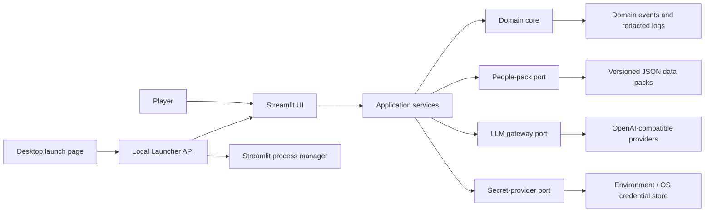
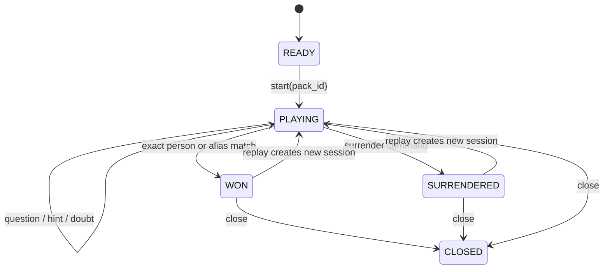
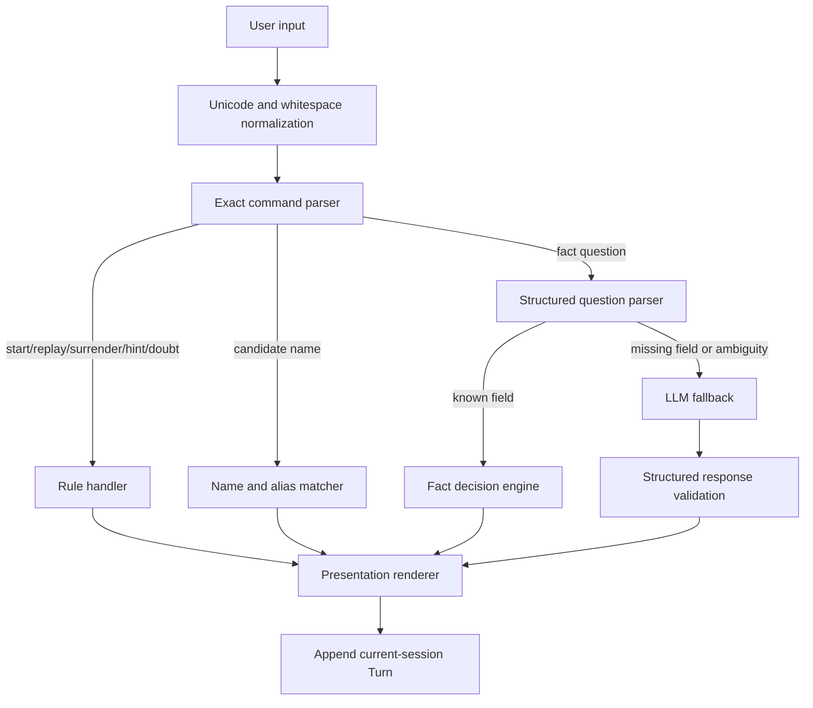
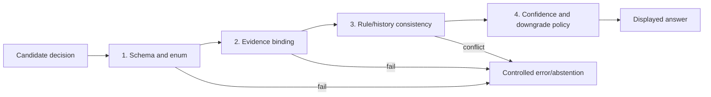

# V4 Architecture and Development Record (Deprecated)

> **Deprecation notice (2026-07-29):** V4 is formally abandoned because input understanding depended on brittle keyword parsing, parse misses escalated directly to the LLM, offline degradation was incomplete, and packaging/runtime boundaries repeatedly failed. This document is retained only as historical evidence and is no longer an implementation authority. See `ARCHITECTURE.md` for the authoritative V5 blueprint.

> Document version: v2.0  
> Target product version: v4 (next generation)  
> Baseline: review of the current v3 repository, 2026-07-29  
> Method: Aria architecture blueprint + Alex dependency-aware implementation plan
> M0 status: local baselines established; external credential rotation, clean-environment install, and remote CI gates await acceptance
> M1 status: closed (all local DoD passed); release remains gated by the open M0 conditions
> M2 status: executing; 9/11 automated DoD complete, the dual-format gold workflow is implemented, and its content plus language gate await dual review
> M3 status: executing; tooling DoD 3.1–3.9 passes, 3.10 awaits a fixed calibration set, and canonical v4 rebuilding has removed the data-baseline drift
> M4 status: closed (local DoD 4.1–4.8 all pass); release remains gated by the external M0, M2, and M3 conditions
> M5 status: executing; 5.1–5.6 and 5.8 pass, while 5.7 has a clean local build and artifact proof but awaits reproduction in an independent clean Windows environment

## 1. Executive Summary

The next version should stop duplicating `app_*.py` files and stop using prompts as a state machine or final authority for critical game decisions. The target is a local-first modular monolith:

- The game engine is pure Python and testable without Streamlit, a network, or an LLM.
- Pack membership is separate from person facts, so enrichment can never expand a themed pack.
- Start, replay, surrender, correct guesses, question counting, hint eligibility, and structured fact questions are decided deterministically.
- The LLM handles only ambiguous questions that structured facts cannot answer, and its result must pass a structured schema.
- Every game has a distinct `session_id` and message scope; prior games never enter a new game's context.
- API keys never enter source code, web assets, logs, build artifacts, or Git history; the desktop launcher passes an isolated environment to each child process.
- Streamlit remains the first UI and the single EXE remains the first distribution format, but both are adapters around the application core.

This design addresses the highest-impact correctness and release-security defects while allowing incremental migration. It does not require rewriting every UI surface or fully enriching all 1,000 people before work can ship.

## 2. Requirements Baseline

### 2.1 Required capabilities

1. Preserve the China 1,000, China Famous 200, and Ming 200 modes.
2. Runtime pack sizes must be exactly 1,000, 200, and 200.
3. Preserve the five canonical answers, hints, surrender, correct guesses, replay, and batch recheck.
4. Use one core implementation for every mode; do not duplicate page business logic.
5. Support Zhipu, DeepSeek, OpenAI, xAI, and custom OpenAI-compatible endpoints.
6. Support source execution and a Windows single-file executable.
7. Allow complete core testing without a real API.
8. Never distribute a usable built-in LLM key.

### 2.2 Quality targets

- At least 95% branch coverage for deterministic rules.
- At least 85% coverage for the core package.
- Every data pack passes schema, uniqueness, member-count, and reference-integrity validation.
- Normal answers crossing the presentation boundary are limited to the canonical enum or an explicit settlement/hint template.
- A new game's LLM context contains no messages from the previous game.
- Changing provider configuration for a mode never reuses a process with stale configuration.
- Logs never contain Authorization headers, API keys, or complete request payloads.
- The release gold set contains at least 500 questions; deterministic accuracy and canonical-output compliance must both be 100%.
- LLM fallback reaches at least 98% selective accuracy on an adjudicated set, with no more than 0.5% confidently wrong `YES/NO` answers.
- Accuracy, answer coverage, and conservative abstention are reported separately so accuracy cannot be inflated by refusing most questions.

### 2.3 Non-goals

- v4 does not introduce a cloud-hosted multi-user platform.
- It does not introduce microservices, a message queue, or a remote database.
- It does not require all 1,000 people to be fully enriched before the first release.
- It does not preserve runtime compatibility with old HTA launchers, Dify workflows, or `legacy/` entry points.
- European packs are not part of the first release, though the architecture must support them later.

### 2.4 Default assumptions

- Windows 10/11 x64 is the first release platform.
- Python 3.12 is the source-development baseline; CI determines any additional supported versions.
- Game history is process-local by default and is not persisted.
- Historical content is shipped as versioned local data packs; no database is required.
- The 1,000-person pack may ship incrementally with 200 structured people and 800 name-only records; missing facts use the controlled LLM fallback.

## 3. Architecture Decision Records

### ADR-001: Modular monolith, not microservices

Use a modular monolith. This is a small local desktop game with modest data and process needs; explicit module boundaries provide the needed maintainability without service deployment, network, and debugging overhead.

### ADR-002: Ports-and-adapters layering

The domain core exposes interfaces and does not depend on Streamlit, Requests, the filesystem, or `http.server`. UI, LLM, data packs, secret storage, and desktop process management connect through adapters.

### ADR-003: Separate packs from the person catalog

A data pack contains only the `person_id` values allowed in that game mode. The person catalog contains facts. Enriching catalog records cannot change pack membership; this structurally prevents the Ming 200 mode from becoming 377 people.

### ADR-004: Versioned files, no database

The first release uses UTF-8 JSON/JSONL plus JSON Schema. The catalog is small and mostly read-only, so a database has no clear benefit. Persistent cross-game analytics would require a later ADR for SQLite.

### ADR-005: Deterministic first, LLM fallback

Commands, state, name matching, and structured facts are resolved in code. Only unresolved open questions reach the LLM. The LLM returns an internal structured decision, which is rendered into allowed display text.

### ADR-006: One application entry point

Keep one `app.py`; select the mode with a pack identifier from configuration or a query parameter. Remove the three nearly identical page implementations, and let the launch screen pass only `pack_id`.

### ADR-007: No client-side built-in credential

Do not ship demo keys in HTML, Python, default environment values, or the EXE. Credentials come from one-time input, process environment, or OS credential storage, and all logs are redacted.

### ADR-008: Synchronous LLM gateway for the first release

Keep synchronous requests for v4 to avoid unnecessary concurrency complexity at current traffic levels. The port may reserve cancellation and streaming capabilities, but they are not release blockers.

## 4. Target System Context



## 5. Layers and Dependency Rules

```text
presentation  ─┐
launcher      ─┼─> application ─> domain
adapters      ─┘        │
                        └─> ports <─ adapters
```

### 5.1 `domain`

Entities, value objects, the state machine, command parsing, deterministic decisions, and domain errors. It may depend only on the Python standard library and its own layer.

### 5.2 `application`

Use-case orchestration: create a game, handle input, provide a hint, batch-recheck a session, and close a game. It may depend on `domain` and `ports`, never on a concrete UI or network implementation.

### 5.3 `ports`

Interfaces for the people repository, LLM gateway, secret provider, clock, random source, and logging. Ports must not expose Requests, Streamlit, or other implementation-specific types.

### 5.4 `adapters`

Implement JSON data packs, OpenAI-compatible HTTP, environment variables, OS keyring, system time, and secure randomness.

### 5.5 `presentation`

Maps Streamlit session state, components, copy, and rendering. It does not read people files or perform HTTP calls directly.

### 5.6 `launcher`

Owns the local HTTP protocol, process registry, ports, log directory, and browser launch. It starts a registered presentation entry point and does not import game business logic.

### 5.7 Enforced import rules

- `domain` imports no other layer.
- `application` never imports `presentation`, `launcher`, or concrete `adapters`.
- `presentation` never imports `requests`, the old `people_db`, or raw data paths.
- Adapters satisfy ports; they do not drive use-case control flow.
- Mode differences come from data packs or configuration, never copied application entry points.

## 6. Domain Model

### 6.1 `Person`

| Field | Type | Constraint |
| --- | --- | --- |
| `id` | `str` | Required stable slug, unique in the catalog |
| `canonical_name` | `str` | Required and trimmed |
| `aliases` | `list[Alias]` | Empty by default; normalized values unique per person |
| `summary` | `str | None` | Maximum 300 characters |
| `facts` | `list[Fact]` | Empty by default |
| `schema_version` | `int` | Must be supported |

### 6.2 `Alias`

| Field | Type | Meaning |
| --- | --- | --- |
| `value` | `str` | Display alias |
| `kind` | `name | courtesy | art_name | temple | era | title | other` | Alias category |
| `normalized` | `str` | Deterministic match value |

### 6.3 `Fact`

| Field | Type | Constraint |
| --- | --- | --- |
| `key` | `FactKey` | For example `period`, `gender`, `identity`, `title`, `birth_year` |
| `value` | JSON scalar or array | Required |
| `normalized_values` | `list[str]` | Comparison values |
| `confidence` | `confirmed | probable | disputed` | Required |
| `source_ids` | `list[str]` | Confirmed facts need a source; migration may mark pending provenance |
| `note` | `str | None` | Dispute or boundary note |

### 6.4 `Source`

| Field | Type | Constraint |
| --- | --- | --- |
| `id` | `str` | Globally unique |
| `title` | `str` | Required |
| `locator` | `str | None` | URL, ISBN, book/volume, or equivalent |
| `publisher` | `str | None` | Optional |
| `accessed_at` | ISO date or `None` | Used for online sources |

### 6.5 `DataPack`

| Field | Type | Constraint |
| --- | --- | --- |
| `id` | `str` | For example `china_all_1000` |
| `version` | SemVer string | Required |
| `display_name` | `str` | Required |
| `theme` | `str` | Persona theme |
| `person_ids` | `list[str]` | Unique and fully referential |
| `expected_count` | `int` | Must equal the length of `person_ids` |
| `default_locale` | `zh-CN` | Fixed for the first release |

### 6.6 `GameSession`

| Field | Type | Constraint |
| --- | --- | --- |
| `id` | UUID | New for every game |
| `pack_id` | `str` | Must exist |
| `target_person_id` | `str` | Must belong to the pack |
| `phase` | `READY | PLAYING | WON | SURRENDERED | CLOSED` | Required |
| `valid_question_count` | Non-negative integer | Counts fact questions only |
| `hint_keys_used` | `set[str]` | Prevents repeated hint dimensions |
| `turns` | `list[Turn]` | Current game only |
| `started_at` | UTC timestamp | Required |
| `ended_at` | UTC timestamp or `None` | Set on completion |

### 6.7 `Turn`

| Field | Type | Meaning |
| --- | --- | --- |
| `id` | UUID | Unique inside the session |
| `kind` | `START | QUESTION | GUESS | HINT | DOUBT | SURRENDER | REPLAY | CHAT` | Parsed intent |
| `user_text` | `str` | Original input |
| `answer` | `CanonicalAnswer | None` | Used for normal fact questions |
| `decision_source` | `RULE | FACT | LLM | SYSTEM` | Decision provenance |
| `fact_refs` | `list[str]` | Facts used |
| `evidence_refs` | `list[str]` | Evidence that actually supports the conclusion |
| `confidence` | `float | None` | 0–1; rules and confirmed facts may use 1 |
| `verification` | `NOT_REQUIRED | PASSED | DEGRADED | FAILED` | Verification outcome |
| `display_text` | `str` | Final rendered output |
| `created_at` | UTC timestamp | Required |

### 6.8 `CanonicalAnswer`

Internal enum:

```text
YES
NO
PROBABLY_YES
PROBABLY_NO
REFUSE_REPHRASE
```

The Chinese presentation maps these values to the existing five phrases. The domain does not store UI strings with punctuation.

### 6.9 `LLMProfile`

| Field | Type | Constraint |
| --- | --- | --- |
| `provider_id` | `zhipu | deepseek | openai | xai | custom` | Required |
| `base_url` | HTTPS URL | Local HTTP requires explicit development mode |
| `model` | `str` | Required |
| `secret_ref` | `str` | References a secret; never contains the key |
| `timeout_seconds` | `int` | 1–120 |
| `max_retries` | `int` | 0–5 |

## 7. Game State Machine



Invariants:

- `target_person_id` belongs to `pack.person_ids`.
- Only `QUESTION` increments `valid_question_count`.
- `HINT`, `DOUBT`, `GUESS`, `SURRENDER`, and `REPLAY` do not increment it.
- `REPLAY` creates a new `GameSession.id`; it never mutates the previous session into a new game.
- `WON` and `SURRENDERED` reject further game-fact questions; only replay, close, or an explicitly supported general-chat adapter is allowed.
- The domain never infers victory from LLM prose.

## 8. Input Decision Pipeline



Fixed precedence:

1. Empty-input and length validation.
2. Exact system commands.
3. Canonical-name or alias guess.
4. Structured fact question.
5. LLM fallback.
6. Enum/template rendering.

The LLM cannot mutate session phase and cannot return arbitrary normal-answer text directly to the player.

## 9. LLM Port Contract

```python
class LLMGateway(Protocol):
    def decide(self, request: DecisionRequest) -> DecisionResult: ...
    def generate_hint(self, request: HintRequest) -> HintResult: ...
    def recheck(self, request: RecheckRequest) -> RecheckResult: ...
```

`DecisionResult`:

```json
{
  "answer": "YES | NO | PROBABLY_YES | PROBABLY_NO | REFUSE_REPHRASE",
  "confidence": 0.0,
  "reason_code": "short_machine_code"
}
```

Contract rules:

- `reason_code` and reasoning are used for diagnostics and recheck, not direct display.
- An invalid schema allows one format-repair request; a second failure returns a controlled error instead of guessing.
- Network and provider failures become a common `GatewayError`; UI messages never expose sensitive response bodies.
- 429, 5xx, and connection errors may retry; other 4xx responses do not.
- Redaction removes keys, Authorization, cookies, and message bodies before any log write.

## 10. People Data-Pack Format

Target layout:

```text
data/
├─ catalog/
│  ├─ people.jsonl
│  ├─ sources.json
│  └─ schema/
│     ├─ person.schema.json
│     └─ source.schema.json
└─ packs/
   ├─ china_all_1000/
   │  └─ manifest.json
   ├─ china_famous_200/
   │  └─ manifest.json
   └─ ming_200/
      └─ manifest.json
```

Example `manifest.json`:

```json
{
  "schema_version": 1,
  "id": "ming_200",
  "version": "1.0.0",
  "display_name": "Ming Dynasty — 200 People",
  "theme": "Ming dynasty history",
  "expected_count": 200,
  "person_ids": ["zhu-yuanzhang", "zhu-yunwen"]
}
```

Validation runs during development, tests, and before packaging. Runtime load failure must never silently fall back to a different pack.

## 11. Local Launcher API v1

The server binds only to `127.0.0.1` and uses JSON responses. Static launch assets need no authentication. Every state-changing endpoint requires same-origin use and a short-lived CSRF token generated at launcher startup.

### `GET /api/v1/status`

Response `200`:

```json
{
  "ok": true,
  "version": "4.0.0",
  "runtime_dir": "...",
  "processes": [
    {
      "pack_id": "ming_200",
      "port": 8501,
      "state": "running",
      "profile_fingerprint": "sha256:..."
    }
  ]
}
```

### `GET /api/v1/packs`

Response `200`:

```json
{
  "items": [
    {
      "id": "ming_200",
      "display_name": "Ming Dynasty — 200 People",
      "expected_count": 200,
      "available": true
    }
  ]
}
```

### `POST /api/v1/processes`

Request:

```json
{
  "pack_id": "ming_200",
  "profile": {
    "provider_id": "zhipu",
    "base_url": "https://example.com/v1/chat/completions",
    "model": "model-name"
  },
  "api_key": "write-only"
}
```

Responses:

- `201`: a new process started;
- `200`: an identical configured process already exists;
- `409`: the pack has a process with different configuration and the client must choose whether to restart;
- `422`: invalid request or pack;
- `503`: the process did not become ready in time.

The key is used only to create the child-process environment; it is never stored in the registry or returned.

### `DELETE /api/v1/processes/{pack_id}`

- `204`: process stopped;
- `404`: no process for that pack.

### Common error envelope

```json
{
  "error": {
    "code": "PACK_NOT_FOUND",
    "message": "Short user-safe message",
    "request_id": "uuid"
  }
}
```

## 12. Target Repository Structure

```text
src/guess_history/
├─ domain/
│  ├─ models.py
│  ├─ enums.py
│  ├─ errors.py
│  ├─ llm_models.py
│  ├─ evidence_validation.py
│  ├─ verification.py
│  ├─ calibration.py
│  ├─ state_machine.py
│  ├─ commands.py
│  ├─ name_matcher.py
│  ├─ fact_parser.py
│  ├─ fact_decider.py
│  └─ answer_renderer.py
├─ application/
│  ├─ dto.py
│  ├─ decision_service.py
│  ├─ recheck_game.py
│  ├─ create_game.py
│  ├─ handle_turn.py
│  ├─ give_hint.py
│  └─ recheck_game.py
├─ ports/
│  ├─ people_repository.py
│  ├─ llm_gateway.py
│  ├─ secret_provider.py
│  ├─ clock.py
│  └─ random_source.py
├─ contracts/
│  └─ llm_gateway.schema.json
├─ adapters/
│  ├─ data_packs/
│  │  ├─ repository.py
│  │  └─ validation.py
│  ├─ llm/
│  │  ├─ openai_compatible.py
│  │  ├─ schemas.py
│  │  └─ retry.py
│  ├─ secrets/
│  │  ├─ environment.py
│  │  └─ keyring_store.py
│  └─ system/
│     ├─ clock.py
│     └─ random_source.py
├─ presentation/
│  └─ streamlit/
│     ├─ app.py
│     ├─ session_mapper.py
│     ├─ sidebar.py
│     └─ views.py
├─ launcher/
│  ├─ server.py
│  ├─ contracts.py
│  ├─ process_manager.py
│  ├─ health.py
│  └─ main.py
├─ config.py
└─ logging_config.py

data/
frontend/
tests/
├─ unit/
├─ contract/
├─ integration/
├─ data/
└─ smoke/
```

`pyproject.toml` becomes the single source for dependencies, tests, static checks, and build configuration. A short root `app.py` may remain as a compatibility shim that imports the new Streamlit main.

## 13. Security Architecture

### 13.1 Secrets

- No default key, XOR key, or demo credential.
- `api_key` exists only in input-memory and the target child environment.
- OS keyring may optionally store the secret behind `secret_ref`.
- Exceptions, telemetry, and health APIs never expose environment contents.
- CI scans both the current tree and Git history for secrets.

### 13.2 Input validation

- Limit user-input length and remove control characters.
- Constrain `pack_id`, `provider_id`, and model names by whitelist or format.
- Custom URLs require HTTPS by default; loopback HTTP requires an explicit development option.
- Launcher requests accept only registered `pack_id` values, never script paths.
- Every data pack passes JSON Schema before use.

### 13.3 Local HTTP

- Bind loopback only.
- Require same-origin CSRF token for state changes.
- Use strict CSP and no remote scripts; ship local fonts or use system fonts.
- Never reflect unescaped user input.
- Pass child arguments as a list to `Popen`, never through a shell.

### 13.4 LLM risk controls

- Historical facts, system instructions, and player text remain separate fields.
- Player text is never interpolated into system-template source.
- Every output passes schema and enum validation.
- Prompt injection cannot bypass the domain state machine to reveal the target.
- The custom-endpoint UI explicitly states that the key will be sent to that address.

## 14. Errors, Logging, and Observability

Common error hierarchy:

```text
DomainError
ApplicationError
DataPackError
GatewayError
LauncherError
```

Rules:

- Domain errors are safe to display and contain no technical details.
- Adapter errors retain `request_id` and redacted context.
- The UI presents a short explanation and the log location.
- JSON logs contain at least timestamp, level, component, event, session_id, and request_id.
- The target person is not written to normal INFO logs; explicit development mode may log it with a sensitive marker.
- Log LLM latency, retry count, error class, and decision source, but not full messages.

Key metrics:

- Game-start success rate.
- Distribution of `decision_source`.
- LLM success rate and P95 latency.
- Invalid model-response rate.
- Data-pack validation failures.
- Process startup and health timeouts.

## 15. Cache Strategy

- Cache the person catalog and pack manifests in process memory by content hash.
- Invalidate on data-file change; packaged runtime assets are read-only and may cache for process lifetime.
- Never cache keys or complete LLM requests/responses.
- Streamlit caches immutable repository objects, never `GameSession`.

## 16. Migration Strategy

### 16.1 Content migration

1. Parse `peoples_names.md` and generate stable `person_id` values.
2. Parse both CSV files and generate three manifests.
3. Map `data/people.json` fields into `Fact` records.
4. Mark migrated facts without provenance as pending; never fabricate citations.
5. Generate a migration report with counts, duplicates, orphan references, and field coverage.
6. Use current-list snapshots to prove pack boundaries remain unchanged.

### 16.2 Code migration

Use a strangler migration:

1. Introduce the new domain core behind the current UI.
2. Move the 200-person mode first and keep the old behavior as a comparison oracle.
3. Move the 1,000-person and Ming modes.
4. Collapse into one entry point.
5. Replace the launcher protocol and process manager.
6. Run behavior-comparison tests before deleting duplicate v3 modules.

### 16.3 Compatibility

- Old `.bat` files may temporarily forward to the single entry point plus `pack_id`.
- HTA and Dify assets become archive-only.
- Old JSON and CSV files are migration inputs, not v4 runtime sources.

## 17. Critical Path

```text
Secret containment
→ domain model and state machine
→ data-pack schema and migration
→ gold question set and error baseline
→ deterministic decision pipeline
→ structured LLM gateway and evidence validation
→ single Streamlit UI
→ Launcher v1
→ accuracy gate, packaging, and end-to-end acceptance
```

The domain model, pack boundary, and LLM output contract are the three architecture gates. Large-scale UI work should not begin until they are stable.

## 18. Milestones

| Milestone | Effort | Shippable slice |
| --- | --- | --- |
| M0: Security and baseline | S | No usable built-in key; pack, error taxonomy, and behavior baselines are automated |
| M1: Domain kernel | L | A complete deterministic game can run without UI or network |
| M2: Data-pack system | L | Three packs load exactly 1,000/200/200; provenance and gold-set validation pass |
| M3: LLM gateway | L | Ambiguous questions use evidence constraints, independent verification, and confidence policy |
| M4: Single Streamlit app | L | All three modes share one UI with cross-game isolation |
| M5: Launcher and EXE | L | Isolated configuration, stop/restart support, runnable package |
| M6: Release quality | L | Accuracy gate, CI, secret scan, integration/smoke tests, and release docs complete |

## 19. Implementation Checklist

Tags: `[LOW|MED|HIGH]` are complexity, `[SEC]` is security-sensitive, and `[EXT]` touches an external service.

### M0: Security and baseline

- [ ] **0.1 [SEC] Inventory and rotate credentials.** DoD: secret scanning finds no valid credential and every previously exposed key is revoked at the provider. `[MED] [EXT]`
- [x] **0.2 [SEC] Remove built-in credential paths.** DoD: no usable provider key can be recovered from source or build artifacts. `[MED]`
- [x] **0.3 Capture current behavior baselines.** DoD: tests reproduce current 1,000/200/377 data facts and known behavior, allowing intentional updates after fixes. `[MED]`
- [ ] **0.4 Establish project configuration.** DoD: `pyproject.toml` declares Python plus runtime, development, and build dependencies, and a clean environment runs tests with one install command. `[LOW]`
- [ ] **0.5 Establish CI baseline.** DoD: every merge request runs unit tests, formatting, static checks, data validation, and secret scanning, with failure blocking merge. `[MED] [SEC]`
- [x] **0.6 Establish accuracy baseline and error taxonomy.** DoD: every failure in a fixed current-version sample maps to exactly one primary category among fact, parsing, context contamination, insufficient evidence, format, and legitimate dispute, and a baseline report is generated. `[MED]`

### M1: Domain kernel

- [x] **1.1 Define domain enums and errors.** DoD: phases, intents, canonical answers, decision sources, and domain errors each have one typed definition without UI copy. `[LOW]`
- [x] **1.2 Define `GameSession` and `Turn`.** DoD: models enforce an independent game ID, legal phase, and non-negative question count. `[MED]`
- [x] **1.3 Implement the state machine.** DoD: illegal transitions raise domain errors and every legal transition has a unit test. `[MED]`
- [x] **1.4 Implement exact command parsing.** DoD: an ordinary question containing the Chinese word for “start” does not restart, and every system command has table-driven tests. `[MED]`
- [x] **1.5 Implement name and alias matching.** DoD: canonical names and registered aliases win deterministically, while wrong names do not change phase. `[MED]`
- [x] **1.6 Implement valid-question counting.** DoD: only `QUESTION` increments the count; hint, guess, doubt, surrender, and replay do not. `[LOW]`
- [x] **1.7 Implement hint eligibility and dimension deduplication.** DoD: hints unlock only after the sixth valid question and a fact dimension is not repeated in one game. `[MED]`
- [x] **1.8 Implement canonical answer rendering.** DoD: normal fact answers render only one of the five allowed Chinese phrases. `[LOW]`
- [x] **1.9 Implement new-game isolation.** DoD: replay creates a new session and decision history contains no turn from the previous game. `[MED]`

### M2: Data-pack system

- [x] **2.1 Define Person, Fact, Source, and DataPack schemas.** DoD: valid fixtures pass while missing fields, wrong types, and orphan references fail. `[HIGH]`
- [x] **2.2 Implement the read-only people repository port.** DoD: application code queries by `person_id`, name, and `pack_id` without knowing the file format. `[MED]`
- [x] **2.3 Build the legacy-data migrator.** DoD: the Markdown, both CSV files, and JSON reproducibly generate identical normalized output. `[HIGH]`
- [x] **2.4 Generate three manifests.** DoD: pack validation returns exactly 1,000, 200, and 200 with no duplicates or orphan IDs. `[MED]`
- [x] **2.5 Implement the data-validation CLI.** DoD: one command prints a machine-readable report and exits nonzero on any error. `[MED]`
- [x] **2.6 Implement structured question parser v1.** DoD: gender, period/dynasty, identity, title, and life-year questions produce verifiable parse results. `[HIGH]`
- [x] **2.7 Implement the fact decision engine.** DoD: covered fields return answer, confidence, and fact references without an LLM. `[HIGH]`
- [x] **2.8 Add pack-regression tests.** DoD: any membership change requires an explicit version and approved snapshot update. `[LOW]`
- [ ] **2.9 Build a human-adjudicated gold question set.** DoD: at least 500 dual-reviewed questions cover at least 100 people and include positive, negative, alias, language-trap, disputed-fact, and injection cases. `[HIGH]`
- [ ] **2.10 Harden language normalization and negation parsing.** DoD: negation, double negation, rhetorical questions, period abbreviations, and alias variants all pass their gold cases. `[HIGH]`
- [x] **2.11 Establish fact-provenance governance.** DoD: every new `confirmed` fact has at least one locatable source, and migrated facts without provenance cannot enter deterministic `YES/NO`. `[MED]`

### M3: LLM gateway

- [ ] **3.1 Define LLM port DTOs and JSON Schema.** DoD: gateway requests/responses contain no UI or Requests types, and invalid answer enums are rejected. `[MED]`
- [ ] **3.2 Implement the OpenAI-compatible adapter.** DoD: four preset providers and a custom HTTPS endpoint pass mocked contract tests. `[HIGH] [EXT]`
- [ ] **3.3 Centralize retry and error mapping.** DoD: 429/5xx/connection errors follow retry policy, other 4xx responses do not retry, and all failures map to the common error type. `[MED] [EXT]`
- [ ] **3.4 Implement response-format repair.** DoD: an invalid schema is repaired once only, and a second failure returns a controlled error. `[MED] [EXT]`
- [ ] **3.5 Implement LLM fallback decisions.** DoD: the gateway is called only when the structured parser cannot decide. `[MED]`
- [ ] **3.6 Refactor batch recheck.** DoD: recheck covers the current session only, recomputes deterministic decisions locally, and batches only LLM decisions. `[HIGH] [EXT]`
- [ ] **3.7 Implement log redaction.** DoD: automated tests prove that keys, Authorization, and message bodies never appear in logs. `[MED] [SEC]`
- [ ] **3.8 Implement an evidence-binding validator.** DoD: an LLM candidate cannot reach presentation when it cites missing, irrelevant, or conclusion-unsupported evidence. `[HIGH]`
- [ ] **3.9 Implement independent verification policy.** DoD: LLM candidates first pass code consistency checks and, when necessary, isolated-context or second-model verification, with every disagreement downgraded instead of majority-voted. `[HIGH] [EXT]`
- [ ] **3.10 Calibrate confidence and downgrade policy.** DoD: every confidence band has a report on the fixed validation set, and `YES/NO` below threshold automatically becomes probable or abstained. `[HIGH]`

### M4: Single Streamlit application

- [x] **4.1 Build the application use-case layer.** DoD: create-game, handle-turn, hint, and recheck use cases run in tests without UI. `[HIGH]`
- [x] **4.2 Build the Streamlit session mapper.** DoD: page reruns preserve the current game and replay switches to a new session. `[MED]`
- [x] **4.3 Merge the three entry points.** DoD: one application launches all three modes by `pack_id` with no copied business branch. `[HIGH]`
- [x] **4.4 Redesign player-visible state.** DoD: production mode never displays the target person and the debug panel requires an explicit development flag. `[MED] [SEC]`
- [x] **4.5 Integrate structured errors and progress.** DoD: LLM, data, and recheck failures have recoverable UI without sensitive response bodies. `[MED]`
- [x] **4.6 Add current-game history and clear behavior.** DoD: UI may show past games, but only current-session turns reach the decision engine. `[MED]`
- [x] **4.7 Add Streamlit smoke tests.** DoD: automated tests cover start, six questions, hint, correct guess, and replay. `[HIGH]`
- [x] **4.8 Add development decision diagnostics.** DoD: explicit development mode can show source, evidence, confidence, and verification while production hides the target and all internal rationale. `[MED] [SEC]`

### M5: Launcher and EXE

- [x] **5.1 Define Launcher v1 contracts.** DoD: status, pack list, start, and stop endpoints pass schema contract tests. `[MED]`
- [x] **5.2 [SEC] Rewrite process environment passing.** DoD: every `Popen` receives an isolated env and the parent global environment is never assigned a request key. `[HIGH]`
- [x] **5.3 Implement profile fingerprints and conflict handling.** DoD: identical configuration is reused while different configuration returns 409 or restarts only after user choice. `[MED]`
- [x] **5.4 Implement reliable health checks.** DoD: import crashes, early process exit, and startup timeout are all detected by automated tests. `[HIGH]`
- [x] **5.5 [SEC] Harden local HTTP.** DoD: the server binds loopback only, state changes require same-origin CSRF, and requests cannot control a script path. `[HIGH]`
- [x] **5.6 Update the launch page.** DoD: it renders modes from the pack API, contains no credential or remote script, and can stop/restart processes. `[MED]`
- [ ] **5.7 Rebuild PyInstaller configuration.** DoD: a clean Windows build succeeds and contains every pack and schema. `[HIGH]`
- [x] **5.8 Add EXE lifecycle tests.** DoD: startup, mode switching, profile conflict, stop, and parent-exit cleanup all pass. `[HIGH]`

### M6: Release quality

- [ ] **6.1 Establish the cross-layer test matrix.** DoD: unit, contract, integration, data, and smoke suites can run independently and together. `[MED]`
- [ ] **6.2 Build a release acceptance command.** DoD: one command performs data validation, tests, secret scanning, build, and artifact inspection. `[HIGH] [SEC]`
- [ ] **6.3 Update Chinese and English user/developer docs.** DoD: installation, configuration, source run, build, troubleshooting, and data contribution have synchronized bilingual documentation. `[MED]`
- [ ] **6.4 Archive legacy assets.** DoD: the root has no misleading v1/v2/HTA launcher and the legacy README states its security risks. `[LOW]`
- [ ] **6.5 Accept a release candidate.** DoD: all three modes complete their full flow on a Windows machine without Python, with no severe log or process leak. `[HIGH]`
- [ ] **6.6 Run the accuracy release gate.** DoD: deterministic gold accuracy and format compliance are 100%, LLM fallback selective accuracy is at least 98%, confident error is at most 0.5%, and answer coverage is published alongside them. `[HIGH] [EXT]`
- [ ] **6.7 Establish the error-review loop.** DoD: every confirmed wrong answer has an anonymized reproduction, root-cause category, fix, and regression test before closure. `[MED]`

## 20. Test Strategy

| Layer | Test type | Required coverage |
| --- | --- | --- |
| Domain | Unit + property | Transitions, command ambiguity, counts, invariants, name matching |
| Data | Schema + snapshot | Counts, uniqueness, references, repeatable migration |
| Application | Use-case | Session isolation, fallback conditions, recheck scope |
| LLM adapter | Contract + mock | Provider requests, retry, invalid response, redaction |
| Streamlit | Smoke | Main player path and error recovery |
| Launcher | Integration | Ports, process lifecycle, profile conflict, CSRF, cleanup |
| Package | Windows E2E | Startup without Python and all three modes |

Real-provider tests do not run in every CI cycle. Use recorded, redacted contract fixtures, with optional provider smoke tests under a controlled release budget.

Accuracy evaluation reports all of the following:

- **Overall accuracy:** correct answers across every adjudicated sample.
- **Selective accuracy:** correctness among samples where the system issued a judgment rather than a legitimate abstention.
- **Answer coverage:** non-abstained samples divided by all samples.
- **Confident error rate:** incorrect `YES/NO` answers divided by all answered samples.
- **Conservative downgrade rate:** candidate `YES/NO` decisions downgraded to probable or abstained.
- **Evidence validity:** displayed answers whose evidence exists and genuinely supports the conclusion.

## 21. Risks and Mitigations

| Risk | Impact | Mitigation |
| --- | --- | --- |
| 1,000-person catalog lacks structured facts | High LLM fallback rate | Enrich high-frequency people incrementally and record decision source |
| Historical facts are disputed | Deterministic answer may be overconfident | Use `confidence=disputed`, render a probable answer, preserve notes |
| Provider prompt behavior differs | Inconsistent schema compliance | Contract tests, one repair attempt, controlled failure |
| PyInstaller package is large | Slow builds and downloads | Minimize collection, pin dependencies, inspect artifacts |
| Migration changes person IDs | Broken pack references | Stable slug map and migration snapshots |
| Streamlit session model is limited | Complex multi-game history | Domain session is authoritative; UI state is only a projection |

## 22. Decision Gates

These choices do not block M0–M2, but must be resolved before their related milestones:

1. **Persist game history?** Recommendation: no persistence in the first v4 release; design SQLite and privacy cleanup separately if needed.
2. **Allow local HTTP custom LLM endpoints?** Recommendation: development mode only.
3. **Support general chat after a game?** Recommendation: prompt replay only; do not broaden v4 into a general assistant.
4. **Require OS keyring in the first release?** Recommendation: optional; environment and one-time input are mandatory baselines.
5. **Minimum enrichment for the 1,000 pack?** Recommendation: do not block architecture release, but expose fact-coverage level in development diagnostics.

## 23. Release Definition of Done

v4 is complete only when all conditions hold:

- The three packs contain exactly 1,000, 200, and 200 people.
- Repository, frontend, logs, and EXE contain no valid credential.
- Every game-state transition is decided by the domain.
- Normal answers pass enum validation.
- Deterministic gold accuracy and canonical-output compliance are 100%.
- LLM fallback reaches at least 98% selective accuracy and at most 0.5% confident error, with answer coverage separately gated and disclosed.
- Every non-rule answer carries valid evidence and a verification status.
- New-game context is completely isolated from prior games.
- LLM use is an explicit fallback with recoverable failure.
- One Streamlit entry point serves every pack.
- Launcher detects profile conflicts and manages processes safely.
- Automated tests, data validation, secret scanning, and Windows E2E all pass.
- Chinese and English runtime, architecture, and release documentation are synchronized.

## 24. Implementation and Review Handoff

### Notes for implementers

- Follow M0 → M6; do not begin by copying or rewriting UI before the M1/M2/M3 contracts are stable.
- Keep each change atomic to one task ID and quote that task's DoD verbatim in the merge request.
- During migration, use the old implementation as a behavior oracle; never make the new domain depend on legacy modules.
- Inject every external dependency through a port; tests must not depend on real time, real randomness, or a real LLM.
- Delete legacy files only in a separate change after the replacement path passes comparison tests.

### Notes for code reviewers

- Enforce dependency direction, especially that `domain` imports no Streamlit, Requests, or filesystem adapter.
- Verify that pack loading cannot append anyone outside a manifest.
- Verify that state changes originate in domain commands, never model prose or UI string matching.
- Verify that secrets cannot enter global environment, logs, exceptions, health endpoints, or packaged resources.
- Require automated tests or explicit release evidence for every task DoD.

### Architecture change control

The following changes require a new ADR and synchronized Chinese/English updates:

- Introducing a database, cloud backend, or multi-user identity system.
- Changing pack-membership semantics or `person_id` rules.
- Giving the LLM authority over state transitions.
- Adding a new local-HTTP trust boundary.
- Changing secret storage location or lifecycle.
- Changing the first-release platform or packaging technology.

## 25. Rigor and Accuracy Assurance Plan

### 25.1 Principle: reduce errors, do not hide them

The system must not manufacture high accuracy by answering most questions with refusal. Accuracy and coverage are both release metrics. Conservative downgrade is allowed when the system cannot answer reliably, but every downgrade has a machine-readable reason.

### 25.2 Three-tier decision policy

| Tier | Condition | Allowed output | LLM required |
| --- | --- | --- | --- |
| A: Deterministic | Exact rule or `confirmed` structured fact directly supports the decision | `YES` / `NO` | No |
| B: Supported but uncertain | `probable/disputed` fact or evidence with a real boundary | `PROBABLY_YES` / `PROBABLY_NO` | Optional |
| C: Insufficient or ambiguous | No supporting fact, ambiguous question, or verifier conflict | `REFUSE_REPHRASE` | Optional |

Only Tier A may issue an unqualified yes/no. An LLM's self-reported confidence can never promote Tier B or C to Tier A.

### 25.3 Four output gates



1. **Format gate:** the decision is an internal enum with all required typed fields.
2. **Evidence gate:** fact or retrieval evidence exists, belongs to the target, and supports the conclusion.
3. **Consistency gate:** the candidate does not contradict deterministic facts, current phase, or confirmed answers in this session.
4. **Policy gate:** fact confidence, model calibration, and verifier outcome decide whether to retain, downgrade, or abstain.

### 25.4 Independent verification rules

- Deterministic rules are not sent to a model for a vote; rerun the same pure function and verify its input.
- An LLM candidate is first cross-checked against structured facts.
- Isolated-context or second-model verification is allowed only when the catalog cannot decide.
- Two agreeing models do not establish truth; the evidence gate still applies.
- Any verifier disagreement downgrades to probable or rephrase; majority vote never forces yes/no.

### 25.5 Minimum gold-set composition

The first release set contains at least 500 questions across at least 100 people:

| Category | Minimum |
| --- | ---: |
| Direct structured positives | 100 |
| Direct structured negatives | 100 |
| Names, courtesy/art names, temple names, and variants | 75 |
| Negation, double negation, rhetorical and ambiguous wording | 75 |
| Fixed titles, relationships, and period boundaries | 75 |
| Disputed facts, missing information, and legitimate abstention | 50 |
| Prompt injection, cross-game contamination, and format attacks | 25 |

Every sample records target person, pack, question, allowed answer set, fact/source references, reviewers, and review date. A disputed question may allow multiple conservative answers, but a uniquely established fact must not be mislabeled as disputed.

### 25.6 Regression and post-release loop

```text
Wrong answer discovered
→ anonymize and minimize reproduction
→ record error category and decision_source
→ identify data, parser, rule, LLM, context, or renderer root cause
→ fix the lowest-level cause
→ add gold/regression case
→ run the complete accuracy gate
→ only then close the issue
```

Post-release collection is opt-in and redacted. Full question text is not stored by default; safe fields may include error category, pack, decision source, evidence IDs, confidence band, and model-profile fingerprint.

### 25.7 Explicit limitations

The system cannot guarantee that every open-ended historical question is error-free, especially when:

- scholarship contains a genuine dispute;
- long-tail person facts are not yet structured;
- the user's wording has multiple valid interpretations;
- an external LLM changes behavior.

The engineering promise is narrower and testable: deterministic correctness inside covered classes; evidence-bound answers outside them; explicit downgrade when evidence is insufficient; and a reproducible regression loop for every confirmed error.

## 26. M0 Execution and Acceptance Record

Last local verification: 2026-07-28 on Python 3.14.

| Task | Status | Evidence obtained | Closure condition |
| --- | --- | --- | --- |
| 0.1 Inventory and rotate credentials | Externally blocked | The current-tree redacting scan passes; exposure mechanisms and response steps are documented | Repository owner confirms old keys revoked, billing/usage reviewed, and a Git-history decision recorded |
| 0.2 Remove built-in credential paths | Complete | Plaintext defaults, XOR payloads, decryptors, built-in flags, and fallback branches were removed from 15 current/historical source files; old `build/build_exe` and `dist/GuessHistory.exe` were removed | Rerun secret scan and full tests before producing a new build |
| 0.3 Capture current behavior | Complete | Automated checks cover the 1,000/200/377 packs, four prompt-digest snapshots, 19 interaction-classification cases, and four hint-threshold cases | Any intentional behavior change updates and reviews the baseline in the same change |
| 0.4 Establish project configuration | In progress | `pyproject.toml` parses and declares Python plus runtime, development, and build dependencies | Run `python -m pip install -e ".[dev]"` and every gate in a clean Python 3.12 environment |
| 0.5 Establish CI baseline | In progress | PR/push CI, current-tree scanning, and scheduled full-history scanning workflows exist | Obtain one green remote run and enable branch protection that requires CI success |
| 0.6 Establish accuracy taxonomy | Complete | Eight fixed observations contain two passes and six failures, with failures uniquely covering fact, parsing, context contamination, insufficient evidence, format, and legitimate dispute | Replace this bootstrap baseline with the dual-reviewed gold set in M2/M3 |

Local acceptance commands:

```powershell
python scripts/security_scan.py
python scripts/check_data_baseline.py
python scripts/check_behavior_baseline.py
python scripts/report_accuracy_baseline.py
python -m pytest -q -p no:cacheprovider
git diff --check
```

The latest run passed every command with `46 passed`. Ruff is configured in CI, but its temporary local installation was blocked by the user-level package-directory permissions and then a network timeout, so there is no local Ruff evidence and tasks 0.4/0.5 remain open. See `security/M0_SECURITY_REVIEW.md` for the M0 security assessment and `security/SECRET_INCIDENT_2026-07-28.md` for credential-incident response.

## 27. M1 Execution and Acceptance Record

Last local verification: 2026-07-28 on Python 3.14. The M1 issue was treated as `ready`, the target was the local development environment, and two implementation-review-correction rounds were completed.

Closure verdict: `accepted / closed`. Tasks 1.1–1.9 satisfy their DoD, and the independent closure gate passed again on 2026-07-28.

| Task | Status | Acceptance evidence |
| --- | --- | --- |
| 1.1 Domain enums and errors | Complete | `GamePhase`, `InputIntent`, `CanonicalAnswer`, `DecisionSource`, `VerificationStatus`, and five domain failures are unique types; enum values contain no presentation copy |
| 1.2 `GameSession` and `Turn` | Complete | Failure tests cover UUIDs, required IDs, UTC timestamps, typed enums, non-negative counts, confidence in 0–1, immutable references, and per-session Turn-ID uniqueness |
| 1.3 State machine | Complete | Tests cover legal and illegal READY→PLAYING, PLAYING self/WON/SURRENDERED/CLOSED, terminal→new-session, and WON/SURRENDERED→CLOSED paths |
| 1.4 Exact command parsing | Complete | Twenty-three command phrases are table-driven; five substring near-misses such as “start serving as an official” remain ordinary questions |
| 1.5 Name and alias matching | Complete | Canonical names, aliases, explicit guess prefixes, and NFKC/whitespace/punctuation normalization match; normal questions containing the name and wrong names do not |
| 1.6 Valid-question counting | Complete | QUESTION alone increments; GUESS, DOUBT, CHAT, controlled HINT, SURRENDER, and REPLAY do not |
| 1.7 Hint eligibility and deduplication | Complete | Counts 0 and 5 reject, count 6 permits; normalized hint dimensions cannot repeat in one session |
| 1.8 Canonical answer rendering | Complete | The five internal values map one-to-one to the five Chinese strings; untyped string input is rejected |
| 1.9 New-game isolation | Complete | Replay after WON/SURRENDERED returns a new UUID, empty-turn, zero-count PLAYING session while the old object and history remain unchanged |

The implementation lives under `src/guess_history/domain/`; legacy `game_state.py` remains an unchanged v3 compatibility layer. M1 targeted tests report `81 passed`; the full v3/M0/M1 regression reports `127 passed`. `pyproject.toml` now exposes the `src` layout to pytest, and CI lint/format scope includes `src` plus the M1 tests.

The local M1 functional DoD is accepted, but this does not bypass M0: old-key revocation, clean-environment installation, remote Ruff/CI, and branch protection remain merge/release gates.

## 28. M2 Start and Execution Record

Last local verification: 2026-07-28 on Python 3.14. M2 uses a read-only migration strategy: legacy `peoples_names.md`, both CSV files, and `data/people.json` remain untouched, while normalized output is written under `data/v4/`.

| Task | Status | Evidence or remaining gate |
| --- | --- | --- |
| 2.1 Schemas | Complete | A valid Catalog passes; missing fields, wrong values/types, duplicates, orphan people/sources, and source-free confirmed Facts fail |
| 2.2 Repository port | Complete | Queries work by stable ID, canonical/alias name, and pack; ambiguous aliases return every candidate rather than silently guessing |
| 2.3 Migrator | Complete | Repeated migration produces byte-identical JSON equal to committed `data/v4`; original input SHA-256 values remain unchanged |
| 2.4 Manifests | Complete | The normalized catalog has 1,098 people and packs contain exactly 1,000/200/200 with no duplicate or orphan IDs |
| 2.5 Validation CLI | Complete | `python scripts/validate_v4_data.py` emits JSON and exits nonzero for schema or boundary failures |
| 2.6 Question parser | Complete | Deterministic tests cover gender, period, identity, title, birth/death year, and BCE year questions |
| 2.7 Fact decision engine | Complete | Confirmed scalar facts can yield YES/NO; probable facts yield only PROBABLY; disputed, missing, and non-exhaustive list negatives abstain |
| 2.8 Pack regression | Complete | Membership snapshots pass; snapshot update is rejected when membership changes without a pack-version change |
| 2.9 Human gold set | Tooling complete, human-blocked | XLSX review, canonical JSONL export, synchronization checks, and dual-approval gates exist; the set currently has 0/500 questions, 0/100 people, and zero dual-approved cases |
| 2.10 Language hardening | Partially complete | Automated negation, double-negation, rhetorical, period-variant, and alias tests pass; formal 2.9 gold cases must pass before checking this item |
| 2.11 Provenance governance | Complete | Migrated facts are probable with file-hash provenance; confirmed count is zero, schemas reject a confirmed Fact without sources, and AI enrichment is outside the canonical directory in an overlay |

### 28.1 Dual-format gold-set workflow

Human adjudication uses `quality/gold/review/m2_gold_review.xlsx` for editable rows, filters, dropdowns, and independent reviewer sign-off. The canonical versioned artifact is `quality/gold/m2_gold_questions.jsonl`, which supports line-level Git review, programmatic loading, and stable regression. `quality/gold/review_schema.json` fixes the field contract. The binary workbook therefore complements rather than replaces reviewable text history.

The standard sequence is:

```powershell
# 1. After human XLSX edits, deterministically export canonical JSONL
python scripts/export_gold_review.py

# 2. Review the JSONL Git diff, then verify synchronization and structure
python scripts/check_gold_sync.py
python scripts/validate_gold_set.py --schema-only

# 3. Run the strict content gate before release
python scripts/validate_gold_set.py
```

The exporter fixes field order, UTF-8 encoding, and one-line JSON rendering. The synchronization check rejects both content drift and non-canonical JSONL bytes. The workbook generator fixes ZIP metadata and has a deterministic-byte verification. Every `approved` case requires both A/B slots, distinct non-empty reviewer identities, two approved verdicts, ISO dates, and non-empty fact/source references. AI may generate `draft` candidates only; it must not populate reviewer identities or approve cases.

M2 targeted automation reports `40 passed`; the full v3/M0/M1/M2 regression reports `167 passed`. Workbook-specific acceptance runs separately under the project runtime that contains `openpyxl`. The strict command `python scripts/validate_gold_set.py` intentionally exits nonzero; CI runs `--schema-only`, which proves that the canonical empty set and format are valid but does not satisfy the content gate.

The smallest human input required to close M2 is two accountable reviewers completing at least 500 cases across at least 100 people in the XLSX under `quality/gold/README.md`, exporting JSONL, and passing the strict gate. Until then, tasks 2.9 and 2.10—and M2 as a whole—must not be marked accepted.

### 28.2 Canonical v4 directory and AI overlay boundary

`data/v4/catalog.json` and `data/v4/packs/` accept only deterministic output from `scripts/migrate_v4_data.py`. AI enrichment, extra aliases, and AI summaries live in `data/v4/overlays/llm-auto-enrichment.json` with a `base_catalog_sha256`. The base hash must be checked before loading an overlay; an overlay may provide only `probable` facts and must not write `confirmed` facts into the canonical directory.

The current migration retains the working-tree 200-record `data/people.json`, produces a 1,098-person catalog with 1,000/200/200 packs, and moves the former 717-person AI enrichment into the overlay. The old script `scripts/enrich_v4_data.py`, which mutated canonical `catalog.json`, is disabled to prevent another migration-snapshot drift.

## 29. M3 Start and Execution Record

Last local verification: 2026-07-29 on Python 3.14. The M3 issue is treated as `ready` under the user instruction, with the local development environment as target; real-provider smoke tests, secret configuration, and fixed calibration data are intentionally outside local automation.

| Task | Status | Acceptance evidence or remaining gate |
| --- | --- | --- |
| 3.1 LLM port DTOs and schema | Complete | `llm_models.py` defines request, result, hint, and recheck DTOs; `contracts/llm_gateway.schema.json` fixes answer enums, and the port/domain import no Requests/UI types |
| 3.2 OpenAI-compatible adapter | Complete | `OpenAICompatibleGateway` covers Zhipu, DeepSeek, OpenAI, and xAI presets plus custom HTTPS/explicit loopback HTTP; 28 M3 mock contract tests cover decisions, hints, and rechecks |
| 3.3 Retry and error mapping | Complete | 429/5xx/connection failures use bounded exponential backoff, other 4xx responses do not retry, and `GatewayError` carries no response body |
| 3.4 Response-format repair | Complete | Invalid JSON/schema triggers at most one repair request; a second failure returns `INVALID_RESPONSE` |
| 3.5 LLM fallback decisions | Complete | `FallbackDecisionService` runs the structured parser first; covered questions never call the network, while only uncovered questions call the gateway |
| 3.6 Batch recheck | Complete | `RecheckGameService` accepts one `GameSession`, recomputes fact turns locally, batches only LLM turns, and requires returned turn IDs to belong to that session |
| 3.7 Log redaction | Complete | The adapter logs only request ID, error category, retry count, and other safe metadata; tests prove keys, Authorization, and message bodies do not enter logs |
| 3.8 Evidence binding | Complete | Missing, cross-person, conclusion-unsupported, or probable evidence for a definitive answer raises `EvidenceBindingError` before the result layer |
| 3.9 Independent verification | Complete | Code consistency runs first; optional isolated verification receives no original context; disagreement downgrades to PROBABLY rather than majority-voting |
| 3.10 Confidence calibration | Tooling complete, data-blocked | `scripts/report_m3_calibration.py` reports accuracy, coverage, and definitive error rate for every confidence band; the fixed dataset is empty and the strict gate intentionally fails |

M3 commands:

```powershell
python -m pytest tests/test_m3_llm_gateway.py -q -p no:cacheprovider
python scripts/report_m3_calibration.py --schema-only
python scripts/report_m3_calibration.py  # passes only after the fixed set is complete
```

M3 targeted tests report `28 passed`; after rebuilding canonical v4, the full regression reports `200 passed, 1 skipped`. The workbook test is skipped only under the default Python without `openpyxl`; the project runtime and CI with that dependency pass the workbook checks. M3 still requires the fixed calibration set before it can be marked `accepted`.

## 30. M4 Start, Execution, and Closure Record

Closure verdict: `accepted / closed (local scope)`. Last local verification: 2026-07-29 on Python 3.14 and Streamlit 1.58. M4 uses `app_v4.py` as the single new entry point while retaining the old v3 entries, keeping UI migration separate from legacy-compatibility cleanup.

| Task | Status | Acceptance evidence |
| --- | --- | --- |
| 4.1 Application use cases | Complete | `GameApplication` exposes create-game, handle-turn, hint, and recheck consistently; application tests do not import Streamlit |
| 4.2 Session mapping | Complete | `StreamlitSessionMapper` explicitly maps current game, current messages, archives, and public errors; rebuilding against the same state preserves the session ID, while replay assigns a new one |
| 4.3 Single entry | Complete | `app_v4.py` and one composition root enumerate all three packs and create games solely by `pack_id`, with no mode-specific business branch |
| 4.4 Player-visible state | Complete | `PlayerSnapshot` contains no target ID, name, evidence, or internal decision data; active production play does not reveal the answer, and diagnostics require `GUESS_HISTORY_DEV_MODE=1` |
| 4.5 Errors and progress | Complete | Turn handling uses a progress spinner; gateway, data, domain, and application failures map to recoverable `PublicError` values, and neither unknown exception details nor upstream bodies reach player messages |
| 4.6 History isolation | Complete | Replay archives the previous game, the sidebar renders only non-sensitive summaries and can clear them, and both LLM context and batched recheck requests are built exclusively from the current `GameSession` |
| 4.7 Streamlit smoke | Complete | AppTest automatically performs start, six structured questions, hint, correct guess, and replay, then verifies archive count and the new session ID |
| 4.8 Development diagnostics | Complete | Explicit development mode shows target, decision source, fact/evidence references, confidence, and verification; production AppTest proves there is no diagnostics JSON |

M4-targeted tests report `9 passed`; the complete M0–M4 regression reports `209 passed, 1 skipped`. The sole skip remains the default Python environment lacking `openpyxl`; the same acceptance run passed `scripts/verify_gold_workbook.py` with the bundled workspace Python. Every local M4 DoD is closed, but overall v4 release must still satisfy M0 external credential/remote-CI gates, M2 dual-review gold content, and the M3 fixed calibration dataset.

## 31. M5 Start and Execution Record

Current verdict: `executing (7/8 DoD passed)`. Last local verification: 2026-07-29 on Windows 11, Python 3.14, PyInstaller 6.21, and Streamlit 1.58.

| Task | Status | Acceptance evidence or remaining gate |
| --- | --- | --- |
| 5.1 Launcher v1 contracts | Complete | Added `launcher_v1.schema.json`; real HTTP tests cover status, packs, start, stop, and the unified error structure |
| 5.2 Process environment isolation | Complete | Every `Popen` receives a copied environment with stale LLM variables removed before injection; tests prove the request key neither mutates parent `os.environ` nor enters records or responses |
| 5.3 Fingerprints and conflicts | Complete | A process-lifetime random key HMACs profile plus key, avoiding retention of the raw key; the real EXE returns `200` for reuse, `409` for conflicting configuration, and `201` after confirmed restart |
| 5.4 Health checks | Complete | Readiness polls `/_stcore/health` while also checking process exit; automated tests separately cover import crash, early exit, timeout, and failed-start cleanup |
| 5.5 Local HTTP hardening | Complete | Server creation rejects any bind other than `127.0.0.1`; POST/DELETE validate Host, Origin, and CSRF; script fields are rejected; CSP uses a startup nonce without `unsafe-inline` |
| 5.6 Launch page | Complete | The page uses only local nonce-authorized resources, dynamically renders all three packs from `/api/v1/packs`, starts, confirms conflict restarts, and stops without retaining a key |
| 5.7 PyInstaller | External environment pending | `python -m PyInstaller --noconfirm --clean build_exe.spec` produced an EXE; archive inspection finds all three packs, `app_v4.py`, the page, the complete `src/guess_history` runtime source, and all three project schemas; the missing `guess_history.presentation` worker package is fixed, while an independent clean Windows rebuild is still required |
| 5.8 EXE lifecycle | Complete | The real EXE passed startup, identical-config reuse, conflict, restart, second-pack startup, and stop; a Windows Kill-on-Close Job Object closed both API/game ports with no residual process after the main process was forcibly terminated |

M5-targeted source tests report `12 passed`, and the complete M0–M5 regression reports `221 passed, 1 skipped`. The default Python's sole skip remains `openpyxl`, while the bundled workspace runtime passes the workbook-specific verification. In response to the reported `ModuleNotFoundError: guess_history.presentation`, the rebuilt EXE started the Streamlit worker and returned `201/running`; comparison questions such as `早于唐?` are also verified not to call the LLM. M5 is not marked `accepted`: closing 5.7 requires running `build_exe.bat` in an independent clean Windows build environment and checking the resulting archive and startup behavior.
